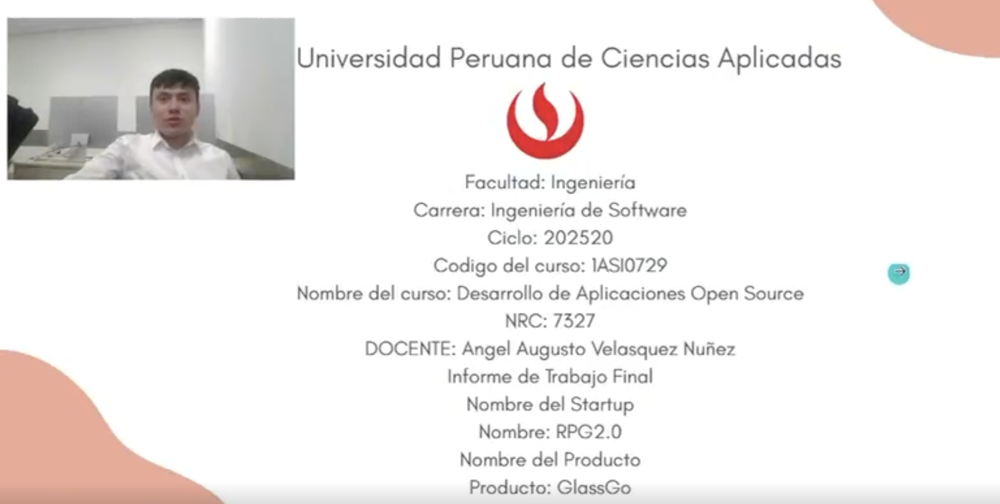

01-README.md:

UNIVERSIDAD PERUANA DE CIENCIAS APLICADAS

Facultad de Ingeniería

Carrera de Ingeniería de Software

Ciclo: 202520

Código del curso: 1ASI0729

Nombre del curso: Desarrollo de Aplicaciones Open Source

NRC: 7327

DOCENTE: Ángel Augusto Velásquez Nuñez

Informe de Trabajo Final

Nombre del Startup

Nombre: RPG2.0

Nombre del Producto

Producto: GlassGo

Relación de integrantes

<table>
  <thead>
    <tr>
      <th style="background-color: #333; color: #fff;">Apellidos y Nombres</th>
      <th style="background-color: #333; color: #fff;">Código de Alumno</th>
    </tr>
  </thead>
  <tbody>
    <tr>
      <td>Howard Robles, Guillermo Arturo</td>
      <td>U202222275</td>
    </tr>
    <tr>
      <td>Cespedes Pillco, Jarod Jack</td>
      <td>U202318588</td>
    </tr>
    <tr>
      <td>Vivar Cesar, David Ignacio</td>
      <td>U202414424</td>
    </tr>
    <tr>
      <td>Guillen Giraldo Myke Dylan</td>
      <td>U202211881</td>
    </tr>
  </tbody>
</table>

MES Y AÑO

Diciembre 2025

---

# Registro de Versiones del Informe

| Versión | Fecha      | Autor                          | Descripción de modificación                                                             |
|:-------:|------------|--------------------------------|-----------------------------------------------------------------------------------------|
|   1.1   | 18/09/2025 | Mike Dylan Guillen Giraldo     | Creación de la organización en github de RPG2-0-OpenSource-1ASI0729-2520-7327           |
|   1.2   | 18/09/2025 | Mike Dylan Guillen Giraldo     | Creación del repositorio de GlassGo-Report                                              |
|   1.3   | 18/09/2025 | Mike Dylan Guillen Giraldo     | Creación de ramas para la división de los capítulos del report                          |
|   1.4   | 18/09/2025 | Guillermo Arturo Howard Robles | Desarrollo de la descripción del startup, solution profile , lean ux problem statements |
|   1.5   | 18/09/2025 | Mike Dylan Guillen Giraldo     | Desarrollo del lean ux assumptions y hypotehis statements                               |
|   1.7   | 18/09/2025 | David Ignacio Vivar Cesar      | Desarrollo del lean ux canvas, segmentos objetivos                                      |
|   2.1   | 18/09/2025 | Guillermo Arturo Howard Robles | Desarrollo de la sección de competidores, Ubiquitous Language                           |
|   2.2   | 09/10/2025 | Mike Dylan Guillen Giraldo     | Desarrollo de las secciones de entrevistas, Big Picture Event Storming                  |
|   2.3   | 09/10/2025 | David Ignacio Vivar Cesar      | Desarrollo de la sección needfinding                                                    |
|   3.1   | 09/10/2025 | Guillermo Arturo Howard Robles | Desarrollo del Product Backlog                                                          |
|   3.2   | 09/10/2025 | Mike Dylan Guillen Giraldo     | Desarrollo del Impact Mapping                                                           |
|   3.3   | 12/10/2025 | David Ignacio Vivar Cesar      | Desarrollo de los User Stories                                                          |
|   4.1   | 26/10/2025 | Guillermo Arturo Howard Robles | Desarrollo del capítulo 4                                                               |
|   4.2   | 27/10/2025 | Mike Dylan Guillen Giraldo     | Desarrollo del capítulo 4                                                               |
|   4.3   | 28/10/2025 | David Ignacio Vivar Cesar      | Desarrollo del sprint 1                                                                 |
|   4.4   | 16/11/2025 | David Ignacio Vivar Cesar      | Corrección en los capítulos 2 y 3                                                       |
|   4.5   | 17/11/2025 | Mike Dylan Guillen Giraldo     | Corrección en las secciones del Capítulo 1 y 4                                          |
|   5.1   | 19/11/2025 | Guillermo Arturo Howard Robles | Desarrollo del sprint 2                                                                 |
|   5.2   | 19/11/2025 | Jarod Jack Céspedes Pillco     | Desarrollo del sprint 3                                                                 |
|   5.3   | 20/11/2025 | Mike Dylan Guillen Giraldo     | Corrección en los sprint 1 y 2                                                          |
|   5.4   | 28/11/2025 | Guillermo Arturo Howard Robles | Desarrollo del sprint 4                                                                 |
|   6.1   | 01/12/2025 | Guillermo Arturo Howard Robles | Corrección del sprint 4                                                                 |
 
---

# Project Report Collaboration Insights

Para el desarrollo del **Project Report**, se utilizó un repositorio dentro de la organización del equipo en GitHub. A continuación, se presenta la evidencia de colaboración correspondiente, en coherencia con el Registro de Versiones del Informe.

Link Github: https://github.com/RPG2-0-OpenSource-1ASI0729-2520-7327

- Para la elaboración del informe, se crearon ramas específicas para cada sección del documento, permitiendo a los integrantes trabajar de manera simultánea y organizada, facilitando la integración de los contenidos.

- **Total de commits:** 46
- **Autores contribuyentes:**
    - Guillermo Howard (`GuillermoPromac`)
    - Vivar David (`DarkBeider20`)
    - Guillen Mike (`FulLHous`)
    - Jarod Cespedes (`PruebaJJC`)
- Actividad distribuida por ramas correspondientes a cada sección del informe.
- Todos los miembros participaron activamente en la redacción y revisión del contenido.

---

# Contenido
**Tabla de contenidos**

- [Registro de Versiones del Informe](#registro-de-versiones-del-informe)
- [Project Report Collaboration Insights](#project-report-collaboration-insights)
- [Contenido](#contenido)
- [Student Outcome 3](#student-outcome-3)
- [**Capítulo I: Introducción**](#capítulo-i-introducción)
    - [1.1. Perfil de la Startup](#11-perfil-de-la-startup)
        - [1.1.1. Descripción de la Startup](#111-descripción-de-la-startup)
        - [1.1.2. Perfiles de los Miembros del Equipo](#112-perfiles-de-los-miembros-del-equipo)
    - [1.2. Solution Profile](#12-solution-profile)
        - [1.2.1. Antecedentes y Problematicas](#121-antecedentes-y-problematicas)
    - [1.2.2 Lean UX Process](#122-lean-ux-process)
        - [1.2.2.1. Lean UX Problem Statements](#1221-lean-ux-problem-statements)
        - [1.2.2.2. Lean UX Assumptions](#1222-lean-ux-assumptions)
        - [1.2.2.3. Lean UX Hypothesis Statements](#1223-lean-ux-hypothesis-statements)
        - [1.2.2.4. Lean UX Canvas](#1224-lean-ux-canvas)
    - [1.3. Segmentos Objetivo](#13-segmentos-objetivo)
- [**Capítulo II: Requirements Elicitation \& Analysis**](#capítulo-ii-requirements-elicitation--analysis)
    - [2.1. Competidores.](#21-competidores)
        - [2.1.1. Análisis competitivo.](#211-análisis-competitivo)
        - [2.1.2. Estrategias y tácticas frente a competidores.](#212-estrategias-y-tácticas-frente-a-competidores)
    - [2.2. Entrevistas.](#22-entrevistas)
        - [2.2.1. Diseño de entrevistas.](#221-diseño-de-entrevistas)
        - [2.2.2. Registro de entrevistas.](#222-registro-de-entrevistas)
        - [2.2.3. Análisis de entrevistas.](#223-análisis-de-entrevistas)
    - [2.3. Needfinding.](#23-needfinding)
        - [2.3.1. User Personas.](#231-user-personas)
        - [2.3.2. User Task Matrix.](#232-user-task-matrix)
        - [2.3.3. User Journey Mapping.](#233-user-journey-mapping)
        - [2.3.4. Empathy Mapping.](#234-empathy-mapping)
    - [2.4. Big Picture Event Storming.](#24-big-picture-event-storming)
    - [2.5. Ubiquitous Language.](#25-ubiquitous-language)
- [**Capítulo III: Requirements Specification**](#capítulo-iii-requirements-specification)
    - [3.1. User Stories](#31-user-stories)
    - [3.2. Impact Mapping](#32-impact-mapping)
    - [3.3. Product Backlog](#33-product-backlog)
- [**Capítulo IV: Product Design**](#capítulo-iv-product-design)
    - [4.1. Style Guidelines](#41-style-guidelines)
        - [4.1.1. General Style Guidelines](#411-general-style-guidelines)
        - [4.1.2. Web Style Guidelines](#412-web-style-guidelines)
    - [4.2. Information Architecture](#42-information-architecture)
        - [4.2.1. Organization Systems](#421-organization-systems)
        - [4.2.2. Labeling Systems](#422-labeling-systems)
        - [4.2.3. SEO Tags and Meta Tags](#423-seo-tags-and-meta-tags)
        - [4.2.4. Searching Systems](#424-searching-systems)
        - [4.2.5. Navigation Systems](#425-navigation-systems)
    - [4.3. Landing Page UI Design](#43-landing-page-ui-design)
        - [4.3.1. Landing Page Wireframe](#431-landing-page-wireframe)
        - [4.3.2. Landing Page Mock-up](#432-landing-page-mock-up)
    - [4.4. Web Applications UX/UI Design](#44-web-applications-uxui-design)
        - [4.4.1. Web Applications Wireframes](#441-web-applications-wireframes)
        - [4.4.2. Web Applications Wireflow Diagrams](#442-web-applications-wireflow-diagrams)
        - [4.4.3. Web Applications Mock-ups](#443-web-applications-mock-ups)
        - [4.4.4. Web Applications User Flow Diagrams](#444-web-applications-user-flow-diagrams)
    - [4.5. Web Applications Prototyping](#45-web-applications-prototyping)
    - [4.6. Domain-Driven Software Architecture](#46-domain-driven-software-architecture)
        - [4.6.1. Design-Level EventStorming](#461-design-level-eventstorming)
        - [4.6.2. Software Architecture Context Diagram](#462-software-architecture-context-diagram)
        - [4.6.3. Diagramas de Contenedor de Arquitectura de Software](#463-diagramas-de-contenedor-de-arquitectura-de-software)
        - [4.6.4. Software Architecture Components Diagrams](#464-software-architecture-components-diagrams)
    - [4.7. Software Object-Oriented Design](#47-software-object-oriented-design)
        - [4.7.1. Class Diagrams](#471-class-diagrams)
    - [4.8. Database Design](#48-database-design)
        - [4.8.1. Database Diagrams](#481-database-diagrams)
- [**Capítulo V: Product Implementation, Validation \& Deployment**](#capítulo-v-product-implementation-validation--deployment)
    - [5.1. Software Configuration Management.](#51-software-configuration-management)
        - [5.1.1. Software Development Environment Configuration.](#511-software-development-environment-configuration)
        - [5.1.2. Source Code Management.](#512-source-code-management)
        - [5.1.3. Source Code Style Guide \& Conventions.](#513-source-code-style-guide--conventions)
        - [5.1.4. Software Deployment Configuration.](#514-software-deployment-configuration)
    - [5.2. Landing Page, Services \& Applications Implementation.](#52-landing-page-services--applications-implementation)
        - [5.2.1. Sprint 1](#521-sprint-1)
            - [5.2.1.1. Sprint Planning 1.](#5211-sprint-planning-1)
            - [5.2.1.2. Aspect Leaders and Collaborators.](#5212-aspect-leaders-and-collaborators)
            - [5.2.1.3. Sprint Backlog 1.](#5213-sprint-backlog-1)
            - [5.2.1.4. Development Evidence for Sprint Review.](#5214-development-evidence-for-sprint-review)
            - [5.2.1.6. Services Documentation Evidence for Sprint Review.](#5216-services-documentation-evidence-for-sprint-review)
            - [5.2.1.7. Software Deployment Evidence for Sprint Review.](#5217-software-deployment-evidence-for-sprint-review)
            - [5.2.1.8. Team Collaboration Insights during Sprint.](#5218-team-collaboration-insights-during-sprint)
        - [5.2.2. Sprint 2](#522-sprint-2)
            - [5.2.2.1. Sprint Planning 2.](#5221-sprint-planning-2)
            - [5.2.2.2. Aspect Leaders and Collaborators.](#5222-aspect-leaders-and-collaborators)
            - [5.2.2.3. Sprint Backlog 2.](#5223-sprint-backlog-2)
            - [5.2.2.4. Development Evidence for Sprint Review.](#5224-development-evidence-for-sprint-review)
            - [5.2.2.5. Execution Evidence for Sprint Review.](#5225-execution-evidence-for-sprint-review)
            - [5.2.2.6. Services Documentation Evidence for Sprint Review.](#5226-services-documentation-evidence-for-sprint-review)
            - [5.2.2.7. Software Deployment Evidence for Sprint Review.](#5227-software-deployment-evidence-for-sprint-review)
            - [5.2.2.8. Team Collaboration Insights during Sprint.](#5228-team-collaboration-insights-during-sprint)
        - [5.2.3. Sprint 3](#523-sprint-3)
            - [5.2.3.1. Sprint Planning 3.](#5231-sprint-planning-3)
            - [5.2.3.2. Aspect Leaders and Collaborators.](#5232-aspect-leaders-and-collaborators)
            - [5.2.3.3. Sprint Backlog 3.](#5233-sprint-backlog-3)
            - [5.2.3.4. Development Evidence for Sprint Review.](#5234-development-evidence-for-sprint-review)
            - [5.2.3.5. Execution Evidence for Sprint Review.](#5235-execution-evidence-for-sprint-review)
            - [5.2.3.6. Services Documentation Evidence for Sprint Review.](#5236-services-documentation-evidence-for-sprint-review)
            - [5.2.3.7. Software Deployment Evidence for Sprint Review.](#5237-software-deployment-evidence-for-sprint-review)
            - [5.2.3.8. Team Collaboration Insights during Sprint.](#5238-team-collaboration-insights-during-sprint)
        - [5.2.4. Sprint 4](#524-sprint-4)
            - [5.2.4.1. Sprint Planning 4.](#5241-sprint-planning-4)
            - [5.2.4.2. Aspect Leaders and Collaborators.](#5242-aspect-leaders-and-collaborators)
            - [5.2.4.3. Sprint Backlog 4.](#5243-sprint-backlog-4)
            - [5.2.4.4. Development Evidence for Sprint Review.](#5244-development-evidence-for-sprint-review)
            - [5.2.4.5. Execution Evidence for Sprint Review.](#5245-execution-evidence-for-sprint-review)
            - [5.2.4.6. Services Documentation Evidence for Sprint Review.](#5246-services-documentation-evidence-for-sprint-review)
            - [5.2.4.7. Software Deployment Evidence for Sprint Review.](#5247-software-deployment-evidence-for-sprint-review)
            - [5.2.4.8. Team Collaboration Insights during Sprint.](#5248-team-collaboration-insights-during-sprint)
    - [5.3. Validation Interviews.](#53-validation-interviews)
        - [5.3.1. Diseño de Entrevistas.](#531-diseño-de-entrevistas)
        - [5.3.2. Registro de Entrevistas.](#532-registro-de-entrevistas)
        - [5.3.3. Evaluación según heurísticas.](#533-evaluación-según-heurísticas)
    - [5.4. Video About-the-Product.](#54-video-about-the-product)
- [Conclusiones y Recomendaciones](#conclusiones-y-recomendaciones)
- [Bibliografía](#bibliografía)
- [Anexos](#anexos)
---

# **Student Outcome 3**

El curso contribuye al cumplimiento del Student Outcome:

**ABET \- EAC \- Student Outcome 3:**

Criterio: Capacidad de comunicarse eficientemente con un rango de audiencias

En el siguiente cuadro se describen las acciones realizadas  y enunciados de conclusiones por parte del grupo, que permiten sustentar el haber alcanzado el logro del ABET \-- EAC \- Student Outcome 3\.

| Criterio específico | Acciones realizadas                                                                                                                                                                                                                                                                                                                                                                                                                                                                                                                                                                                                                                                                                                                                                                                                                                                                                                                                                                                                                                                                                                                                                                                                                                                                                                                                                                                               | Conclusiones                                                                                                                                                                                                                                                                                                                                                                                                                                                                                                                                                                                                                                                                                                                                                                                                                                                                                                                                                                                                                                                                                    |
| :---- |:------------------------------------------------------------------------------------------------------------------------------------------------------------------------------------------------------------------------------------------------------------------------------------------------------------------------------------------------------------------------------------------------------------------------------------------------------------------------------------------------------------------------------------------------------------------------------------------------------------------------------------------------------------------------------------------------------------------------------------------------------------------------------------------------------------------------------------------------------------------------------------------------------------------------------------------------------------------------------------------------------------------------------------------------------------------------------------------------------------------------------------------------------------------------------------------------------------------------------------------------------------------------------------------------------------------------------------------------------------------------------------------------------------------|:------------------------------------------------------------------------------------------------------------------------------------------------------------------------------------------------------------------------------------------------------------------------------------------------------------------------------------------------------------------------------------------------------------------------------------------------------------------------------------------------------------------------------------------------------------------------------------------------------------------------------------------------------------------------------------------------------------------------------------------------------------------------------------------------------------------------------------------------------------------------------------------------------------------------------------------------------------------------------------------------------------------------------------------------------------------------------------------------|
| **Comunica oralmente  con efectividad a  diferentes rangos  de audiencia.** | **Howard Robles, Guillermo Arturo**  TB1: Lideró la presentación de mock-ups y flujos funcionales a usuarios durante sesiones grupales; además, condujo entrevistas como parte del proceso de needfinding.  **TP:** Explicó objetivos y organización de tareas durante el Sprint Planning 2. **TB2:** Explicó los avances en el módulo de configuración.   **TF1:** Explicó los avances en las correcciones del report .   **David Ignacio, Vivar Cesar**  TB1: Lideró la explicación del Lean UX Canvas y su relación con hallazgos del usuario.  **TP:** Coordinó la exposición de contextos delimitados durante el Event Storming.  **TB2:** Presentó la estructura del módulo principal en el frontend.   **TF1:** Presentó la estructura del módulo final en el backend.   **Mike Dylan Guillen Giraldo**  TB1: Lideró la presentación del perfil de usuarios y user personas, enfocando en los hallazgos del proceso de necesidad.  **TP:** Explicó el Sprint Backlog 2 en reuniones de planificación.  **TB2:** Explicó el despliegue del sistema en la revisión del sprint.   **TF1:** Explicó el funcionamiento y procedimiento del frontend.  .   **Cespedes Pillco Jarod Jack**   TB2: Presentó los avances de la estructura principal del backend.    **TF1:** Explicó el despliegue del frontend. | **TB1:** Cada integrante asumió liderazgo en al menos una sección clave de comunicación oral. Esto permitió no solo desarrollar habilidades expresivas, sino también adaptar el lenguaje según el tipo de audiencia. A través de entrevistas, presentaciones de análisis, prototipos y flujos, el equipo transmitió efectivamente conceptos complejos y decisiones de diseño.   **TP:**  La participación activa y rotativa en presentaciones orales fortaleció la cohesión del grupo y la claridad de los mensajes. Los videos, reuniones y exposiciones contribuyeron a comunicar con precisión el progreso técnico y organizacional del proyecto.   **TB2:**  El equipo continuó con una comunicación oral efectiva al presentar avances técnicos, funcionales y organizacionales en diferentes contextos. La explicación de módulos específicos, el despliegue del sistema y los videos demostrativos evidencian la capacidad de comunicar de forma clara tanto entre el equipo como frente a evaluadores y usuarios.  **TF:**    En la fase final, el equipo consolidó su capacidad de comunicación oral mediante exposiciones integrales que abarcaron la explicación técnica del sistema, las decisiones de diseño, el proceso de desarrollo y los resultados finales obtenidos.. |
| **Comunica por escrito  con efectividad a  diferentes rangos  de audiencia.** | **Howard Robles, Guillermo Arturo**  TB1: Lideró la redacción de escenarios de usuario y tareas funcionales; documentó el desarrollo inicial del flujo base.  **TP:** Redactó las conclusiones del equipo y afinó la coherencia de los supuestos.  **TB2:** Redactó y corrigió entregables relacionados a clases del backend.   **TF1:** Redactó y corrigió estructura y malas prácticas presentadas en el report.   **David Ignacio, Vivar Cesar**  TB1: Lideró la elaboración escrita del Lean UX Canvas y síntesis de hallazgos.  **TP:** Redactó reflexiones del equipo sobre colaboración durante el Sprint.  **TB2:** Redactó el Sprint Backlog 3 y contribuyó con las evidencias de desarrollo.   **TF1:** Redactó y corrigió el backend .   **Mike Dylan Guillen Giraldo**  TB1: Lideró la documentación del proceso de entrevistas y validación de usuarios.  **TP:** Documentó las evidencias del despliegue de software para revisión técnica.  **TB2:** Redactó y corrigió entregables relacionados a heurísticas del sistema.   **TF1:** Redactó los componentes faltantes en el frontend.   **Cespedes Pillco Jarod Jack**   TB2: Documentó evidencias de desarrollo del backend.   **TF1:** Documentó evidencias de desarrollo del frontend .                                                  | **TB1:** Cada integrante tomó liderazgo en la elaboración de entregables escritos clave, garantizando una comunicación clara, precisa y estructurada. Esto permitió representar con fidelidad el trabajo realizado, desde documentos metodológicos como el Lean UX Canvas, hasta descripciones funcionales, user personas y análisis técnicos.   **TP:**  El equipo fortaleció su redacción técnica corrigiendo y mejorando entregas anteriores, lo cual se refleja en la calidad y claridad de los nuevos documentos. Cada evidencia escrita permitió comunicar adecuadamente tanto los avances del producto como el proceso seguido por el equipo.   **TB2:**  Se evidenció un avance en la precisión de los documentos técnicos y colaborativos. Las evidencias de desarrollo, actualizaciones del informe y análisis de módulos muestra la capacidad del equipo de comunicar información compleja a diferentes audiencias a través de medios escritos.   **TF:**   En la fase final, el equipo consolidó su capacidad de comunicación oral mediante exposiciones integrales que abarcaron la explicación técnica del sistema, las decisiones de diseño, el proceso de desarrollo y los resultados finales obtenidos..                                                               |

---
02-cap1-introduction.md:

# **Capítulo I: Introducción**

## 1.1. Perfil de la Startup

### 1.1.1. Descripción de la Startup

RPG nació con el propósito de transformar la seguridad y la eficiencia en el transporte de licores en envases de vidrio, un sector donde las pérdidas por roturas, la falta de trazabilidad y los retrasos en la distribución afectan directamente la rentabilidad de las empresas.

Nuestro producto principal, GlassGo, es una plataforma B2B que integra rastreo GPS en tiempo real, algoritmos de optimización de rutas y sensores inteligentes para garantizar un transporte seguro, transparente y eficiente.

A través de un modelo de membresía al estilo de Netflix, GlassGo ofrece a transportistas, distribuidores y dueños de negocios una herramienta escalable que facilita la supervisión de envíos, minimiza riesgos y mejora la calidad del servicio en toda la cadena de distribución.

La propuesta de RPG se diferencia del software tradicional de gestión de flotas y de los sensores de impacto existentes al combinar tres elementos clave: trazabilidad total de las entregas, prevención de roturas y un modelo de negocio accesible para empresas de todos los tamaños.

Con GlassGo, buscamos reducir las pérdidas económicas por roturas, optimizar los tiempos de entrega y proporcionar transparencia en el transporte de licores en vidrio, contribuyendo a una industria más competitiva, eficiente y confiable.

**Misión**: Revolucionar el transporte de licores en envases de vidrio a través de GlassGo, una plataforma integral que combina trazabilidad, optimización logística y prevención de daños. Queremos apoyar a las empresas de transporte y distribución a reducir pérdidas, mejorar la eficiencia operativa y garantizar entregas seguras mediante tecnología accesible y confiable.

**Visión**: Visualizamos un futuro donde todo el transporte de licores en vidrio esté respaldado por soluciones inteligentes como GlassGo, asegurando entregas sin roturas, con total transparencia y eficiencia. Aspiramos a que RPG se convierta en líder en la digitalización y seguridad del transporte de vidrio a nivel regional, creando un nuevo estándar en la industria logística.

### 1.1.2. Perfiles de los Miembros del Equipo

| Foto | Apellido y Nombre | 
| --- | --- | 
 | **Jarod Jack Cespedes Pillco - u202318588**  Soy estudiante de quinto ciclo de la carrera de Ingeniería de Software. Me considero una persona atenta, creativa y colaborativa, siempre dispuesta a apoyar a mi equipo en todo lo que sea necesario. Además, cuento con conocimientos en diversos lenguajes de programación, como C++, C#, Python y Java. 
 | **Guillermo Arturo Howard Robles - u202222275**  Soy un estudiante de Ingeniería de Software enfocado en el aprendizaje constante. Me apasiona investigar y analizar problemas para proponer soluciones innovadoras. Busco desarrollar software integral, aplicando mejores prácticas y tecnologías modernas para garantizar eficiencia, escalabilidad, calidad y mejora continua en cada proyecto. 
 | **David Ignacio Vivar Cesar - u202414424**  Estudiante de Ingeniería de Software interesado en desarrollar soluciones eficientes con tecnología de vanguardia. Siempre buscando mejorar y abierto a cualquier crítica constructiva. 
 | **Mike Dylan Guillén Giraldo - u202211881**  Soy un estudiante de Ingeniería de Software interesado en desarrollar aplicaciones y sistemas escalables. Disfruto investigar y aprender nuevas tecnologías para crear soluciones innovadoras e impactantes. Estoy motivado para aplicar buenas prácticas de programación, principios de arquitectura de software y metodologías ágiles para construir proyectos de calidad, manteniendo siempre una visión de mejora continua y crecimiento profesional. 

## 1.2. Solution Profile
### 1.2.1. Antecedentes y Problematicas

**¿Who (Quiénes son los afectados?)**  
 Los principales afectados son:

* Empresas de transporte de carga pesada en Perú, enfrentando altos costos operativos debido a rutas ineficientes, desgaste de vehículos y accidentes.

* Distribuidores de licores, que deben cubrir pérdidas económicas por rotura de botellas de vidrio y robo parcial de mercancía durante el transporte.

* Dueños de bares, licorerías y restaurantes, que reciben pedidos incompletos o tardíos, afectando la planificación de inventarios, promociones y ventas.

**What (Qué sucede?)**  
 La cadena logística para el transporte de licores en Perú presenta problemas estructurales:

* Flotas de camiones con una antigüedad promedio de 17 años (MTC, 2023), aumentando el riesgo de fallas y daños a la mercancía.

* Trazabilidad limitada de la carga en tiempo real: solo el 50% de las empresas logísticas utilizan sistemas de rastreo digital (Andina, 2023).

* Las pérdidas por rotura de botellas alcanzan hasta el 3% de la carga transportada en el sector de bebidas (Durán, UNI, 2020).

**¿Where (Dónde ocurre?)**

El problema ocurre en el mercado peruano de transporte y distribución de bebidas alcohólicas, especialmente en rutas interprovinciales y urbanas de alto consumo (Lima, Arequipa, Trujillo, Cusco). El impacto es mayor en pequeñas y medianas empresas de transporte y distribución, que carecen de recursos para implementar soluciones tecnológicas avanzadas.

**¿When (Desde cuándo y con qué frecuencia?)**

Este problema es persistente y estructural. Aunque los avances tecnológicos han mejorado la eficiencia en otros sectores, la digitalización en la logística de bebidas en Perú es lenta. El problema ocurre diariamente con cada entrega de productos y se intensifica durante temporadas de alta demanda (festividades nacionales, fin de año, campañas regionales).

**¿Why (Por qué es un problema?)**  
 La falta de digitalización y control logístico genera graves consecuencias:

* **Económicas**: pérdidas por rotura, reemplazos, robos y retrasos.

* **Operativas**: rutas ineficientes, desgaste de flotas y falta de trazabilidad.

* **Comerciales**: fallas en las entregas afectan la confianza entre distribuidores y clientes.

* **Estratégicas**: sin datos consolidados, es imposible planificar inventarios y optimizar costos.

**¿How (Cómo se manifiesta?)**

* Los pedidos llegan incompletos o tarde.

* Mercancía dañada durante el transporte (botellas rotas por vibraciones y mal apilamiento).

* Dificultad para monitorear la ubicación y el estado de la carga en tiempo real.

* Procesos de coordinación informales entre transportistas, distribuidores y clientes.

* Capacidad limitada para reaccionar ante imprevistos en la carretera.

**¿How Much (Cuál es el impacto cuantitativo?)**

* El transporte terrestre en Perú moviliza más del 80% de la carga nacional (MTC, 2024).

* La antigüedad promedio de las flotas supera los 17 años, aumentando el riesgo de fallas (MTC, 2023).

* La rotura de envases de vidrio representa pérdidas de hasta el 3% en el transporte de bebidas (Durán, UNI, 2020).

* Las interrupciones viales causan pérdidas de hasta S/ 280 millones diarios en el sector transporte (RPP, 2024).

* Los modelos digitales en las pymes logísticas pueden reducir costos operativos en hasta un 15% al optimizar rutas y trazabilidad (Cabrera-Gala et al., 2021).

## 1.2.2 Lean UX Process
### 1.2.2.1. Lean UX Problem Statements

El transporte y distribución de licores en Perú busca asegurar entregas seguras y puntuales, pero hoy este objetivo no se cumple. Las operaciones dependen de flotas envejecidas y baja digitalización, lo que lleva a roturas de botellas, robos parciales de carga y combustible, y retrasos. El mercado demanda mayor trazabilidad y eficiencia, destacando las limitaciones del sistema actual.

Las soluciones disponibles no responden a esta realidad: son costosas, están diseñadas para grandes empresas y son poco adecuadas para las pymes logísticas. No abordan directamente la reducción de pérdidas por rotura ni facilitan la coordinación entre transportistas, distribuidores y clientes, que siguen enfrentando altos costos y una disminución de la confianza en el servicio.

El desafío, por lo tanto, no es crear una herramienta predefinida, sino proponer formas de mejorar la seguridad y eficiencia de la distribución. Sabremos que vamos por el buen camino cuando observemos menos pérdidas, menores costos operativos y mayor satisfacción del cliente gracias a entregas completas y puntuales.

### 1.2.2.2. Lean UX Assumptions

#### A. Business Assumptions

1. Creemos que nuestros clientes (transportistas, distribuidores y dueños de negocios) necesitan reducir las pérdidas por rotura, robo y retrasos en la cadena de distribución de licores.

2. Estas necesidades se resuelven con una plataforma digital accesible que ofrezca optimización de rutas, trazabilidad en tiempo real y comunicación centralizada.

3. Nuestros primeros clientes serán pymes en el transporte y distribución de bebidas en Lima y principales ciudades de Perú.

4. Valor esperado #1: seguridad y trazabilidad de carga en tiempo real.

5. Beneficios adicionales: ahorro en costos operativos (combustible, mantenimiento), reducción de roturas, confianza en entregas completas y puntuales.

6. Adquisición: referencias del sector, alianzas con distribuidores, cámaras de comercio, marketing digital B2B.

7. Ingresos: modelo de suscripción SaaS mensual (escalado por flota o volumen de envíos).

8. Principal competencia: soluciones genéricas de gestión de flotas (Geotab, GPS Perú, TrackLink).

9. Ventaja competitiva: precios asequibles para pymes, enfoque específico en el transporte de vidrio y reducción de pérdidas por rotura.

10. Principal riesgo del producto: baja adopción debido a desconfianza tecnológica en las pymes logísticas.

11. Mitigación: incorporación guiada, soporte técnico local, versión ligera de la plataforma que muestre éxitos rápidos.

12. Otras suposiciones críticas: conectividad móvil estable en rutas interprovinciales y disposición de las empresas a compartir datos de flota y carga.

#### B. User Assumptions

* ¿Quién es el usuario?  
   Conductores de camiones, distribuidores de licores y dueños de bares/licorerías.

* ¿Dónde encaja el producto?  
   En las operaciones diarias de transporte y recepción de pedidos, a través de una aplicación móvil y un panel web.

* Problema a resolver: pérdidas por rotura (3% de la carga), retrasos en las entregas, falta de visibilidad de la carga.

* Uso típico: asignar ruta, monitorear estado de la carga en tiempo real, recibir alertas de incidentes, confirmar entregas.

* Funcionalidades importantes: trazabilidad GPS, sensores de impacto, alertas automáticas, chat centralizado, informes de eficiencia.

* Aspecto y sensación: interfaz clara y responsiva; mapas interactivos, alertas visuales en rojo/amarillo y paneles simples con KPIs clave.

#### C. User Outcome & Benefit Assumptions

* Menos pérdidas económicas por rotura y robo.

* Rutas optimizadas → menos desgaste de flota y consumo de combustible.

* Los dueños de negocios reciben entregas completas y puntuales.

* Mayor confianza y transparencia en la cadena logística.

* Toma de decisiones basada en datos (por ejemplo, tiempos de entrega, incidentes en rutas).

#### D. Business Outcome Assumptions (target metrics)

* Reducir las pérdidas por rotura en un 50% en el primer año.

* Reducir los costos operativos en un 15% en 12 meses.

* Aumentar el cumplimiento de entregas a tiempo en un 25%.

* Alcanzar 200 pymes logísticas y distribuidores suscritos en 12 meses.

* El 70% de los usuarios activos utiliza el sistema a diario para monitoreo y coordinación.

#### E. Feature Assumptions

* La trazabilidad por GPS y sensores reduce pérdidas y robos.

* La optimización de rutas disminuye costos operativos y tiempos de entrega.

* La comunicación centralizada reduce errores y mejora la coordinación.

* Los informes y alertas permiten decisiones basadas en datos y aumentan la confianza del cliente.

### 1.2.2.3. Lean UX Hypothesis Statements

#### Optimización de Rutas

Creemos que al ofrecer un módulo de optimización de rutas en tiempo real, reduciremos los costos operativos del transporte.

Sabremos que tenemos éxito cuando veamos el siguiente feedback del mercado: los gerentes de flota informan menores gastos en combustible y mantenimiento, y/o los paneles muestran un ahorro sostenido del 15% en los costos logísticos mensuales.

#### Trazabilidad en Tiempo Real con Alertas

Creemos que al implementar la trazabilidad de la carga con alertas inmediatas, reduciremos las pérdidas por rotura o robo parcial.

Sabremos que tenemos éxito cuando veamos el siguiente feedback del mercado: transportistas y distribuidores dicen "ahora sabemos exactamente dónde está la carga y si algo falla" y/o los registros de incidentes muestran una disminución del 50% en roturas y robos.

#### Comunicación Centralizada

Creemos que al habilitar un canal de comunicación digital entre transportistas, distribuidores y clientes, reduciremos los errores de coordinación y los retrasos en las entregas.

Sabremos que tenemos éxito cuando veamos el siguiente feedback del mercado: los clientes comentan que "las entregas llegan más completas y a tiempo" y/o las métricas de entrega a tiempo aumentan en un 30% respecto a la línea base.

#### Panel de Control para el Cliente

Creemos que al ofrecer un panel de control de pedidos y entregas en tiempo real, los dueños de negocios (bares, licorerías, restaurantes) aumentarán su satisfacción y confianza.

Sabremos que tenemos éxito cuando veamos el siguiente feedback del mercado: los clientes expresan que "ahora podemos planificar mejor los inventarios y promociones" y/o las encuestas de satisfacción (NPS) aumentan en un 40% en comparación con el estado inicial.

### 1.2.2.4. Lean UX Canvas

| **Business Problem** | **Solutions** | **Business Outcomes** |
| :------------------- | :------------ | :------------------- |
| El estado actual del transporte y distribución de licores en Perú se caracteriza por flotas envejecidas y procesos poco digitalizados, lo que resulta en pérdidas por rotura, robo de carga y combustible, retrasos en las entregas y altos costos operativos. Los productos o servicios existentes no abordan la realidad de las pymes logísticas: son costosos, complejos y no están enfocados en reducir pérdidas ni facilitar la coordinación entre transportistas, distribuidores y clientes. Nuestro producto busca cerrar esta brecha a través de una plataforma digital accesible que optimice rutas, reduzca costos, proporcione trazabilidad en tiempo real, alerte incidentes y centralice la comunicación en la cadena logística. Nuestro enfoque inicial será satisfacer las necesidades de los dueños de negocios de transporte y sus partes interesadas. Sabremos que hemos tenido éxito cuando reduzcamos las pérdidas por rotura, los costos operativos y aumentemos la satisfacción del cliente mediante entregas completas y puntuales. | - Optimización de rutas con análisis predictivo: algoritmos que reducen tiempos de viaje y costos de combustible. - Sistema de trazabilidad en tiempo real: monitoreo de ubicación, alertas de incidentes y seguimiento de carga. - Comunicación centralizada: canal único entre transportistas, distribuidores y clientes. - Tableros para clientes: visibilidad de pedidos, estado de entregas y métricas de cumplimiento. | - Reducción del 50% en pérdidas por rotura y robo parcial. - Reducción del 15% en costos operativos de transporte. - Incremento del 30% en entregas completas y puntuales. - Alcanzar 300–500 usuarios activos en 6 meses. - Mejorar la confianza en la cadena de distribución (NPS > 40%). |

| **Users** | **User Outcomes & Benefits** |
| :-------- | :-------------------------- |
| - Empresas de transporte de camiones: “Nuestro objetivo es optimizar rutas y reducir el desgaste de los vehículos.” - Distribuidores de licores: “Nuestro objetivo es que la mercancía llegue completa y a tiempo para evitar reemplazos.” - Dueños de negocios (bares, licorerías, restaurantes): “Nuestro objetivo es requerir pedidos completos, puntuales y trazables para planificar inventarios, promociones y ventas.” | - Conductores de camiones: Optimizar rutas, reducir desgaste y costos, mantener entregas puntuales, seguridad y control en la gestión de flotas. Trazabilidad en tiempo real, rutas recomendadas y alertas proactivas. Indicadores de éxito: menor costo por km, menos desgaste y más entregas puntuales. - Distribuidores de licores: Entregas completas y puntuales con trazabilidad total, confianza en la ubicación de cada lote y reducción de reemplazos. Seguimiento de envíos, alertas de incidentes y comunicación centralizada. Menos pérdidas por daños, menos devoluciones y entregas completas. - Dueños de negocios: Pedidos completos y puntuales, con trazabilidad para inventarios y promociones. Tranquilidad y mayor visibilidad de la cadena de suministro. Tableros de entregas, notificaciones de retrasos e informes de planificación. Inventarios más precisos, promociones mejor planificadas y menos roturas. |

| **Hypotheses** | **What’s the most important thing we need to learn first?** | **What’s the least amount of work we need to do to learn the next most important thing?** |
| :------------- | :------------------------ | :----------------------- |
| - Creemos que reduciremos los costos operativos de transporte en un 15% si los conductores de camiones obtienen rutas más eficientes y menos desgaste de vehículos con un sistema de optimización de rutas predictivo. - Creemos que disminuiremos las pérdidas por rotura y robo parcial en un 50% si los distribuidores de licores obtienen trazabilidad total de los lotes y alertas de incidentes en tiempo real con un sistema digital de monitoreo y seguimiento de carga. - Creemos que aumentaremos las entregas completas y puntuales en un 30% si los dueños de bares, licorerías y restaurantes obtienen visibilidad de pedidos, notificaciones de retrasos e informes de cumplimiento con paneles de control y tableros de entregas. - Creemos que alcanzaremos 300–500 usuarios activos en los primeros 6 meses si los transportistas, distribuidores y dueños de negocios obtienen una plataforma accesible, móvil y con incorporación guiada. - Creemos que mejoraremos la confianza en la cadena de distribución (NPS > 40%) si todos los actores obtienen transparencia en la información, trazabilidad de pedidos y un canal de comunicación unificado. | - ¿Los transportistas perciben el costo de combustible, tiempo y desgaste como problemas lo suficientemente importantes como para probar un sistema de optimización de rutas? - ¿Los distribuidores consideran la trazabilidad total como algo crítico y realmente usarían un sistema de alertas para reducir pérdidas por rotura o robo? - ¿Los dueños de negocios necesitan visibilidad de pedidos y se beneficiarían de recibir notificaciones de retrasos e informes en tiempo real? - ¿La adopción de la aplicación depende de que sea fácil de usar, móvil y con un proceso de registro rápido? - ¿La falta de comunicación y transparencia es la principal causa de desconfianza entre transportistas, distribuidores y dueños de negocios? | - Entrevistas y encuestas con transportistas, distribuidores y dueños de negocios para validar necesidades y disposición a usar la plataforma. - Prototipo funcional (MVP) de trazabilidad con alertas básicas de carga en ruta. - Prueba piloto con 1–2 empresas de transporte y un grupo de distribuidores de licores para medir la reducción de pérdidas y tiempos de entrega. - Crear un prototipo funcional de la plataforma y realizar pruebas de usabilidad con usuarios reales (dueños de negocios, distribuidores o transportistas). |

## 1.3. Segmentos Objetivo

* **Segmento 1: Empresas de Transporte de Camiones**  
  * Buscan optimizar rutas y reducir pérdidas. Necesitan herramientas que proporcionen trazabilidad en tiempo real y menos desgaste en la logística.  
      
* **Segmento 2: Distribuidores de Licores**  
  * Su principal necesidad es que la mercancía llegue sin pérdidas y a tiempo. Incurren en costos adicionales al reemplazar productos dañados.  
      
* **Segmento 3: Dueños de Negocios (Bares, Licorerías, Restaurantes)**  
  * Requieren pedidos completos y puntuales. La transparencia en la trazabilidad les permite planificar inventarios, promociones y ventas sin depender de procesos poco confiables.
03-cap2-requirements-elicitation-and-analysis.md:

# **Capítulo II: Requirements Elicitation & Analysis**
## 2.1. Competidores.

* **Verizon Connect (competidor directo):** Es una plataforma de gestión de flotas basada en la nube que ofrece soluciones de localización GPS, optimización de rutas, mantenimiento predictivo y seguridad de vehículos. Está orientada a empresas con flotas medianas y grandes que buscan mejorar la eficiencia logística y reducir costos operativos. Su presencia es fuerte en Estados Unidos, Canadá y Europa, donde atiende sectores como transporte, construcción y distribución.

* **Frotcom (competidor directo):** Es un software de gestión de flotas diseñado para el monitoreo y control de vehículos en tiempo real. Ofrece funcionalidades como geolocalización, análisis de consumo de combustible, control de conductores y planificación de rutas. Se enfoca en empresas medianas y grandes que necesitan mejorar la trazabilidad y eficiencia de sus operaciones de transporte. Tiene presencia internacional, con fuerte adopción en Europa, África y Latinoamérica.

* **Schockwatch (competidor directo):** Es una empresa especializada en dispositivos y etiquetas sensibles a impactos y vibraciones, diseñados para detectar golpes y malas manipulaciones durante el transporte. Sus productos son utilizados en sectores donde la integridad física de la mercancía es crítica, como el farmacéutico, electrónico y de bebidas. Está presente globalmente, con una amplia red de distribuidores en América, Europa y Asia.

### 2.1.1. Análisis competitivo.

| Competitive Analysis Landscape  |  |                                                                                                                                                                                                                                           |                                                                                                                                                                                                |                                                                                                                                                                           |                                                                                                                                                                                     |
| ----- | ----- |-------------------------------------------------------------------------------------------------------------------------------------------------------------------------------------------------------------------------------------------|------------------------------------------------------------------------------------------------------------------------------------------------------------------------------------------------|---------------------------------------------------------------------------------------------------------------------------------------------------------------------------|-------------------------------------------------------------------------------------------------------------------------------------------------------------------------------------|
| **¿Por qué llevar a cabo este análisis?** | Comparar propuestas tecnológicas de mapeo sísmico para identificar ventajas competitivas en accesibilidad, educación y personalización ciudadana. |                                                                                                                                                                                                                                           |                                                                                                                                                                                                |                                                                                                                                                                           |                                                                                                                                                                                     |
|  |  | **GlassGo**                                                                                                                                                                                                                               | **Verizon**                                                                                                                                                                                    | **Frotcom**                                                                                                                                                               | **Shockwatch**                                                                                                                                                                      |
|  |  |                                                                                                                                                                                                    |                                                                                                                                                         |                                                                                                                                    |                                                                                                                                              |
| **Perfil** | **Overview** | Plataforma integral que busca mejorar la seguridad y eficiencia en el transporte de licores en envases de vidrio. Integra seguimiento en tiempo real, optimización de rutas y sensores inteligentes, bajo un modelo de membresía accesible.  | Software global de gestión de flotas. Ofrece rastreo GPS, reportes de comportamiento del conductor, optimización de rutas y cumplimiento de mantenimiento preventivo para todo tipo de vehículos. | Sistema europeo de control de flotas. Permite monitorear ubicación, consumo de combustible, rendimiento de conductores y planificación de rutas para empresas de transporte. | Especialista en sensores de impacto y temperatura. Sus etiquetas y dispositivos registran vibraciones y golpes en el transporte de mercancías frágiles, reduciendo pérdidas por daños. |
|  | **Ventaja competitiva   ¿Qué valor ofrece a los clientes?** | Trazabilidad completa de los envíos, prevención de roturas mediante sensores, optimización logística y modelo de suscripción accesible para empresas de cualquier tamaño.                                                                 | Cobertura global y herramientas avanzadas para flotas de gran escala.                                                                                                                          | Simplicidad en monitoreo y costos adaptados a medianas empresas de transporte.                                                                                            | Protección específica para mercancía frágil mediante dispositivos de impacto.                                                                                                       |
| **Perfil de Marketing** | **Mercado objetivo** | Transportista, distribuidores y dueños de negocios de licores que requieren seguridad y eficiencia en envases de vidrio.                                                                                                                  | Grandes corporaciones con flotas diversas y necesidades de control total.                                                                                                                      | PYMES de transporte y logística en crecimiento.                                                                                                                           | Empresas que mueven productos delicados (electrónica, vidrio, alimentos premium).                                                                                                   |
|  | **Estrategias de marketing** | Estrategia digital, alianzas con distribuidores y demostraciones en ferias de bebidas y logística.                                                                                                                                        | Campañas globales, webinars y ventas consultivas B2B.                                                                                                                                          | Distribuidores locales, demostraciones personalizadas y soporte posventa.                                                                                                 | Catálogos especializados, distribuidores industriales y presencia en eventos de embalaje.                                                                                           |
| **Perfil de Producto** | **Productos & Servicios** | Plataforma SaaS con dashboard, sensores inteligentes de impacto, alertas en tiempo real y reportes analíticos.                                                                                                                            | Software de gestión de flotas, telemetría avanzada, informes de rendimiento.                                                                                                                   | Módulos de rastreo GPS, consumo de combustible y planificación de rutas.                                                                                                  | Indicadores visuales y sensores electrónicos para detectar golpes y vibraciones.                                                                                                    |
|  | **Precios & Costos** | Membresía mensual escalable según número de vehículos y sensores.                                                                                                                                                                         | Licencias por vehículo \+ instalación.                                                                                                                                                         | Cuota por dispositivo y servicio mensual.                                                                                                                                 | Venta directa de dispositivos y kits.                                                                                                                                               |
|  | **Canales de distribución (Web y/o Móvil)** | Plataforma web y app móvil.                                                                                                                                                                                                               | Web y apps móviles integradas.                                                                                                                                                                 | Web y app móvil ligera.                                                                                                                                                   | Web corporativa y distribuidores físicos.                                                                                                                                           |
| **Análisis FODA** | **Fortalezas** | Solución especializada en licores en vidrio, integración de trazabilidad, prevención de roturas y optimización en un solo sistema.                                                                                                        | Experiencia global y robustez en telemetría.                                                                                                                                                   | Facilidad de uso y soporte cercano.                                                                                                                                       | Precisión en control de impactos.                                                                                                                                                   |
|  | **Oportunidades** | Alianzas con bodegas y distribuidores; integración con aseguradoras; expansión regional.                                                                                                                                                  | Ajustar planes para sectores específicos (bebidas).                                                                                                                                            | Ampliar servicios para transporte delicado.                                                                                                                               | Desarrollar sensores conectados con plataformas logísticas.                                                                                                                         |
|  | **Debilidades** | Necesidad de educar al mercado sobre su propuesta innovadora.                                                                                                                                                                             | Costos altos para PYMES.                                                                                                                                                                       | Funciones limitadas para mercancía frágil.                                                                                                                                | Falta de trazabilidad integral y optimización de rutas.                                                                                                                             |
|  | **Amenazas** | Entrada de grandes players de fleet management al nicho de mercancía frágil.                                                                                                                                                              | Competencia de soluciones más económicas.                                                                                                                                                      | Avance de herramientas gratuitas de rastreo.                                                                                                                              | Copias de bajo costo sin soporte técnico.                                                                                                                                           |

### 2.1.2. Estrategias y tácticas frente a competidores.

**Enfoque Estratégico de GlassGo**

GlassGo se posiciona como la solución integral para el transporte de licores en envases de vidrio, combinando seguimiento GPS, optimización de rutas y sensores inteligentes para minimizar pérdidas por roturas y garantizar transparencia en la cadena logística. A diferencia de los softwares de gestión de flotas genéricos o dispositivos aislados de monitoreo de impacto, GlassGo está especializado en un sector altamente sensible y rentable, con un modelo de membresía flexible y accesible para empresas de cualquier tamaño.

**1\. Frente a Verizon Connect**

* **Estrategia de nicho accesible:** Dirigido a PYMEs del sector de bebidas y distribución con presupuestos limitados, ofreciendo una alternativa más económica y especializada frente a las soluciones de alto costo de Verizon Connect.
* **Táctica de modelo flexible:** Implementación de un esquema de suscripción tipo Netflix, que permite acceso a herramientas avanzadas sin grandes inversiones iniciales.
* **Optimización de adopción tecnológica:** Plataforma de fácil integración y sin necesidad de personal técnico especializado, reduciendo tiempos de implementación.
* **Soporte personalizado:** Acompañamiento local con atención directa a transportistas y distribuidores, fortaleciendo la cercanía y fidelización del cliente.

**2\. Frente a Frotcom**

* **Estrategia de especialización funcional:** Enfoque exclusivo en mercancías frágiles, ofreciendo mayor profundidad en trazabilidad y prevención de roturas frente a la oferta generalista de Frotcom.
* **Táctica de integración avanzada:** Combinación de seguimiento GPS, sensores de impacto y análisis predictivo en un solo entorno digital.
* **Simplicidad operativa:** Interfaz intuitiva diseñada para el personal de transporte, evitando procesos complejos y mejorando la eficiencia operativa.
* **Valor agregado sectorial:** Implementación de funcionalidades específicas para el transporte de vidrio y bebidas premium, mejorando la calidad del servicio y reduciendo pérdidas.

**3\. Frente a Schockwatch**

* **Estrategia de trazabilidad inteligente:** Evolucionar más allá del control pasivo de impactos mediante un sistema que registre, analice y optimice cada etapa del transporte.
* **Táctica de conectividad total:** Integración de los sensores de impacto con la plataforma GlassGo, generando alertas en tiempo real y rutas alternativas ante incidentes.
* **Optimización logística:** Aplicación de algoritmos de rutas seguras para minimizar movimientos bruscos y evitar roturas durante el trayecto.
* **Propuesta integral:** Unificar en una sola solución el monitoreo físico, la trazabilidad digital y la gestión de desempeño logístico, superando la oferta fragmentada de Schockwatch.

## 2.2. Entrevistas.

### 2.2.1. Diseño de entrevistas.

* **Segmento 1: Empresas de transporte de camiones**
    * **Preguntas de descubrimiento:**
        * ¿Cuál es su nombre completo y edad?
        * ¿Cuál es su cargo en la empresa y su tiempo de servicio actual?
        * ¿Podría contarme brevemente sobre su negocio de camiones transportistas? (ubicación, mercancía principal de transporte, flota actual de la empresa)
        * ¿Quiénes son sus clientes principales (distribuidores, bares, licorerías, supermercados)?
        * ¿En qué épocas del año se incrementa la demanda de transporte?
        * ¿Qué dispositivos electrónicos utilizan para coordinar rutas y entregas? (smartphone, tablet, computadora)
        * ¿Qué marcas o plataformas utilizan actualmente para el seguimiento de la flota?

    * **Preguntas principales:**
        * ¿Cómo evalúan el desgaste logístico (consumo de combustible, mantenimiento, horas hombre) con el sistema actual?
        * ¿Presentan alguna conexión directa con los proveedores?(comunicación)
        * ¿Cómo planifican actualmente las rutas de entrega para optimizar tiempos y costos?
        * ¿Qué tan frecuentes son los problemas de pérdidas o daños durante el transporte?
        * ¿Qué costos adicionales generan estas pérdidas o retrasos para la empresa?
        * ¿Utilizan alguna herramienta de trazabilidad en tiempo real? Si es así, ¿Qué ventajas y limitaciones han encontrado?
        * ¿Qué tipo de información les gustaría recibir en tiempo real sobre cada viaje (estado del vehículo, estado de la carga, posición exacta)?
        * Si existiera una solución que mejore la eficiencia logística, ¿Qué características serían imprescindibles para adoptarla?

* **Segmento 2: Proveedores de licores**
    * **Preguntas de descubrimiento:**
        * ¿Cuál es su nombre completo y edad?
        * ¿Cuál es su cargo o rol dentro del negocio?
        * ¿Podría contarme brevemente sobre el negocio de distribución de licores? (tipo, ubicación, tamaño, años operando, periodos de mayor demanda)
        * ¿Qué tipo de clientes atienden con mayor frecuencia? (bares, licorerías, restaurantes, supermercados)
        * ¿Cuántas entregas de licores realizan en promedio por mes?
        * ¿Qué dispositivos electrónicos utilizan para gestionar pedidos, rutas y entregas? (smartphone, tablet, laptop, PC)
        * ¿Qué marcas, apps o plataformas utilizan actualmente para el seguimiento logístico?

    * **Preguntas principales:**
        * ¿Quiénes suelen coordinar directamente con los transportistas: el área logística, almacén, el dueño?
        * ¿Presentan alguna conexión directa con los dueños de negocios?(comunicación)
        * Cuando hay golpes o demoras, ¿Llegan a enterarse? ¿disponen de alguna manera de obtener esa información necesaria de su carga?
        * ¿Qué indicadores o reportes logísticos les gustaría ver para mejorar el control? (tiempos, impactos, estado de la carga)
        * ¿Qué costos adicionales generan las pérdidas o demoras en las entregas?
        * ¿Qué consecuencias tienen los retrasos en la satisfacción de sus clientes o en su operación logística?
        * ¿Ha llegado a utilizar alguna plataforma tecnológica de gestión para garantizar la trazabilidad de sus pedidos?
        * ¿Qué les haría cambiar o incluir un nuevo servicio/tecnología en su cadena logística?
        * Si existiera una herramienta para reducir pérdidas y garantizar tiempos exactos, ¿Qué características consideraría imprescindibles?

* **Segmento 3: Dueños de negocios**
    * **Preguntas de descubrimiento:**
        * ¿Cuál es su nombre completo y edad?
        * ¿Cuál es su cargo o rol dentro del negocio?
        * ¿Podría contarme brevemente sobre su negocio? (tipo, ubicación, tamaño, años operando, periodos de mayor demanda)
        * ¿Qué dispositivos utiliza más para gestionar pedidos e inventarios (PC, tablet, smartphone)?
        * ¿Qué canales digitales prefiere para comunicarse con proveedores (llamadas, WhatsApp, correo, apps especializadas)?

    * **Preguntas principales:**
        * Cuando realizan pedidos de su producto, ¿Qué tan fácil o difícil les resulta coordinar con los proveedores?
        * ¿Cuáles son los criterios clave al momento de escoger un proveedor?
        * ¿Prefieren hacer pedidos con anticipación o en el momento que surge la necesidad?
        * ¿Qué tanto usan herramientas digitales para la planificación de inventarios y ventas?
        * ¿Qué información consideran esencial recibir al hacer un pedido (confirmación, hora estimada, disponibilidad de stock, trazabilidad)?
        * ¿Cuáles son los problemas más frecuentes que enfrentan con los pedidos (retrasos, falta de stock, cambios de precio, problemas de comunicación)?
        * ¿Cómo les gustaría recibir actualizaciones sobre el estado de sus pedidos (notificaciones automáticas, seguimiento en tiempo real, contacto directo)?
        * ¿Estarían dispuestos a invertir a un servicio que les ofrezca transparencia total y confiabilidad en la entrega?¿ Que más les debería ofrecer para que la adopten?

### 2.2.2. Registro de entrevistas.

* **Segmento 1: Empresas de transporte de camiones**
    * **Entrevista 1:**
        * **Nombres:** Luis Abad
        * **Apellidos:** Palacin Lope
        * **Edad:** 50 años
        * **Distrito:** Santa Anita
        * **Screenshot:**
          ****
        * **Video URL:** [https://upcedupe-my.sharepoint.com/:f:/g/personal/u20211c201\_upc\_edu\_pe/Es8K6\_X\_xsJHrlv-dxhmHkABEHjeQZwvaX-u0im39rLfLQ?e=p8hklN](https://upcedupe-my.sharepoint.com/:f:/g/personal/u20211c201_upc_edu_pe/Es8K6_X_xsJHrlv-dxhmHkABEHjeQZwvaX-u0im39rLfLQ?e=p8hklN)
        * **Timing:** 00:00 \- 10:48
        * **Resumen:**  
          Luis Abad Palacin López, gerente de operaciones de HPL Transport SAC, es un profesional con más de 20 años de experiencia en el rubro del transporte de carga por carretera. A sus 50 años, se caracteriza por una personalidad meticulosa, analítica y orientada a la eficiencia operativa, lo que se refleja en su forma de gestionar procesos y supervisar la flota. Su liderazgo combina disciplina y control logístico con un enfoque preventivo hacia la seguridad vial y el mantenimiento técnico. La empresa cuenta con una flota de camiones en donde transportan principalmente envases y productos terminados de la Cervecería Backus, operando tanto en Lima, provincia y la selva peruana. La ayuda de aliados logísticos son cruciales para seguir ampliando su alcance a nivel nacional, lo que categoriza la comunicación y la planificación, entre la central logística y los conductores del transporte, en un nivel alto e incluso crucial durante temporadas de mayor demanda como fiestas nacionales, Navidad y Año Nuevo.

          Las tecnologías utilizadas por el usuario Luis son la plataforma Frotcom, como herramienta de seguimiento y control de flota, smartphones y computadoras personales con propósitos empresariales con el sistema operativo popular Windows. Herramientas imprescindibles al momento de querer visualizar en tiempo real las unidades, establecer geocercas, definir paradas autorizadas y notificar sobre desvíos no autorizados.

          Adicionalmente, el sistema mencionado es capaz de obtener métricas como consumo de combustible y desgaste de neumáticos. Característica atractiva para el usuario para considerar el contexto completo de la unidad respectiva. A pesar de que la plataforma Frotcom cumple con la mayoría de sus expectativas, menciona como necesidad pendiente sensores de fatiga del conductor y alerta de somnolencia. De este modo, el usuario sentiría una mayor seguridad durante trayectos extensos. En resumen, el usuario presenta una alta confianza en herramientas digitales, pero también con una mirada crítica hacia la innovación mediante mejoras tangibles.

* **Entrevista 2:**
    * **Nombres:** Jordan Paolo
    * **Apellidos:** Palacin Raraz
    * **Edad:** 31 años
    * **Distrito:** Santa Anita
    * **Screenshot:**  
      ****
    * **Video URL:**   
      [**https://upcedupe-my.sharepoint.com/:f:/g/personal/u20211c201\_upc\_edu\_pe/Es8K6\_X\_xsJHrlv-dxhmHkABEHjeQZwvaX-u0im39rLfLQ?e=p8hklN**](https://upcedupe-my.sharepoint.com/:f:/g/personal/u20211c201_upc_edu_pe/Es8K6_X_xsJHrlv-dxhmHkABEHjeQZwvaX-u0im39rLfLQ?e=p8hklN)
    * **Timing: 10:51 \- 40:18**
    * **Resumen:**

      Jordan Paolo Palacín Raraz, de 31 años, trabaja como analista de distribución primaria en Arca Continental Logística donde labora desde hace más de dos años y acumula cinco años y medio de experiencia en el rubro de distribución. Su perfil refleja una personalidad analítica, responsable y metódica, con un fuerte enfoque en la eficiencia operativa y la planificación logística. Muestra una comunicación clara, técnica y centrada en la resolución de problemas, lo que evidencia su conocimiento profundo de los procesos de transporte y abastecimiento nacional. En su puesto, coordina la distribución de productos a nivel nacional, asegurando que las entregas lleguen en el tiempo óptimo y con las cantidades solicitadas. Los principales clientes que atiende son almacenes propios de la compañía y mayoristas siendo sus  picos más altos entre los meses de verano y finales de año.

      Respecto a su entorno tecnológico, utiliza un teléfono móvil Android (Samsung) y una laptop Toshiba T40, herramientas que le permiten mantener una conexión continua con transportistas y proveedores. Dentro de la empresa, emplean la plataforma Geotab, un sistema de GPS que centraliza el monitoreo de flotas a nivel nacional, permitiendo visualizar el tránsito de unidades, generar reportes y dar seguimiento a productos críticos. Sin embargo, reconoce que el sistema presenta limitaciones en zonas accidentadas del país, donde la señal se interrumpe.

      La compañía trabaja con transportistas licitados y terceros, quienes gestionan sus propios costos de mantenimiento y desgaste. Su rol implica asegurar la planificación eficiente de las rutas, priorizando productos críticos y buscando siempre equilibrar los costos de transporte con la utilización máxima de la capacidad de carga (llenar el mayor número posible de pallets por unidad). Explica que el flete pactado con transportistas licitados es más competitivo, mientras que el de terceros suele ser más elevado, por lo que deben optimizar la asignación de rutas según conveniencia y eficiencia.

      En cuanto a los problemas operativos, menciona que las mermas y pérdidas de producto son frecuentes, principalmente debido al tipo de apilamiento y a las condiciones accidentadas de las carreteras. Estas fallas impactan en la retornabilidad de unidades y, por ello, requieren de reportes rutinarios semanales. El usuario valora las tecnologías emergentes como cámaras a bordo para detectar la fatiga del conductor y monitorear incidentes, además de sensores de combustible que permiten identificar robos mediante el análisis de consumo en tiempo real. Considera que estas herramientas representan una evolución necesaria, aunque reconoce que su alto costo limita su adopción por parte de transportistas terceros.

      Finalmente, menciona que la empresa está en proceso de migración al sistema SAP S/4HANA y próximamente al TMS (Transport Management System), con el objetivo de automatizar la planificación de rutas, cubicaje y costos. Reduciendo el tiempo de los procesos analíticos.

* **Entrevista 3:**
    * **Nombre:** Percy Adrián
    * **Edad:** Rojas León
    * **Edad:** 37 años
    * **Distrito: Lima**
    * **Screenshot:**
      ****
    * **Video URL:**

      [**https://upcedupe-my.sharepoint.com/:f:/g/personal/u20211c201\_upc\_edu\_pe/Es8K6\_X\_xsJHrlv-dxhmHkABEHjeQZwvaX-u0im39rLfLQ?e=p8hklN**](https://upcedupe-my.sharepoint.com/:f:/g/personal/u20211c201_upc_edu_pe/Es8K6_X_xsJHrlv-dxhmHkABEHjeQZwvaX-u0im39rLfLQ?e=p8hklN)

    * **Timing: 40:19 \- 46:25**
    * **Resumen:**
  
      Percy Adrián Rojas León, de 37 años, es el director de una empresa de transporte de carga con varios años de experiencia en el rubro. Su personalidad refleja organización, responsabilidad y orientación a resultados, especialmente en el cumplimiento de tiempos de entrega y el cuidado de la mercancía transportada. Dirige una flota mediana de camiones, dedicada principalmente al transporte y distribución de productos de consumo y bebidas hacía bares, licorerías y supermercados, lo que evidencia su inserción en un segmento comercial con alta demanda de puntualidad y conservación del producto.

      El equipo de trabajo que lidera es reducido pero eficiente, con una estructura enfocada en la coordinación logística y la integridad de las entregas. En cuanto al uso de la tecnología, la herramienta principal es el smartphone, empleado tanto por los conductores como por el personal de logística para la comunicación y coordinación diaria. También utilizan computadoras para la gestión general y hojas de cálculo en la planificación semi-manual de rutas, combinando procedimientos tradicionales con recursos digitales básicos.

      El usuario emplea sistemas GPS estándar, los cuales permiten el rastreo de ubicación y monitoreo del avance de las entregas. No obstante, reconoce limitaciones en la automatización y precisión de los datos obtenidos. Identifica como información valiosa la posibilidad de acceder a alertas en tiempo real sobre ubicación, temperatura de la carga, impactos o movimientos bruscos, lo que revela un interés por mejorar la trazabilidad y control de las condiciones del transporte, especialmente en el manejo de botellas y líquidos frágiles. Dichas carencias pueden representar costos adicionales

      Finalmente, el usuario expresa que una solución ideal para su empresa debería caracterizarse por su facilidad de uso, especialmente desde aplicaciones móviles, de modo que tanto él como su equipo puedan integrarse sin necesidad de conocimientos técnicos complejos. Esto refleja una preferencia por tecnologías intuitivas, accesibles y compatibles con dispositivos móviles, consolidando un perfil de usuario pragmático y funcional, que busca eficiencia logística sin sacrificar simplicidad operativa.
  
    
* **Segmento 2: Proveedores de licores**
    * **Entrevista 1:**
        * **Nombre:** Omar
        * **Edad:** 48 años
        * **Distrito:** Arequipa
        * **Screenshot:**  
          ****
        * **Video URL:**

          [**https://upcedupe-my.sharepoint.com/:f:/g/personal/u20211c201\_upc\_edu\_pe/Es8K6\_X\_xsJHrlv-dxhmHkABEHjeQZwvaX-u0im39rLfLQ?e=p8hklN**](https://upcedupe-my.sharepoint.com/:f:/g/personal/u20211c201_upc_edu_pe/Es8K6_X_xsJHrlv-dxhmHkABEHjeQZwvaX-u0im39rLfLQ?e=p8hklN)

        * **Timing:** 57:30 \- 01:04:35
        * **Resumen:**
      
          Omar, gerente general de una distribuidora de licores ubicada en la ciudad de Arequipa, cuenta con 18 años de experiencia en el rubro y actualmente lidera un equipo de 35 personas junto a una flota de 12 camiones que atienden principalmente a hoteles, cadenas de restaurantes, licorerías de mediana y gran escala, además de supermercados. A sus 48 años, proyecta una personalidad organizada, con visión estratégica y capacidad de negociación, participando directamente en acuerdos con proveedores e inversiones mientras delega la coordinación logística a un supervisor.   Las mayores demandas de su negocio se concentran en las campañas de julio por fiestas patrias, diciembre por navidad y año nuevo, así como en ferias gastronómicas y eventos corporativos, donde llegan a realizar alrededor de 600 entregas mensuales, lo que representa un 40% de su volumen total en picos de temporada. La empresa opera con computadoras y laptops para tareas administrativas, mientras que los conductores utilizan celulares Android con GPS para reportes y coordinación, apoyándose además en WhatsApp y hojas de cálculo como herramientas complementarias para el control de inventarios y facturación.

          Sin embargo, el entrevistado reconoce que actualmente dependen de reportes tardíos de choferes o reclamos de clientes para identificar incidencias, lo que impacta negativamente en la satisfacción y confianza de clientes clave, obligando a asumir costos adicionales como reposiciones de producto, horas extras, penalidades y envíos urgentes. Dentro de sus expectativas de mejora, considera prioritario implementar soluciones tecnológicas que ofrezcan seguimiento en tiempo real, reportes automáticos y alertas tempranas que permitan anticipar retrasos y reducir pérdidas, siempre con un claro retorno de inversión que justifique la adopción de nuevas plataformas.

    
* **Entrevista 2:**
    * **Nombres:** Adolfo Palacin
    * **Apellidos:** Palacin Lope
    * **Edad:** 46 años
    * **Distrito:** Lima metropolitana
    * **Screenshot:**
      ****
      **Video URL:**

      [**https://upcedupe-my.sharepoint.com/:f:/g/personal/u20211c201\_upc\_edu\_pe/Es8K6\_X\_xsJHrlv-dxhmHkABEHjeQZwvaX-u0im39rLfLQ?e=p8hklN**](https://upcedupe-my.sharepoint.com/:f:/g/personal/u20211c201_upc_edu_pe/Es8K6_X_xsJHrlv-dxhmHkABEHjeQZwvaX-u0im39rLfLQ?e=p8hklN)

    * **Timing: 46:26 \- 57:28**
    * **Resumen:**
  
       Lulio Adolfo Palacín López, supervisor de transporte en Distribuidora San Martín, cuenta con más de 10 años de experiencia en la gestión logística dentro del sector de distribución de licores. A sus 46 años, se caracteriza por una personalidad organizada y resolutiva, enfocada en la programación de viajes, la coordinación con conductores y la supervisión del correcto traslado de la mercadería hacia clientes como bares, licorerías, restaurantes, pequeños supermercados y minimarkets en Lima.

       La empresa, ubicada en Ate, dispone de una flota de 5 camiones medianos y concentra su mayor volumen de operaciones durante los meses de julio, diciembre y en fechas festivas o fines de semana, alcanzando en promedio 150–160 entregas mensuales. El control logístico se realiza principalmente con herramientas básicas: teléfonos móviles con Android, WhatsApp y Google Maps.

       La comunicación con los conductores es directa y se reportan incidentes mediante fotos o mensajes, aunque en ocasiones con demoras, lo que dificulta la trazabilidad en tiempo real. Las principales preocupaciones identificadas resultan ser la merma de carga, accidentes con su producto y retrasos sobre los tiempos acordados previamente en cada entrega. Estas contingencias impactan en la satisfacción para sus clientes al igual que su credibilidad de su trabajo repercutiendo en cancelaciones o pérdidas de futuras oportunidades.

       Al usar una plataforma digital, considera imprescindible alertas o notificaciones sobre posibles cuellos de botella para evitar demoras. Desea una herramienta económica, sencilla de usar y compatible con dispositivos moviles. Su motivación principal radica en mantener un control más riguroso de las operaciones, reducir pérdidas y asegurar un servicio que refuerce la confianza del cliente.

* **Entrevista 3:**
    * **Nombres:** Luis Javier
    * **Apellidos:** Jiménez Sandoval
    * **Edad:** 52 años
    * **Distrito:** Lima metropolitana
    * **Screenshot:**
      ****
    * **Video URL:**

      [**https://upcedupe-my.sharepoint.com/:f:/g/personal/u20211c201\_upc\_edu\_pe/Es8K6\_X\_xsJHrlv-dxhmHkABEHjeQZwvaX-u0im39rLfLQ?e=p8hklN**](https://upcedupe-my.sharepoint.com/:f:/g/personal/u20211c201_upc_edu_pe/Es8K6_X_xsJHrlv-dxhmHkABEHjeQZwvaX-u0im39rLfLQ?e=p8hklN)

    * **Timing: 01:04:36 \- 01:14:50**
    * **Resumen:**

      Luis Javier Jiménez Sandoval, empresario limeño de 52 años, cuenta con 28 años de experiencia en la venta y distribución de licores, tanto al por mayor como al por menor, dentro del sector de Lima Metropolitana. Su negocio se caracteriza por una trayectoria consolidada basada en relaciones de confianza, principalmente con bares, restaurantes y licorerías, evitando atender a supermercados debido a los altos volúmenes y exigencias de bonificaciones que estos requieren. En cuanto a la estacionalidad del mercado, Javier explica que los productos de mayor demanda varían según la época del año: los licores espirituosos (whisky, vodka, ron de 40°) registran su mayor venta en otoño e invierno, mientras que las cervezas y bebidas listas para consumir (RTD) dominan las temporadas de primavera y verano. El volumen de distribución fluctúa entre 500 y 1000 cajas mensuales, dependiendo de la estacionalidad.

      Su canal principal de comunicación con los clientes es WhatsApp, descartando el uso del correo electrónico por considerarlo más lento. Afirma que su red de clientes se ha formado a través del boca a boca y las recomendaciones personales, aunque reconoce la necesidad de adaptarse al entorno digital actual, por lo que planea implementar redes sociales como canal de comercialización en el corto plazo. Javier muestra una actitud receptiva hacia la digitalización, manifestando interés en una aplicación móvil que le permita agilizar pedidos, filtrar clientes y garantizar la seguridad en las transacciones. Destaca la importancia de que el sistema implementa filtros de validación como verificación de identidad o registro RUC para evitar fraudes, comparándolo con los sistemas de clasificación usados en servicios como eDriver o aplicaciones telefónicas que identifican llamadas sospechosas.

      En cuanto a su gestión operativa, identifica como una necesidad fundamental conocer el estado de sus pedidos en tiempo real, debido a los retrasos frecuentes en las entregas, especialmente en Lima, donde el tráfico complica la puntualidad de los repartos. Señala que los retrasos generan pérdidas de tiempo y posibles cancelaciones de parte de clientes que recurren a otros distribuidores, afectando su reputación y rentabilidad. Considera que los indicadores logísticos dentro de una aplicación debería permitirles gestionar inventarios, controlar la rotación de productos y exhibir el catálogo disponible para la venta, todo dentro de un entorno seguro y accesible para los clientes verificados.

      El usuario también comentó sus experiencias negativas del rubro como intentos de estafa de clientes y pagos falsos. Por ello, insiste en que cualquier sistema digital debe incluir mecanismos de seguridad y validación de compradores, además de seguimiento georreferenciado de unidades de reparto que permitan visualizar las rutas y el estado de las entregas en tiempo real. Finalmente, recomienda que los desarrolladores de este tipo de plataformas consideren las “variables ocultas” del mercado de licores, como las bonificaciones por volumen, premios de fidelización (viajes, electrodomésticos, autos) y los costos logísticos derivados del tráfico y los retrasos urbanos, para ofrecer un sistema integral que refleje el valor real de la operación.

* **Segmento 3: Dueños de negocios**
    * **Entrevista 1:**
        * **Nombre:** Carla Martinez
        * **Edad:** 33 años
        * **Distrito:** San Juan de Miraflores
        * **Screenshot:**
          ****
        * **Video URL:**

          [**https://upcedupe-my.sharepoint.com/:f:/g/personal/u20211c201\_upc\_edu\_pe/Es8K6\_X\_xsJHrlv-dxhmHkABEHjeQZwvaX-u0im39rLfLQ?e=p8hklN**](https://upcedupe-my.sharepoint.com/:f:/g/personal/u20211c201_upc_edu_pe/Es8K6_X_xsJHrlv-dxhmHkABEHjeQZwvaX-u0im39rLfLQ?e=p8hklN)

        * **Timing: 01:21:59 \- 01:25:35**
        * **Resumen:**

          Carla Martinez, administradora de un negocio con tres años de operación en el sector de ventas minoristas, refleja una personalidad organizada y enfocada en el control del inventario. A sus 33 años, combina la disciplina en la gestión con un estilo de liderazgo práctico, apoyándose en herramientas digitales básicas para coordinar los procesos de abastecimiento. El negocio utiliza principalmente la computadora de escritorio (PC) para la gestión de pedidos e inventarios, mientras que para la comunicación con los proveedores se emplean canales como llamadas telefónicas, correos electrónicos y WhatsApp, lo que permite un contacto directo y constante.
        * 
          Dentro de sus criterios de selección de proveedores, Carla prioriza la confianza, la calidad y la trayectoria de la marca en el mercado, destacando que siempre prefiere realizar pedidos con anticipación para garantizar disponibilidad de productos. Sin embargo, menciona que la coordinación puede ser tanto fácil como complicada, debido al análisis constante de la demanda y el control de los artículos más solicitados. Entre los principales problemas enfrentados por el negocio están los retrasos en las entregas, la falta de ciertos productos y los cambios repentinos en los precios.

          Para ella, resulta fundamental recibir confirmaciones claras de envío y conocer los horarios exactos de llegada de los pedidos. Asimismo, considera que contar con un sistema de seguimiento en tiempo real aumentaría la confianza y transparencia en el proceso. Finalmente, Carla expresa disposición a invertir en un servicio que ofrezca transparencia, confiabilidad y puntualidad, siempre que esté alineado con la misión de brindar un servicio de calidad a la sociedad.

* **Entrevista 2:**
    * **Nombre:** Alejandro
    * **Apellido:** Rodrigez
    * **Edad:** 37 años
    * **Distrito:** Lima metropolitana
    * **Screenshot:**
      ****
    * **Video URL:**

      [**https://upcedupe-my.sharepoint.com/:f:/g/personal/u20211c201\_upc\_edu\_pe/Es8K6\_X\_xsJHrlv-dxhmHkABEHjeQZwvaX-u0im39rLfLQ?e=p8hklN**](https://upcedupe-my.sharepoint.com/:f:/g/personal/u20211c201_upc_edu_pe/Es8K6_X_xsJHrlv-dxhmHkABEHjeQZwvaX-u0im39rLfLQ?e=p8hklN)

    * **Timing: 01:14:52 \- 01:21:57**
    * **Resumen:**

      Alejandro Rodríguez, de 37 años, es propietario de un bar de tamaño mediano ubicado en Lima, con varios años de funcionamiento. Su negocio se orienta a un público joven y adulto joven. Alejandro proyecta una personalidad organizada, analítica y con interés en mantener control operativo, aunque delega parte de la gestión a su equipo. Muestra predisposición al uso de la tecnología, aunque prefiere mantener una supervisión directa de los procesos administrativos.

      En cuanto al uso de tecnología, su dinámica de trabajo se apoya principalmente en smartphones y laptops. Los smartphones se emplean para la coordinación rápida de inventarios y pedidos, mientras que la laptop es su herramienta preferida para redactar reportes, realizar facturación y revisar detalles administrativos. No menciona el uso de software especializado, sino herramientas comunes y accesibles, lo que indica un nivel medio de digitalización.

      Alejandro utiliza WhatsApp como medio principal para interactuar con proveedores, destacando su rapidez y practicidad. Para proveedores más grandes o con mayor formalidad, recurre al correo electrónico o a los perfiles corporativos de las empresas, lo que refleja adaptabilidad según el tipo de interlocutor. Son herramientas con procesos lentos o no estandarizados para adoptarlo como regla dentro de un negocio formal.

      Por consiguiente, el usuario nos indicó como dificultades frecuentes los retrasos en pedidos, cambios de última hora de la llegada de su mercancía, modificaciones de precios sin previo aviso y problemas de productos dañados o mal empacados.

      Alejandro enfatiza la necesidad de confirmaciones inmediatas de pedidos, visibilidad del estado de las entregas en tiempo real y la posibilidad de reportar incidentes o inconvenientes directamente en una plataforma. Muestra especial interés en contar con un sistema integrado y automatizado, con notificaciones automáticas, checklists previos a despachos y seguimiento centralizado de todo el proceso logístico. Considera que esto permitiría reducir errores y mejorar la comunicación con proveedores y repartidores.

      En general, es un usuario pragmático, tecnológicamente activo pero no especializado. Sus hábitos digitales se apoyan en herramientas cotidianas (WhatsApp, correo, laptop), y su visión de mejora está centrada en la automatización y la trazabilidad a favor de su negocio.

* **Entrevista 3:**
    * **Nombre:** Bruno del castillo
    * **Edad:** 27 años
    * **Distrito:** Trujillo
    * **Screenshot:**
      ****
    * **Video URL:**

      [**https://upcedupe-my.sharepoint.com/:f:/g/personal/u20211c201\_upc\_edu\_pe/Es8K6\_X\_xsJHrlv-dxhmHkABEHjeQZwvaX-u0im39rLfLQ?e=p8hklN**](https://upcedupe-my.sharepoint.com/:f:/g/personal/u20211c201_upc_edu_pe/Es8K6_X_xsJHrlv-dxhmHkABEHjeQZwvaX-u0im39rLfLQ?e=p8hklN)

    * **Timing: 01:25:36 \- 01:30:20**
    * **Resumen:**

      Encargado de la logística en una tienda de abarrotes ubicada en Trujillo, lidera un negocio con seis años de operación y una clientela consolidada, especialmente activa en épocas de alta demanda como festividades y fines de semana. A pesar de su juventud, demuestra una personalidad organizada, práctica y con enfoque operativo, combinando responsabilidad administrativa con adaptabilidad ante la presión estacional del mercado.

      En términos tecnológicos, Bruno utiliza el smartphone como herramienta principal para la gestión rápida de pedidos y la comunicación con proveedores, mientras que la PC se emplea para las tareas de inventario. Sin embargo, su gestión de inventarios aún mantiene un componente manual o semi digital, apoyándose en cuadernos o archivos de Excel, lo que evidencia una transición parcial hacia la digitalización.

      En cuanto a los criterios de selección de proveedores, Bruno prioriza la puntualidad, estabilidad de precios, disponibilidad de stock y facilidad de pago, evidenciando una visión pragmática centrada en la fiabilidad operativa. Prefiere planificar los pedidos con anticipación, aunque admite que en ocasiones deben realizar pedidos de emergencia cuando el stock disminuye inesperadamente.

      Entre las dificultades más comunes, menciona los retrasos en las entregas, falta de stock, comunicación deficiente y cambios sin previo aviso, factores que afectan la eficiencia logística y la capacidad de respuesta ante la demanda.

      Finalmente, se muestra abierto a invertir en soluciones tecnológicas que aporten transparencia, confiabilidad y trazabilidad, valorando funciones como el historial de compras, reportes de gastos, pagos en línea y alertas personalizadas. Este perfil evidencia una mentalidad proactiva y moderna, dispuesta a adoptar herramientas digitales que integren los procesos de gestión y mejoren la eficiencia general del negocio.

### 2.2.3. Análisis de entrevistas.

El análisis de entrevista profundiza en la comprensión de las necesidades o comportamientos de nuestros usuarios. Esto se considera de gran peso para la orientación de nuestras decisiones sobre diseño y desarrollo de un producto atractivo y útil para dicho público.

* **Segmento 1: Empresas de transporte de camiones**

  Se analizaron entrevistas a gerentes de operaciones de empresas transportistas que utilizan herramientas digitales básicas para coordinar sus flotas. La información permitió identificar características objetivas y subjetivas clave para la planificación del proyecto.

| Característica | Mención | % | Evidencia |
| ----- | :---: | :---: | ----- |
| Uso de smartphones Android como herramienta principal de coordinación | 3/3 | 100% | Los tres entrevistados mencionan el uso de teléfonos móviles Android para comunicación, coordinación y seguimiento de rutas. |
| Uso de hojas de cálculo (Excel) para planificación o control | 2/3 | 66% | Percy y Luis refieren el uso de hojas de cálculo para planificar rutas y monitorear operaciones administrativas. |
| Empleo de sistemas GPS para rastreo de flotas | 3/3 | 100% | Todos utilizan GPS: Luis (Frotcom), Jordan (Geotab) y Percy (GPS básico).  |
| limitaciones tecnológicas por costo o falta de capacitación  | 2/3 | 66% | Luis y Percy mencionan que los costos y la capacitación son obstáculos para implementar nuevas herramientas digitales. |
| Interés en monitoreo avanzado (alertas de temperatura, impactos, fatiga del conductor) | 3/3 | 100% | Todos expresan interés en contar con datos más detallados y sensores que garanticen seguridad y trazabilidad. |
| Predisposición positiva hacia la digitalización con enfoque práctico | 3/3 | 100% | Todos valoran la tecnología, pero priorizan la utilidad y el retorno operativo sobre la complejidad del sistema.  |
| Interés en integrar sistemas más robustos (TMS, SAP, Frotcom) | 2/3 | 66% | Luis utiliza Frotcom y Jordan está en proceso de migración hacia SAP S/4HANA y TMS para automatizar procesos. |
| Uso de computadoras con sistema Windows | 3/3 | 100% | Se menciona explícitamente el uso de laptops o PCs con Windows para gestiones logísticas y administrativas. |
| Problemas frecuentes: mermas o daños en la carga | 3/3 | 100% | Mencionan pérdidas o daños por malas condiciones de camino, manejo o apilamiento deficiente. |
| Alta experiencia en el rubro de transporte y distribución | 3/3 | 100% | Todos superan los 5 años de experiencia en transporte, logística o distribución a nivel nacional. |

* **Insights;**
    * Aunque las empresas utilizan GPS o plataformas digitales, el smartphone Android sigue siendo la herramienta central para la coordinación diaria. Esto evidencia una digitalización práctica pero aún limitada, centrada en la comunicación más que en la automatización.
    * Los tres gerentes valoran las soluciones tecnológicas que aporten eficiencia tangible sin requerir procesos complejos. Esto sugiere que el mercado está preparado para herramientas intuitivas y modulares antes que por sistemas de gran escala.
    * La recurrencia de pérdidas por apilamiento deficiente o carreteras en mal estado refleja la falta de integración entre monitoreo digital y gestión física de las operaciones, abriendo espacio para sistemas predictivos o de alerta temprana.

* **Segmento 2: Proveedores de licores**

  Se analizaron entrevistas a dos distribuidores con amplia experiencia logística. Ambos presentan prácticas similares pese a diferencias en el tamaño de sus flotas.

| Característica | Mención | % | Evidencia |
| ----- | :---: | :---: | ----- |
| Uso de smartphones Android y WhatsApp para coordinar entregas y pedidos | 3/3 | 100% | Todos los entrevistados mencionan el uso de teléfonos móviles y WhatsApp como herramientas clave de comunicación entre conductores, clientes y supervisores.  |
| Uso de computadoras o laptops para tareas administrativas | 3/3 | 100% | Los tres entrevistados reportan emplear computadoras para la gestión de inventarios, facturación o contabilidad. |
| Dependencia de reportes manuales o tardíos sobre incidencias | 2/3 | 66% | Omar y Lulio afirman que los incidentes se reportan mediante mensajes o fotos, a menudo con demoras. |
| Valoración del retorno de inversión (ROI) como criterio de adopción tecnológica | 2/3 | 66% | Omar y Luis Javier enfatizan que las nuevas tecnologías deben justificar su costo mediante beneficios medibles. |
| Interés en seguridad digital y validación de clientes o pedidos | 1/3 | 33% | Luis Javier menciona la necesidad de filtros de validación y mecanismos antifraude en plataformas digitales. |
| Reconocimiento de pérdidas y mermas por fallas logísticas o incidentes | 2/3 | 66% | Omar y Lulio reportan pérdidas de producto y accidentes como problemas frecuentes.  |
| Falta de trazabilidad o monitoreo en tiempo real  | 3/3 | 100% | Los tres coinciden en la necesidad de soluciones que brinden seguimiento continuo y alertas ante retrasos o incidencias. |
| Experiencia consolidada en el rubro de distribución | 3/3 | 100% | Todos superan los 10 años en el sector, con cargos de liderazgo o supervisión logística.  |

* **Insights:**
    * La tecnología se usa más para comunicación y gestión básica que para control logístico integral; aún predomina la dependencia de hojas de cálculo y reportes manuales.
    * Algunos actores, especialmente los más digitalizados, demandan sistemas con validación antifraude y monitoreo de pedidos para evitar estafas o entregas fallidas.
    * A pesar de décadas de experiencia, los líderes del segmento aún no cuentan con herramientas de gestión automatizada que integren la información logística y comercial.

* **Segmento 3: Dueños de negocios**

  Este segmento corresponde a pequeños comerciantes minoristas con entre 2 y 3 años de experiencia consolidando su negocio propio.

| Característica | Mención | % | Evidencia |
| ----- | :---: | :---: | ----- |
| Perfil organizado y orientado al control operativo | 3/3 | 100% | Los tres entrevistados priorizan la planificación, el control de inventarios y la gestión directa de pedidos. |
| Uso de tecnología básica o media (sin sistemas especializados) | 3/3 | 100% | Utilizan PC, laptops y smartphones para sus operaciones; ninguno emplea software especializado de gestión logística. |
| Valoran la confianza, puntualidad y comunicación con proveedores | 3/3 | 100% | La fiabilidad, cumplimiento y claridad en la información son criterios esenciales para elegir y mantener proveedores. |
| Motivación por mantener la calidad del servicio y reputación del negocio | 3/3 | 100% | Asocian la eficiencia tecnológica con la satisfacción del cliente final y la imagen profesional de su negocio. |
| Interés en automatizar o digitalizar la gestión de pedidos | 3/3 | 100% | Desean mejorar la trazabilidad, recibir alertas y tener visibilidad en tiempo real del estado de los pedidos. |
| Preferencia por herramientas conocidas y de fácil acceso | 3/3 | 100% | Emplean WhatsApp, llamadas y correo electrónico; evitan procesos complejos o plataformas de difícil uso. |
| Preocupación constante por los retrasos y cambios inesperados | 3/3 | 100% | Mencionan los retrasos, precios variables y problemas de comunicación como los principales dolores del proceso logístico. |
| Apertura a invertir en soluciones tecnológicas si generan valor tangible | 2/3 | 66% | Carla y Bruno indican que estarían dispuestos a invertir en sistemas que aporten transparencia y control operativo. |
| Gestión de inventario semi-digital o manual | 2/3 | 66% | Bruno y Carla aún registran parte de sus inventarios con métodos tradicionales o archivos Excel. |
| Necesidad de confirmaciones y seguimiento en tiempo real | 3/3 | 100% | Todos consideran crucial contar con notificaciones automáticas y confirmaciones de entrega para reducir la incertidumbre. |

* **Insights:**
    * Los dueños de negocios quieren visualizar el estado de sus pedidos, entregas y confirmaciones en tiempo real.
    * Existe dependencia fuerte de WhatsApp como canal de gestión con proveedores, lo que podría integrarse dentro de la propuesta de GlassGo.
    * Su necesidad está menos en la flota y más en la gestión del inventario y previsión de compras, lo cual puede resolverse con reportes claros y simples.

## 2.3. Needfinding.

### 2.3.1. User Personas.

En esta sección se presentan tres User Personas que representan los segmentos clave del proyecto: los Transportistas de carga, las Distribuidoras de licores y los dueños de bares y licorerías. Estos perfiles permiten comprender en profundidad las necesidades, motivaciones, frustraciones y comportamientos de los usuarios potenciales del sistema GlassGo, una plataforma que busca mejorar la trazabilidad, la eficiencia y la seguridad en el transporte de licores en envases de vidrio en el Perú.

* **Segmento 1: Empresas de transporte de camiones**

El User Persona Jorge Mendoza representa a los transportistas independientes de carga pesada, encargados de trasladar bebidas entre distintas ciudades del país. Jorge tiene más de veinte años de experiencia en el rubro y trabaja con una flota envejecida que le genera dificultades operativas y pérdidas por rotura de botellas. Ha probado algunas herramientas de geolocalización, pero ninguna se adapta realmente a las condiciones de las rutas locales ni a su nivel de familiaridad digital. Su principal motivación es optimizar las rutas y reducir los costos de combustible y mantenimiento, logrando entregas puntuales que le permitan mantener su reputación y contratos. Busca una solución simple, accesible y confiable que le permita monitorear su carga sin depender de procesos manuales o llamadas telefónicas.  

* **Segmento 2: Proveedores de licores**

El User Persona Andrea Flores representa a las distribuidoras de licores, responsables de garantizar que los pedidos lleguen completos y en buen estado. Andrea gestiona la logística de distribución para bares y restaurantes en Lima, y con frecuencia enfrenta pérdidas por robos parciales o botellas dañadas durante el transporte. Aunque ha implementado algunos sistemas de control, estos suelen ser costosos o poco adaptables a las necesidades de su empresa. Su motivación principal es contar con trazabilidad total de la carga y minimizar los riesgos en cada entrega, asegurando la confianza de sus clientes. Busca una plataforma que le ofrezca visibilidad en tiempo real, alertas automáticas y reportes simples que le permitan tomar decisiones rápidas sin depender de múltiples canales de comunicación.  

* **Segmento 3: Dueños de negocios**

Por su parte, el User Persona José Álvarez representa a los dueños de bares y licorerías, quienes dependen de la puntualidad de sus proveedores para mantener el flujo de ventas. José administra un bar en Miraflores y ha tenido que lidiar con entregas tardías o incompletas que afectan directamente su inventario y promociones. Ha intentado llevar un control de pedidos mediante hojas de cálculo y mensajería, pero estos métodos le resultan ineficientes y poco precisos. Su motivación principal es contar con un sistema que le brinde transparencia y puntualidad en los pedidos, permitiéndole planificar mejor sus compras y evitar pérdidas por falta de stock. Busca una herramienta intuitiva, visual y de fácil acceso que le permita recibir notificaciones de entrega en tiempo real y mantener comunicación directa con sus proveedores.  

### 2.3.2. User Task Matrix.

En esta sección se presenta el *User Task Matrix*, que reúne las tareas que los **User Personas** (representativos de cada segmento) realizan para alcanzar sus objetivos operativos, independientemente de la existencia de una solución tecnológica.

Los segmentos considerados para este análisis son:

* **Empresas de transporte de camiones**
* **Distribuidores de licores**
* **Dueños de negocios (bares/licorerías)**

| Tarea | Andrea Flores |  | José Alvarez |  | Jorge Mendoza |  |
| ----- | :---: | :---: | :---: | :---: | :---: | :---: |
|  | **Frecuencia** | **Importancia** | **Frecuencia** | **Importancia** | **Frecuencia** | **Importancia** |
| **Planificar rutas de transporte eficientes** | Often | High | Rarely | Always | Always | High |
| **Monitorear ubicación y estado de la carga** | Always | High | Sometimes | High | Always | High |
| **Coordinar entregas con clientes o puntos de destino** | Always | High | Often | Medium | Often | High |
| **Registrar incidencias durante el transporte** | Often | High | Rarely | Medium | Often | High |
| **Supervisar condiciones de la carga (roturas, pérdidas)** | Always | High | Often | High | Always | High |
| **Gestionar reportes y documentos logísticos** | Often | High | Sometimes | Medium | Often | Medium |
| **Mantener comunicación directa con conductores o proveedores** | Always | High | Always | High | Always | High |
| **Controlar inventario de productos transportados** | Always | High | Always | High | Sometimes | Medium |
| **Evaluar desempeño de entregas (tiempo, cumplimiento)** | Often | High | Sometimes | Medium | Sometimes | Medium |
| **Buscar herramientas digitales para mejorar la trazabilidad** | Often | High | Sometimes | Medium | Sometimes | High |
| **Gestionar reclamos o incidencias con clientes** | Often | High | Sometimes | Medium | Sometimes | Medium |
| **Planificar compras o reposiciones de stock** | Sometimes | Medium | Always | High | Rarely | Low |
| **Garantizar puntualidad y cumplimiento de pedidos** | Always | High | Always | High | Often | High |
| **Analizar costos operativos y pérdidas por rotura** | Often | High | Always | Medium | Often | High |

**Coincidencias clave entre segmentos:**

* Todos los perfiles valoran la puntualidad, trazabilidad y comunicación en tiempo real, aunque con distinto enfoque.
    * Para el transportista, significa control operativo.
    * Para el distribuidor, significa confianza y cumplimiento.
    * Para el dueño de bar, significa seguridad y planificación de stock.
* La prevención de roturas y pérdidas es una prioridad transversal, especialmente para los dos primeros segmentos.
* La necesidad de información clara y actualizada (ubicación, incidencias, entregas) aparece como requisito común y de alta importancia.

**Diferencias:**

* Los transportistas priorizan la optimización de rutas y la reducción de costos logísticos.
* Las distribuidoras concentran su atención en la trazabilidad completa y la relación con el cliente final.
* Los dueños de negocios valoran más la transparencia y notificaciones en tiempo real que la gestión logística profunda.

### 2.3.3. User Journey Mapping.

* **Segmento 1: Empresas de transporte de camiones**

  

* **Segmento 2: Proveedores de licores**

  

* **Segmento 3: Dueños de negocios**

  

### 2.3.4. Empathy Mapping.

* **Segmento 1: Empresas de transporte de camiones**

  

* **Segmento 2: Proveedores de licores**

  

* **Segmento 3: Dueños de negocios**

  

## 2.4. Big Picture Event Storming.

  

## 2.5. Ubiquitous Language.

revisión

| Identity & Access Management |  |  |
| :---- | :---- | :---- |
| **Term (English)** | **Term (Spanish)** | **Definition (in Spanish)** |
| User | Usuario | Persona que interactúa con la aplicación. Puede ser cliente o administrador. |
| Register User | Registrar usuario | Acción de crear una cuenta nueva en el sistema. |
| Login | Iniciar sesión | Proceso de autenticación para acceder al sistema. |
| Credentials | Credenciales | Conjunto de datos (correo, contraseña) para la autenticación. |
| User registered | Usuario registrado | Evento que indica que una nueva cuenta ha sido creada. |

| Profiles & Preferences Management |  |  |
| :---- | :---- | :---- |
| **Term (English)** | **Term (Spanish)** | **Definition (in Spanish)** |
| Profile | Perfil | Información personal del usuario (nombre, correo, teléfono, etc.). |
| Preferences | Preferencias | Configuración personalizada definida por el usuario. |
| Profile created | Perfil creado | Evento que indica que se creó un perfil asociado a un usuario. |
| Preferences updated | Preferencias actualizadas | Evento que indica que el usuario cambió su configuración. |

| Payments & Subscriptions |  |  |
| :---- | :---- | :---- |
| **Term (English)** | **Term (Spanish)** | **Definition (in Spanish)** |
| Subscription | Suscripción | Relación activa entre cliente y plan de servicios. |
| Subscription started | Suscripción iniciada | Evento que indica el inicio de un plan contratado. |
| Payment | Pago | Transacción financiera para habilitar un servicio o renovar la suscripción. |
| Payment processed | Pago procesado | Evento que confirma que un pago fue realizado exitosamente. |
| Plan | Plan | Conjunto de servicios con un precio definido. |
| Grace Period | Periodo de gracia | Tiempo extra permitido antes de cancelar un servicio por falta de pago. |

| Service Planning |  |  |
| :---- | :---- | :---- |
| **Term (English)** | **Term (Spanish)** | **Definition (in Spanish)** |
| Service | Servicio | Actividad que la plataforma organiza para atender al cliente. |
| Schedule service | Programar servicio | Acción de definir fecha y hora para un servicio. |
| Service planned | Servicio planificado | Evento que confirma la programación de un servicio. |
| Administrator | Administrador | Actor responsable de planificar y supervisar servicios. |

| Service Execution & Monitoring |  |  |
| :---- | :---- | :---- |
| **Term (English)** | **Term (Spanish)** | **Definition (in Spanish)** |
| Execute service | Ejecutar servicio | Acción de poner en marcha un servicio planificado. |
| Service executed | Servicio ejecutado | Evento que indica que el servicio fue completado. |
| Monitoring | Monitoreo | Proceso de supervisión en tiempo real de los servicios activos. |
| Notification sent | Notificación enviada | Evento que informa al usuario sobre el estado del servicio. |

| Dashboard & Analytics |  |  |
| :---- | :---- | :---- |
| **Term (English)** | **Term (Spanish)** | **Definition (in Spanish)** |
| Dashboard | Panel de control | Vista centralizada con métricas y reportes del sistema. |
| Analytics | Analítica | Proceso de análisis de datos para generar insights. |
| Report | Reporte | Documento con resultados y métricas del negocio. |
| Report generated | Reporte generado | Evento que confirma que se creó un reporte. |

| Loyalty & Engagement |  |  |
| :---- | :---- | :---- |
| **Term (English)** | **Term (Spanish)** | **Definition (in Spanish)** |
| Loyalty Program | Programa de fidelización | Sistema que premia al cliente por su interacción. |
| Loyalty points | Puntos de fidelidad | Beneficios acumulados por el cliente. |
| Accumulate points | Acumular puntos | Acción de añadir puntos al programa de fidelización. |
| Loyalty points accumulated | Puntos de fidelidad acumulados | Evento que indica que los puntos fueron sumados. |

| External Systems |  |  |
| :---- | :---- | :---- |
| **Term (English)** | **Term (Spanish)** | **Definition (in Spanish)** |
| Payment Gateway | Pasarela de pagos | Servicio externo que procesa transacciones financieras. |
| External Provider | Proveedor externo | Actor o empresa que ejecuta servicios subcontratados. |
| Notification Service | Servicio de notificaciones | Sistema externo que envía correos, SMS o push. |
| Logistics Partner | Socio logístico | Entidad que apoya en la ejecución o entrega de servicios. |

04-cap3-requirements-specification.md:

# **Capítulo III: Requirements Specification**

## 3.1. User Stories

User Stories describe system requirements from the end-user perspective, prioritizing the functionality and value that each action provides. In the GlassGo project, stories were formulated based on the needs identified during the user analysis and empathy stages, with the goal of ensuring a consistent, efficient, and human-centered experience for the people interacting with the platform.
Each story clearly defines who the user is, what they want to achieve, and their goal. It also includes verifiable acceptance criteria that ensure compliance with the expected behavior.

| Epic / Story ID | Title | Description | Acceptance Criteria | Related to (Epic ID) |
| :---: | ----- | ----- | :---: | :---: |
| E-1 | Order and Customer Management | As a system, I want to centralize authentication so that different roles can access it securely. | N/A | N/A |
| US-1 | Digital Order Entry | As a distributor, you want to record customer orders in a digital system to have centralized control and reduce manual errors. | Given the distributor accesses the system, when a new order is entered, then the order is correctly stored with the date, customer, and total amount. | E-1 |
| US-2 | Modification of Existing Orders | As a distributor, I want to edit the information of an active order so that I can correct errors or update data before dispatch. | Given an order with “Pending” status, when the distributor updates the order information, then the system records the changes and maintains an edit history. | E-1 |
| US-3 | Deletion of Canceled Orders | As a distributor, I want to delete canceled orders so that the database remains organized. | Given an order with “Canceled” status, when the distributor selects the delete option, then the system removes the record and updates the list of active orders. | E-1 |
| US-4 | Customer Data Management | As a distributor, I want to register customer information so that I can maintain contact and track orders. | Given that the distributor accesses the customer module, when customer data is entered, then the system saves the information in the database. | E-1 |

| Epic / Story ID | Title | Description | Acceptance Criteria | Related to (Epic ID) |
| :---: | ----- | ----- | ----- | ----- |
| **US-05** | Advanced Order Search | **As** a distributor, **I want** to search orders by filters (customer, date, status) **so that** I can quickly find specific information. | **Given** that multiple orders exist, **When** filters are applied, **Then** the system displays the corresponding results. | E-1 |
| **US-06** | Order Confirmation by the Customer | **As** a customer (José), **I want** to confirm the received orders **so that** I can validate their contents before payment. | **Given** an order with “Delivered” status, **When** the customer selects “Confirm receipt,” **Then** the system updates the status to “Received and confirmed.” | E-1 |
| **US-07** | Customer Order History | **As** a customer, **I want** to view my order history **so that** I can review my previous purchases. | **Given** that the customer has placed orders, **When** they access their history, **Then** the system displays all orders with date, amount, and status. | E-1 |
| **US-08** | Automatic Totals and Discounts Calculation | **As** a distributor, **I want** the system to automatically calculate totals and discounts **so that** manual errors are avoided. | **Given** that products are added to the order, **When** the order is saved, **Then** the system automatically calculates subtotal, discounts, and final total. | E-1 |
| **US-09** | Stock Validation Before Order Registration | **As** a distributor, **I want** the system to check stock availability **so that** sales without inventory are avoided. | **Given** that a new order is being created, **When** a product is selected, **Then** the system validates stock and displays a warning if no units are available. | E-1 |
| **US-10** | Export Orders to PDF or Excel Format | **As** a distributor, **I want** to export my orders to a downloadable format **so that** I can keep an information backup. | **Given** that orders are registered, **When** the distributor selects “Export,” **Then** the system generates a PDF or Excel file with the requested data. | E-1 |

| Epic / Story ID | Title | Description | Acceptance Criteria | Related to (Epic ID) |
| :---: | ----- | ----- | ----- | :---: |
| **E-2** | Shipment Tracking and Monitoring | This epic covers shipment traceability, incident logging, real-time location tracking, and delivery status management. It focuses on the distributor and the carrier (Jorge). | N/A | N/A |
| **US-11** | Start of Trip | **As** a carrier, **I want** to record the start of the trip **so that** the order is marked as “In transit.” | **Given** an order with “Pending shipment” status, **When** the carrier selects “Start trip,” **Then** the system changes the order status to “In transit” and logs the departure time. | E-2 |
| **US-12** | Automatic Location Logging | **As** a carrier, **I want** the system to automatically record my location periodically **so that** route traceability is maintained. | **Given** that the trip is in progress, **When** the system detects a GPS signal, **Then** it stores the coordinates with timestamp and associated order. | E-2 |
| **US-13** | Real-Time Map Visualization | **As** a distributor, **I want** to visualize the carrier’s location **so that** I can monitor shipment status. | **Given** that the order is in transit, **When** the distributor opens the tracking map, **Then** the system displays the vehicle’s real-time location. | E-2 |
| **US-14** | Impact Incident Reporting | **As** a carrier, **I want** to record an impact or damage detected during the trip **so that** I can notify the distributor. | **Given** that an impact event occurs, **When** the carrier reports the incident, **Then** the system logs the event with time, location, and damage type. | E-2 |
| **US-15** | Automatic Incident Notification | **As** a distributor, **I want** to receive an automatic alert when an incident occurs **so that** I can take immediate action. | **Given** a registered impact event, **When** the report is confirmed, **Then** the distributor receives a notification on their dashboard and via email. | E-2 |
| **US-16** | End of Trip | **As** a carrier, **I want** to record the end of the trip **so that** delivery completion is confirmed. | **Given** that the order is “In transit,” **When** “End trip” is selected, **Then** the system updates the order to “Delivered” and records the arrival time. | E-2 |
| **US-17** | Delivery Confirmation with Photo Evidence | **As** a carrier, **I want** to attach a photograph when confirming delivery **so that** I can provide proof of product condition. | **Given** that the order is being delivered, **When** the carrier uploads an image, **Then** the system saves the photo and links it to the delivered order. | E-2 |
| **US-18** | Trip History | **As** a carrier, **I want** to view my delivery history **so that** I can review dates, routes, and times. | **Given** that previous trips exist, **When** the carrier accesses the history, **Then** the system displays a list with details of each delivery. | E-2 |
| **US-19** | Delay Alert Notifications | **As** a distributor, **I want** to receive alerts when a shipment is delayed **so that** I can notify the customer. | **Given** that an order exceeds the estimated delivery time, **When** the system detects the delay, **Then** a notification is generated with the cause and estimated delay. | E-2 |
| **US-20** | Completed Route Report Generation | **As** a carrier, **I want** to generate a completed trip report **so that** I can keep proof of fulfillment. | **Given** that a trip has ended, **When** the carrier requests a report, **Then** the system generates a document with times, route, incidents, and completed deliveries. | E-2 |

| Epic / Story ID | Title | Description | Acceptance Criteria | Related to (Epic ID) |
| :---: | ----- | ----- | ----- | ----- |
| **E-3** | Incident and Communication Management | This epic addresses the management of carriers, route assignment, availability control, and trip safety. | N/A | N/A |
| **US-21** | Carrier Registration | **As** an administrator, **I want** to register new carriers in the system **so that** I can assign deliveries in an organized manner. | **Given** that the administrator accesses the carriers module, **When** the required data is entered, **Then** the system stores the record and confirms profile creation. | E-3 |
| **US-22** | Automatic Route Assignment | **As** a distributor, **I want** the system to assign routes based on proximity and availability **so that** delivery time is optimized. | **Given** that pending orders exist, **When** the system processes the assignment, **Then** it assigns the optimal route to an available carrier. | E-3 |
| **US-23** | Carrier Data Editing | **As** an administrator, **I want** to update a carrier’s information **so that** the data remains accurate and up to date. | **Given** that a carrier is registered, **When** their data is edited, **Then** the system updates the information without losing the delivery history. | E-3 |
| **US-24** | Driver Availability Control | **As** a distributor, **I want** to know which carriers are available **so that** I can assign orders based on their status. | **Given** that active carriers exist, **When** the distributor checks the list, **Then** the system displays status (Available, In Transit, Resting). | E-3 |
| **US-25** | License and Document Registration | **As** a carrier, **I want** to upload my license and required documents **so that** I can comply with legal requirements. | **Given** that the carrier updates their profile, **When** documents are uploaded, **Then** the system validates and stores the files. | E-3 |
| **US-26** | Manual Route Assignment | **As** a distributor, **I want** to manually assign a specific route **so that** I can manage exceptional cases. | **Given** that an order has no route assigned, **When** a manual assignment is made, **Then** the system records it and updates the route map. | E-3 |
| **US-27** | Planned Route Visualization | **As** a carrier, **I want** to view my planned route before starting the trip **so that** I can plan time and trajectory. | **Given** that the order is assigned, **When** the carrier views the route, **Then** the system displays the path with stops and total distance. | E-3 |
| **US-28** | Overload or Excess Weight Alerts | **As** a distributor, **I want** to receive alerts if an order exceeds the allowed weight **so that** transport damage is prevented. | **Given** that an order is being generated, **When** the system detects excess weight, **Then** it displays a warning before confirming the load. | E-3 |
| **US-29** | Automatic Distance and Estimated Time Calculation | **As** a carrier, **I want** to know the total distance and estimated delivery time **so that** I can better plan my workday. | **Given** that a route is assigned, **When** the trip begins, **Then** the system displays estimated time and distance based on GPS data. | E-3 |
| **US-30** | Delivery Validation by Priority Order | **As** a carrier, **I want** to complete deliveries in the assigned order **so that** the route is optimized and confusion is avoided. | **Given** that the route has a defined sequence, **When** delivery begins, **Then** the system blocks out-of-order deliveries until previous ones are completed. | E-3 |

| Epic / Story ID | Title | Description | Acceptance Criteria | Related to (Epic ID) |
| :---: | ----- | ----- | ----- | :---: |
| E-4 | Communication and Notifications | Focuses on the exchange of information between distributors, carriers, and customers through alerts and messaging. | N/A | N/A |
| US-31 | Order Confirmation Notification | **As a** customer, **I want** to receive a confirmation message when my order is accepted **so that** I can be assured of the process. | **Given** a registered order, **When** the distributor confirms it, **Then** the system sends an automatic notification to the customer. | E-4 |
| US-32 | Shipping Start Alerts | **As a** customer, **I want** to receive a notification when my order is on the way **so that** I can prepare for delivery. | **Given** a confirmed order, **When** the carrier starts the trip, **Then** the customer receives a notification with an estimated arrival time. | E-4 |
| US-33 | Delivery Completion Notification | **As a** distributor, **I want** to receive a notification when the carrier completes a delivery **so that** I can update the order status. | **Given** the carrier finishes the trip, **When** they confirm the delivery, **Then** the system sends an automatic confirmation to the distributor’s dashboard. | E-4 |
| US-34 | Internal Messaging Channel | **As a** carrier, **I want** to communicate directly with the distributor **so that** I can report issues or ask questions. | **Given** there is an active shipment, **When** the carrier sends a message, **Then** the distributor receives it in the internal communication panel. | E-4 |
| US-35 | Vehicle Maintenance Alerts | **As an** administrator, **I want** to receive automatic maintenance notifications **so that** I can ensure fleet availability. | **Given** a vehicle reaches its mileage limit, **When** the system detects this condition, **Then** it generates an automatic alert in the administrative dashboard. | E-4 |
| US-36 | Pending Payment Reminders | **As a** customer, **I want** to receive automatic payment reminders **so that** I can avoid delays. | **Given** an order delivered without payment, **When** 48 hours pass, **Then** the system sends a reminder to the customer’s email. | E-4 |
| US-37 | Unread Message Report | **As a** distributor, **I want** to know if a message was read **so that** I can confirm information receipt. | **Given** a notification is sent, **When** the recipient views it, **Then** the system marks the message as “Read.” | E-4 |
| US-38 | Mobile Push Notification Activation | **As a** carrier, **I want** to receive push notifications on my phone **so that** I don’t depend on email. | **Given** the app is installed, **When** a relevant event occurs, **Then** an immediate notification is sent to the mobile device. | E-4 |
| US-39 | Communication History Log | **As an** administrator, **I want** to keep a historical record of all communications **so that** I can maintain internal control. | **Given** a conversation is generated, **When** messages are exchanged, **Then** the system saves the history with date, time, and users. | E-4 |
| US-40 | Route Deviation Alert Notification | **As a** distributor, **I want** to receive alerts if a vehicle deviates from the assigned route **so that** I can prevent incidents. | **Given** a route is mapped, **When** the system detects a deviation, **Then** it immediately sends a notification to the control panel. | E-4 |

| Epic / Story ID | Title | Description | Acceptance Criteria | Related to (Epic ID) |
| :---: | ----- | ----- | ----- | :---: |
| E-5 | System Analysis and Reporting | This epic allows generating statistics, metrics, and automated reports for decision-making. | N/A | N/A |
| US-41 | Delivery Report Generation | **As an** administrator, **I want** to generate reports of completed deliveries **so that** I can evaluate logistic performance. | **Given** that delivery records exist, **When** a report is requested, **Then** the system generates a document with totals and compliance percentages. | E-5 |
| US-42 | Performance Metrics Visualization | **As a** distributor, **I want** to view performance indicators **so that** I can improve planning. | **Given** that shipping data exists, **When** the distributor accesses the dashboard, **Then** metrics of time, incidents, and customer satisfaction are displayed. | E-5 |
| US-43 | Advanced Analysis Filters | **As an** administrator, **I want** to apply filters by date, area, or carrier **so that** I can obtain segmented reports. | **Given** that historical data exists, **When** filters are applied, **Then** the system updates charts and tables. | E-5 |
| US-44 | Report Export | **As an** administrator, **I want** to export reports in PDF or Excel **so that** I can share them with executives. | **Given** that a report is generated, **When** “Export” is selected, **Then** the system downloads the file in the chosen format. | E-5 |
| US-45 | Delay Pattern Detection | **As an** administrator, **I want** to identify patterns in delays **so that** I can optimize routes. | **Given** that delayed deliveries exist, **When** an analysis is generated, **Then** the system highlights sections with the highest incidence. | E-5 |
| US-46 | Critical Alerts Dashboard | **As a** distributor, **I want** to view all active alerts on a dashboard **so that** I can prioritize actions. | **Given** that incidents are registered, **When** the panel is accessed, **Then** alerts are displayed by type and severity. | E-5 |
| US-47 | Customer Satisfaction Analysis | **As an** administrator, **I want** to know customer satisfaction levels **so that** I can measure service quality. | **Given** that surveys have been completed, **When** a report is generated, **Then** the system calculates an average satisfaction index. | E-5 |
| US-48 | Generated Reports History | **As an** administrator, **I want** to access previous reports **so that** I can compare results. | **Given** that prior reports exist, **When** the history is consulted, **Then** reports are listed with date and author. | E-5 |
| US-49 | Monthly Compliance Indicator | **As a** distributor, **I want** to view my monthly delivery compliance rate **so that** I can evaluate progress. | **Given** that delivery data exists, **When** the monthly dashboard loads, **Then** the overall compliance percentage is displayed. | E-5 |
| US-50 | Incidents and Damage Report | **As an** administrator, **I want** to generate a consolidated report of incidents **so that** I can analyze causes and trends. | **Given** that impact events are recorded, **When** the report is generated, **Then** the system classifies incidents by type and frequency. | E-5 |

| Epic / Story ID | Title | Description | Acceptance Criteria | Related to (Epic ID) |
| :---: | :---: | :---: | :---: | :---: |
| E-6 | Business Web and Visitor Experience | Stories focused on visitors to the GlassGo website and institutional communication. | N/A | N/A |
| US-51 | General Information Display | **As a** visitor, **I want** to know the service description **so that** I understand its purpose. | **Given** that the visitor accesses the website, **When** they visit the “About GlassGo” section, **Then** they see information about the company and its objectives. | E-6 |
| US-52 | Access to Landing Page Sections | **As a** visitor, **I want** to navigate easily between sections **so that** I can explore the content. | **Given** that the visitor is on the main page, **When** they select a menu link, **Then** the system redirects them to the corresponding section. | E-6 |
| US-53 | Contact Form | **As a** visitor, **I want** to contact the team **so that** I can request additional information. | **Given** that the visitor is in the “Contact” section, **When** they complete and submit the form, **Then** the system confirms the submission and notifies the administrator. | E-6 |
| US-54 | Success Stories Display | **As a** visitor, **I want** to see client testimonials **so that** I can trust the solution. | **Given** that the visitor accesses the “Success Stories” section, **When** they select a testimonial, **Then** the system displays the client’s story and results. | E-6 |
| US-55 | Brochure Download Access | **As a** visitor, **I want** to download a brochure **so that** I can review information offline. | **Given** that the visitor is on the site, **When** they select “Download Brochure,” **Then** the system correctly downloads the PDF file. | E-6 |
| US-56 | Responsive Display on Mobile Devices | **As a** visitor, **I want** the site to be adaptable **so that** it displays correctly on any device. | **Given** that the visitor accesses the site from a mobile device, **When** the site loads, **Then** the content adjusts to the screen size. | E-6 |
| US-57 | Quick Access to Social Media | **As a** visitor, **I want** to access the project’s social media **so that** I can follow updates. | **Given** that the visitor is on the main page, **When** they select a social media icon, **Then** the system opens the corresponding link. | E-6 |
| US-58 | Team Location Map | **As a** visitor, **I want** to see the company’s physical location **so that** I can know the office address. | **Given** that the visitor is in “Contact,” **When** they view the map, **Then** the system displays the correct location using Google Maps. | E-6 |
| US-59 | Visible Privacy Policy | **As a** visitor, **I want** to know the privacy policy **so that** I understand how my data is handled. | **Given** that the visitor accesses the footer, **When** they select “Privacy Policy,” **Then** the system displays the full, updated text. | E-6 |

| Epic / Story ID | Title | Description | Acceptance Criteria | Related to (Epic ID) |
| :---: | :---: | :---: | :---: | :---: |
| E-7 | RESTful API and Technical Support | Technical stories related to the GlassGo API. | N/A | N/A |
| US-60 | Impact Data Registration via API | **As a** developer, **I want** to register impact and location data via a POST request **so that** the system is updated in real time. | **Given** that the IoT client sends valid data, **When** the API receives the request, **Then** it stores the event with its identifier and timestamp. | E-7 |

## 3.2. Impact Mapping

*Impact Mapping* was used as a strategic tool to connect business objectives with the expected actions and behaviors of users. This method allowed us to identify the main actors, their impact on achieving goals, and the deliverables necessary to drive those changes. In the context of **GlassGo**, the impact map facilitated alignment between *Business Goals* and the requirements of the digital product, ensuring that each development directly contributes to fulfilling the project’s objectives.

## 3.3. Product Backlog

The *Product Backlog* is the prioritized list of features, improvements, and technical requirements that will guide the incremental development of the GlassGo system. It was created based on the *User Stories* and the results of the *Impact Mapping*, with the purpose of structuring the development team’s work in an organized manner, aligned with user needs and business goals. Each backlog item represents a concrete feature, evaluated according to its priority and complexity, allowing for effective planning of future project iterations.

# Product Backlog Prioritization

| #Orden | User Story ID | Título | Descripción | Story Points (1 / 2 / 3 / 5 / 8) |
| :---: | :---: | ----- | ----- | :---: |
| 1 | US-1 | Registro de pedidos digitales | Como distribuidora, deseo registrar los pedidos de los clientes para tener control centralizado, reducir errores manuales y mejorar trazabilidad. | 3 |
| 2 | US-2 | Modificación de pedidos | Como distribuidora, deseo modificar pedidos existentes para corregir errores, mantener información actualizada y asegurar precisión antes del despacho. | 3 |
| 3 | US-3 | Eliminación de pedidos cancelados | Como distribuidora, deseo eliminar pedidos cancelados para mantener la base limpia, reducir confusiones y conservar orden administrativo. | 3 |
| 4 | US-4 | Registro de clientes | Como distribuidora, deseo registrar información de clientes para contactarlos fácilmente, personalizar entregas y fidelizarlos. | 5 |
| 5 | US-5 | Búsqueda avanzada de pedidos | Como distribuidora, deseo buscar pedidos por filtros para acceder rápido, comparar resultados y optimizar consultas. | 5 |
| 6 | US-6 | Confirmación de pedido recibido | Como cliente, deseo confirmar la recepción de mis pedidos para validar contenido, reducir disputas y mantener historial confiable. | 5 |
| 7 | US-7 | Historial de pedidos | Como cliente, deseo consultar mi historial de pedidos para revisar compras, controlar gastos y planificar nuevas órdenes. | 3 |
| 8 | US-8 | Cálculo automático de totales | Como distribuidora, deseo que el sistema calcule totales y descuentos para ahorrar tiempo, evitar errores y emitir facturas correctas. | 5 |
| 9 | US-9 | Validación de stock | Como distribuidora, deseo que el sistema valide el stock antes de registrar un pedido para evitar sobreventas, garantizar cumplimiento y mejorar control. | 5 |
| 10 | US-10 | Exportación de pedidos | Como distribuidora, deseo exportar pedidos a PDF o Excel para compartir información, generar reportes y tener respaldo digital. | 5 |
| 11 | US-11 | Inicio de viaje | Como transportista, deseo registrar el inicio del viaje para indicar el estado, generar trazabilidad y mantener control logístico. | 3 |
| 12 | US-12 | Registro automático de ubicación | Como transportista, deseo registrar mi ubicación automáticamente para ahorrar tiempo, reducir errores y garantizar seguimiento. | 3 |
| 13 | US-13 | Mapa en tiempo real | Como distribuidora, deseo visualizar la ubicación del transportista para monitorear envíos, responder incidencias y cumplir plazos. | 5 |
| 14 | US-14 | Reporte de incidencias | Como transportista, deseo reportar incidencias de impacto para informar daños, activar alertas y evitar reclamos posteriores. | 3 |
| 15 | US-15 | Alertas automáticas de incidente | Como distribuidora, deseo recibir alertas automáticas para reaccionar rápido, prevenir pérdidas y proteger relaciones con clientes. | 3 |
| 16 | US-16 | Finalización de viaje | Como transportista, deseo registrar la finalización del viaje para confirmar entrega, cerrar registros y generar evidencia. | 3 |
| 17 | US-17 | Evidencia fotográfica | Como transportista, deseo adjuntar evidencia fotográfica de entregas para demostrar cumplimiento, reducir disputas y ganar confianza. | 3 |
| 18 | US-18 | Historial de viajes | Como transportista, deseo consultar mi historial de viajes para evaluar rendimiento, planificar jornadas y revisar incidencias pasadas. | 3 |
| 19 | US-19 | Alertas de retraso | Como distribuidora, deseo recibir alertas por retrasos para avisar al cliente, reprogramar entregas y mantener transparencia. | 3 |
| 20 | US-20 | Reporte de ruta completada | Como transportista, deseo generar reportes de ruta completada para documentar entregas, analizar eficiencia y mantener evidencias. | 3 |
| 21 | US-21 | Registro de transportistas | Como administradora, deseo registrar nuevos transportistas para asignar rutas, gestionar disponibilidad y garantizar cobertura. | 5 |
| 22 | US-22 | Asignación automática de rutas | Como distribuidora, deseo que el sistema asigne rutas automáticamente para reducir tiempos, equilibrar cargas y optimizar logística. | 5 |
| 23 | US-23 | Edición de transportistas | Como administradora, deseo editar datos de transportistas para mantener información vigente, prevenir errores y actualizar permisos. | 5 |
| 24 | US-24 | Control de disponibilidad | Como distribuidora, deseo conocer disponibilidad de conductores para planificar entregas, asignar pedidos y evitar sobrecarga. | 5 |
| 25 | US-25 | Registro de licencias | Como transportista, deseo registrar mis documentos de licencia para cumplir normativas, evitar sanciones y mantener confianza. | 5 |
| 26 | US-26 | Asignación manual de rutas | Como distribuidora, deseo asignar rutas manualmente para controlar excepciones, personalizar entregas y mantener flexibilidad. | 5 |
| 27 | US-27 | Visualización de ruta planificada | Como transportista, deseo visualizar mi ruta planificada para organizar paradas, ahorrar combustible y cumplir tiempos. | 3 |
| 28 | US-28 | Alerta por exceso de carga | Como distribuidora, deseo recibir alertas por exceso de carga para evitar daños, cumplir regulaciones y optimizar seguridad. | 5 |
| 29 | US-29 | Cálculo de distancia y tiempo | Como transportista, deseo conocer distancia y tiempo estimado de viaje para planificar descansos, ahorrar recursos y mejorar puntualidad. | 5 |
| 30 | US-30 | Orden de entrega prioritaria | Como transportista, deseo entregar en orden de prioridad para mantener consistencia, reducir errores y cumplir rutas óptimas. | 5 |
| 31 | US-31 | Confirmación de pedido al cliente | Como cliente, deseo recibir confirmación de pedido para tener certeza, registrar compra y planificar inventario. | 3 |
| 32 | US-32 | Alerta de envío iniciado | Como cliente, deseo recibir alerta cuando el pedido esté en camino para anticipar recepción, evitar esperas y mejorar experiencia. | 5 |
| 33 | US-33 | Notificación de entrega completada | Como distribuidora, deseo recibir confirmación de entrega para validar cumplimiento, cerrar orden y actualizar reportes. | 5 |
| 34 | US-34 | Canal interno de mensajes | Como transportista, deseo comunicarme con la distribuidora para resolver problemas, coordinar entregas y reducir errores. | 5 |
| 35 | US-35 | Alertas de mantenimiento | Como administradora, deseo recibir alertas de mantenimiento para programar revisiones, evitar fallos y garantizar seguridad. | 5 |
| 36 | US-36 | Recordatorio de pago | Como cliente, deseo recibir recordatorios de pago para evitar retrasos, mantener historial limpio y conservar beneficios. | 5 |
| 37 | US-37 | Confirmación de lectura | Como distribuidora, deseo saber si mis mensajes fueron leídos para confirmar recepción, mejorar comunicación y planificar acciones. | 5 |
| 38 | US-38 | Notificaciones push móviles | Como transportista, deseo recibir notificaciones push en mi móvil para responder rápido, reducir llamadas y mantenerme informado. | 3 |
| 39 | US-39 | Historial de comunicaciones | Como administradora, deseo guardar el historial de mensajes para auditar comunicaciones, resolver conflictos y cumplir políticas. | 5 |
| 40 | US-40 | Alerta por desviación de ruta | Como distribuidora, deseo recibir alertas si un vehículo se desvía para prevenir pérdidas, actuar rápido y mejorar seguridad. | 5 |
| 41 | US-41 | Reporte de entregas | Como administradora, deseo generar reportes de entregas para evaluar desempeño, detectar fallas y mejorar procesos. | 5 |
| 42 | US-42 | Métricas de desempeño | Como distribuidora, deseo visualizar métricas de rendimiento para analizar tiempos, optimizar rutas y tomar decisiones. | 5 |
| 43 | US-43 | Filtros avanzados | Como administradora, deseo aplicar filtros avanzados para obtener reportes segmentados, comparar periodos y detectar patrones. | 5 |
| 44 | US-44 | Exportación de reportes | Como administradora, deseo exportar reportes a PDF o Excel para compartir datos, archivar resultados y mantener registros. | 5 |
| 45 | US-45 | Análisis de retrasos | Como administradora, deseo identificar patrones de retraso para optimizar rutas, asignar recursos y mejorar eficiencia. | 3 |
| 46 | US-46 | Panel de alertas críticas | Como distribuidora, deseo ver un panel de alertas críticas para priorizar incidencias, tomar decisiones rápidas y prevenir daños. | 5 |
| 47 | US-47 | Satisfacción del cliente | Como administradora, deseo medir satisfacción del cliente para conocer percepciones, corregir fallas y fidelizar usuarios. | 5 |
| 48 | US-48 | Historial de reportes | Como administradora, deseo acceder a reportes antiguos para comparar periodos, observar evolución y mantener control histórico. | 5 |
| 49 | US-49 | Cumplimiento mensual | Como distribuidora, deseo ver mi tasa de cumplimiento mensual para medir desempeño, establecer metas y mejorar servicio. | 3 |
| 50 | US-50 | Reporte de incidencias | Como administradora, deseo generar reportes de incidencias para detectar causas, priorizar mejoras y reducir riesgos. | 3 |
| 51 | US-51 | Información general del sitio | Como visitante, deseo conocer el servicio GlassGo para entender su propuesta, valorar beneficios y decidir contacto. | 3 |
| 52 | US-52 | Navegación entre secciones | Como visitante, deseo navegar fácilmente entre secciones para explorar contenido, comprender el producto y mantener interés. | 5 |
| 53 | US-53 | Formulario de contacto | Como visitante, deseo contactar al equipo para resolver dudas, solicitar cotización y evaluar opciones. | 5 |
| 54 | US-54 | Casos de éxito | Como visitante, deseo leer casos de éxito para confiar en el producto, conocer resultados y tomar decisión de compra. | 3 |
| 55 | US-55 | Descarga de brochure | Como visitante, deseo descargar un brochure para revisar información, compartirla y analizarla offline. | 5 |
| 56 | US-56 | Diseño responsivo | Como visitante, deseo que el sitio sea responsivo para visualizarlo en cualquier dispositivo, evitar errores y mejorar experiencia. | 5 |
| 57 | US-57 | Acceso a redes sociales | Como visitante, deseo acceder a redes sociales para seguir novedades, fortalecer vínculo y compartir contenido. | 5 |
| 58 | US-58 | Mapa de ubicación | Como visitante, deseo ver la ubicación de la empresa para conocer su sede, verificar confianza y planificar visita. | 5 |
| 59 | US-59 | Política de privacidad | Como visitante, deseo leer la política de privacidad para conocer manejo de datos, confiar en la plataforma y cumplir regulaciones. | 5 |
| 60 | US-60 | API de datos de impacto | Como desarrollador, deseo registrar datos de impacto vía API para actualizar información, garantizar trazabilidad y mantener sincronización IoT. | 3 |
05-cap4-product-design.md:

# **Capítulo IV: Product Design**

## 4.1. Style Guidelines

Una guía de estilo es un conjunto de reglas y estándares que definen cómo deben escribirse, diseñarse y presentarse los documentos, el contenido web y el software. A continuación, se presentan las especificaciones de los parámetros implementados en la estructura del proyecto.

### 4.1.1. General Style Guidelines 

* Branding History

  Para la creación del logotipo de nuestro producto GlassGo, optamos por un diseño moderno y minimalista que refleje las intenciones de la aplicación. El logotipo consta de una tipografía elegante y sencilla, acompañada de un ícono que simboliza la eficiencia rápida y la durabilidad del producto durante el envío, junto con una frase honesta y alentadora. Mostrando colores que demuestran seguridad, rapidez y equilibrio como blanco, gris, verde, naranja y azul.

  

* Typography

  Para la tipografía de nuestro producto GlassGo, elegimos fuentes modernas y minimalistas que reflejen las intenciones de la aplicación. La tipografía consta de fuentes elegantes y sencillas, complementando el ícono que simboliza la eficiencia rápida y la durabilidad del producto durante el envío, junto con un mensaje honesto y alentador. La tipografía utiliza colores que demuestran seguridad, rapidez y equilibrio, incluyendo blanco, gris, verde, naranja y azul.

  

  

* Colors

  La paleta de colores de GlassGo consiste en tonos que transmiten confianza, rapidez y profesionalismo, valores esenciales para una marca enfocada en la entrega segura de productos. El azul principal refleja estabilidad y seguridad, mientras que el naranja añade dinamismo y movimiento, reforzando la idea de inmediatez. El gris neutro equilibra y añade sobriedad, asegurando una comunicación clara y profesional.

  * Azul → *#002140*

    

  * Gris Medio → *#6B6B6B*
  * Blanco → *#FFFFFF*
  * Negro → *#000000*

    

* Spacing

  La paleta de colores de GlassGo consiste en tonos que transmiten confianza, rapidez y profesionalismo, valores esenciales para una marca enfocada en la entrega segura de productos. El azul principal refleja estabilidad y seguridad, mientras que el naranja añade dinamismo y movimiento, reforzando la idea de inmediatez. El gris neutro equilibra y añade sobriedad, asegurando una comunicación clara y profesional.

  

### 4.1.2. Web Style Guidelines

  Para GlassGo, planeamos desarrollar una plataforma web. Por lo tanto, implementaremos un diseño responsivo (conocido como Web Responsive Design) con el objetivo de optimizar la presentación de la información en cualquier dispositivo. Esto garantizará que el contenido se mantenga intacto y, en última instancia, mejore la experiencia del usuario.

  Como equipo, hemos decidido incorporar el diseño en patrón F en nuestro sitio web. Este patrón es especialmente adecuado para GlassGo, ya que los usuarios tienden a explorar el contenido rápidamente y priorizan la información en la parte superior e izquierda de la pantalla. Esto ayuda a resaltar los datos relevantes desde el principio y facilita la lectura de las secciones clave.

## 4.2. Information Architecture

### 4.2.1. Organization Systems

* Menú Principal

| Tópico | Definición |
| :---: | ----- |
| Home page | La página de inicio puede mostrar una descripción general del servicio y resaltar las características clave. |
| Log in | La página donde los usuarios pueden iniciar sesión en su sesión. Si no tienen una cuenta, hay una sección para registrarse gratis en el servicio web. |
| Technical support | La página proporciona un espacio para que los usuarios compartan sus preguntas, asistencia técnica o quejas sobre el sistema. |

* Página de Suscripción

| Tópico | Definición |
| :---: | ----- |
| Plan para Empresas de Transporte | Plan para empresas que buscan una asociación con un distribuidor. Los beneficios incluyen: tarifas preferenciales, informes avanzados y soporte prioritario. |
| Plan para Distribuidores de Productos Terminados | Plan para distribuidores que buscan una solución logística para gestionar adecuadamente sus recursos. |
| Plan de Mercado | Plan individual para negocios comunes como restaurantes, bares y licorerías. |

* Página de Inicio de Sesión

| Tópico | Definición |
| :---: | ----- |
| Registro y Autenticación | Plan para empresas que buscan una asociación con un distribuidor. Los beneficios incluyen: tarifas preferenciales, informes avanzados y soporte prioritario. |

* Otras Páginas y Funciones

| Tópico | Definición |
| :---: | ----- |
| Perfil de Usuario | La página de inicio puede mostrar una descripción general del servicio y resaltar las características clave. |
| Configuración | La página donde los usuarios pueden iniciar sesión en su sesión. Si no tienen una cuenta, hay una sección para registrarse gratis. |
| Sobre Nosotros | La página proporciona un espacio para que los usuarios compartan sus preguntas, asistencia técnica o quejas. |
| Barra de Navegación | Una barra de navegación clara y consistente en la parte superior de cada página facilita la navegación entre las secciones principales. |
| Responsive design | La aplicación debe ser fácil de usar tanto en dispositivos de escritorio como móviles, adaptando la interfaz de usuario al tamaño de la pantalla. |

### 4.2.2. Labeling Systems

Para los sistemas de etiquetado, hemos elegido organizar el contenido a través de encabezados que agrupan las secciones a las que los usuarios pueden acceder. De esta manera, los usuarios saben dónde hacer clic para acceder a las secciones correspondientes.

| Tópico | Definición |
| :---: | ----- |
| Home Page | Sección principal a la que los usuarios llegarán al ingresar al enlace de la aplicación web. |
| Subscription | En esta sección, los usuarios pueden ver los planes y tarifas disponibles. |
| Technical Support | Esta sección proporciona a los usuarios todos los canales a través de los cuales pueden contactarnos. |

### 4.2.3. SEO Tags and Meta Tags

* ### Landing Page

  * Charset:
    *<meta charset="utf-8">*

    Indica al navegador cómo interpretar los caracteres de texto. Al especificar UTF-8, se asegura de que la página de aterrizaje de GlassGo  muestre correctamente tildes, la letra "ñ" y símbolos especiales, asegurando una visualización adecuada en cualquier idioma

  * Viewport(responsive):
    *<meta name="viewport" content="width=device-width, initial-scale=1">*

    Permite que la página se adapte a diferentes dispositivos (móvil, tableta, PC), asegurando que la presentación de GlassGo sea legible y óptima en cualquier pantalla.

  * Title(SEO):
    *<title>GlassGo | Transporte Seguro y Trazabilidad de Envíos de Vidrio</title>*

    Define el título que aparecerá en la pestaña del navegador y en los resultados de búsqueda. Su función es proporcionar una descripción clara y concisa del servicio principal de GlassGo.

  * Meta Description:
    *<meta name="description" content="GlassGo ofrece transporte seguro y trazabilidad de envíos de vidrio. Reduce pérdidas, asegura la integridad del producto y mejora la eficiencia logística.">*

    Proporciona un resumen breve que aparecerá en los resultados de búsqueda. Su objetivo es atraer a usuarios interesados en logística sostenible y soluciones de transporte seguro.

  * Meta keywords(SEO, deprecated for Google):
    *<meta name="keywords" content="transporte de vidrio, logística sostenible, trazabilidad, distribución segura, envío rápido, GlassGo">*

    Identifica palabras clave relacionadas con el servicio de GlassGo. Aunque su impacto es actualmente limitado, sigue siendo útil para sistemas de indexación básicos.

  * Meta Authors:
    *<meta name="author" content="Equipo de GlassGo">*

    Atribuye la autoría del contenido de la página de aterrizaje al equipo del proyecto GlassGo.

  * Meta Robots:
    *<meta name="robots" content="index, follow">*

    Permite que los motores de búsqueda indexen la página de GlassGo y sigan sus enlaces, asegurando una mayor visibilidad.

  * Meta Language:
    *<meta name="language" content="es">*

    Indica que el contenido de la página de aterrizaje está en español, optimizando su indexación y compatibilidad con navegadores.

  * Meta Copyright:
    *<meta name="copyright" content="GlassGo 2025">*

    Indica la titularidad de los derechos de autor del contenido y diseño de la página de aterrizaje.

* ### Aplicación Web

  * Charset:
    *<meta charset="utf-8">*

    Asegura que todos los caracteres y símbolos en la interfaz de la aplicación GlassGo se muestren correctamente.

  * Viewport(responsive):
    *<meta name="viewport" content="width=device-width, initial-scale=1">*

    Asegura que la aplicación web (panel de gestión, tablero de trazabilidad) sea completamente responsiva y se adapte a diferentes dispositivos.

  * Title(SEO):
    *<title>Aplicación GlassGo | Trazabilidad y Panel de Gestión</title>*

    Define el título que aparece en el navegador para identificar el panel de la aplicación web.

  * Meta Description:
    *<meta name="description" content="Panel interno de GlassGo para gestionar envíos, trazabilidad y planes de suscripción. Acceso exclusivo para usuarios registrados.">*

    Describe el contenido del panel, aunque su relevancia SEO es limitada ya que es un espacio interno.

  * Meta Authors:
    *<meta name="author" content="Equipo de GlassGo">*

    Atribuye el desarrollo del panel de control a la marca.

  * Meta Robots:
    *<meta name="robots" content="noindex, nofollow">*

    Evita que los motores de búsqueda indexen el contenido privado de la aplicación (historial de envíos, métricas, etc.).

  * Meta Language:
    *<meta name="language" content="es">*

    Declara el español como el idioma principal del panel de GlassGo.

  * Meta Copyright:
    *<meta name="copyright" content="GlassGo 2025">*

    Protege legalmente el contenido y diseño del software de GlassGo.

### 4.2.4. Searching Systems

El motor de búsqueda es fundamental para que los usuarios encuentren rápidamente detalles específicos.
* Características Clave

  Las búsquedas basadas en objetivos permitirán a los propietarios de negocios, transportistas y distribuidores:

  * Identificar impactos en la carga en las últimas 24 horas
  * Anticipar rutas con altas tasas de incidentes durante el tránsito, guardando esta información para que otros transportistas puedan manejar con precaución
  * Generar evidencia si un reclamo es realizado por el cliente o proveedor
  * Verificar el estado de la carga antes de la aceptación
  * Etiquetar inventario de alta prioridad durante temporadas pico
  * Consultar el historial de transporte para prevenir posibles roturas de carga

### 4.2.5. Navigation Systems

El Sistema de Navegación es la estructura que permite a los usuarios moverse de manera eficiente entre diferentes secciones y páginas de la aplicación.

* Estructura de Navegación
  * Logo - link to Homepage
  * Homepage— resumen / landing con beneficios y CTA
  * Solutions / Servicios — páginas por segmento
    * Transportistas
    * Distribuidores
    * Comercios (Dueños de negocio)
  * Subscriptions / Planes — comparación de planes y precios
  * Support / Soporte — Centro de ayuda, FAQ, contacto
  * Contact — formulario de contacto / ventas
  * Buscar (Search) — campo de búsqueda global
  * Botón Log In / Sign Up (derecha)

## 4.3. Landing Page UI Design

### 4.3.1. Landing Page Wireframe

**Wireframe 1: Vista general de la página de aterrizaje**

**Wireframe 2: Que aportamos nostros**

**Wireframe 3: Sección de beneficios y características**

**Wireframe 4: Testimonios e historias de éxito**

**Wireframe 5: FAQ y soporten**

**Wireframe 6: Turiales de como funciona la pagina web**

**Wireframe 7: Descargar nuestra web**

### 4.3.2. Landing Page Mock-up

**Mockup 1: Vista general de la página de aterrizaje**

**Mockup 2: Que aportamos nostros**

**Mockup 3: Sección de beneficios y características**

**Mockup 4: Testimonios e historias de éxito**

**Mockup 5: FAQ y soporten**

**Mockup 6: Turiales de como funciona la pagina web**

**Mockup 7: Descargar nuestra web**

## 4.4. Web Applications UX/UI Design

El diseño de la experiencia del usuario (UX) y la interfaz de usuario (UI) de nuestra página de aterrizaje tiene como objetivo ofrecer una interacción digital clara, atractiva y simple para los visitantes. UX se centra en comprender qué buscan y esperan los usuarios, organizando la información y los flujos de navegación para que el recorrido sea cómodo y eficiente. UI, por otro lado, se ocupa del aspecto visual, como la disposición de elementos, botones, menús y presentación de contenido. Al combinar ambos enfoques, lograremos un diseño que no solo es estéticamente agradable, sino también funcional y fácil de usar, generando una experiencia positiva que motive a los usuarios a interesarse por nuestro producto.

### 4.4.1. Web Applications Wireframes

* #### Log in

#### Segmento 1: Transportistas

#### Segmentos 2 & 3: Distribuidores de Licores y Propietarios de Negocios

### 4.4.2. Web Applications Wireflow Diagrams

Los diagramas de wireflow son representaciones gráficas que combinan la estructura del wireframe con la lógica de un diagrama de flujo, mostrando cómo los usuarios interactúan y se mueven dentro de una aplicación web. Estos diagramas permiten visualizar la experiencia de navegación, detectar posibles fricciones de usabilidad y diseñar recorridos de usuario más fluidos y eficientes.

Los diagramas abarcan la gestión de inventario, el seguimiento de envíos, el uso del calendario de entregas, la generación de informes y la gestión de reclamos. De esta manera, el diagrama proporciona una visión completa de la plataforma, asegurando una experiencia clara y organizada alineada con las necesidades de cada usuario.

[https://lucid.app/lucidchart/1d76ffac-1618-4b03-a28f-a5a840f67ac7/edit?viewport\_loc=-12591%2C-6613%2C22617%2C11070%2C0\_0\&invitationId=inv\_592714f1-7efd-4777-8053-5ed7aae18f41](https://lucid.app/lucidchart/1d76ffac-1618-4b03-a28f-a5a840f67ac7/edit?viewport_loc=-12591%2C-6613%2C22617%2C11070%2C0_0&invitationId=inv_592714f1-7efd-4777-8053-5ed7aae18f41)

### 4.4.3. Web Applications Mock-ups

* Login - Pantalla de acceso principal que permite el inicio de sesión según el tipo de usuario. Priorizando la simplicidad, alto contraste y botones accesibles.

  ****

* Google Login – Acceso Rápido
Alternativa de autenticación utilizando la cuenta de Google para agilizar el proceso de inicio de sesión.

  ****

* Actualizar contraseñas olvidadas.

  ****

* Registrar una cuenta para acceder a la aplicación.

  ****

* Pantalla de Bienvenida de GlassGo
Presenta la identidad visual del sistema antes de ingresar al panel principal.

   ****

#### Segmentos 2 & 3: Distribuidores de Licores y Propietarios de Negocios

* Vista inicial con resumen de viajes activos, notificaciones y acceso rápido.
  
  ****

* Crear y ver resumen de órdenes de entrega asignadas.
  
  ****

* Muestra la ruta actual con origen, destino y puntos de control definidos.
  
  ****

* Ver ubicación en tiempo real del camión, mostrando desvíos, impactos o alertas de exceso de velocidad.
  
  ****

* Muestra los productos transportados y su estado. Permite reportar incidentes o confirmar recepción.
  
  ****

* Muestra fechas programadas y horas estimadas de llegada (ETA) para la planificación de rutas.
  
  ****

* Formulario para registrar eventos como retrasos, daños o alertas durante el viaje.
  
  ****

* Registro de viajes completados con información de fechas, horas y distancias.
  
  ****

* Muestra reclamos asociados a entregas anteriores para referencia y seguimiento.
  
  ****

#### Segmento 1: Transportistas

* Resumen general de órdenes activas, entregas y estadísticas de rendimiento.
  
  ****

* Muestra los negocios asociados y sus órdenes recientes.
  
  ****

* Muestra la ubicación en tiempo real de los camiones asignados en el mapa.
  
  ****

* Ver productos disponibles con cantidad, estado y opción para editar registros.
  
  ****

* Revisar y organizar entregas próximas a través de un calendario visual.
  
  ****

* Muestra métricas comparativas de tiempo, distancia y costos de entrega.
  
  ****

* Registro de compras anteriores con estado, fecha y monto.
  
  ****

* Permite la comunicación directa con los transportistas desde el panel.
  
  ****  

### 4.4.4. Web Applications User Flow Diagrams

**Global**

**Diagrama 1: Inicio del flujo de usuario en la plataforma**

**Diagrama 2: Proceso de autenticación y acceso**

**Diagrama 3: Navegación por el panel principal**

**Diagrama 4: Gestión y visualización de órdenes**

**Diagrama 5: Seguimiento de envíos y rutas**

**Diagrama 6: Registro y gestión de incidentes**

**Diagrama 7: Finalización de procesos y cierre de sesión**

## 4.5. Web Applications Prototyping

[https://www.figma.com/design/nV0UrH5YsFXu9run93EmRm/GlassGo?node-id=0-1\&t=2SDCRONXUcQzrQsj-1](https://www.figma.com/design/nV0UrH5YsFXu9run93EmRm/GlassGo?node-id=0-1&t=2SDCRONXUcQzrQsj-1)

## 4.6. Domain-Driven Software Architecture

El Diseño Orientado al Dominio (DDD) se centra en modelar el sistema en función de los procesos comerciales clave: transporte seguro de licores en envases de vidrio, trazabilidad de envíos y monitoreo de condiciones de transporte. Este enfoque permite que cada parte del software refleje fielmente la lógica del negocio, facilitando la escalabilidad y el mantenimiento de GlassGo, el producto principal de la startup RPG.

### 4.6.1. Design-Level EventStorming
* visión global

  

* Vistas Específicas por Bounded Context:
  * **Identity Access**

  

  * **Profiles Preferences**

  

  * **Payments Subscriptions**

  

  * **Service Planning**

  

  * **Service Execution**

  

  * **Dashboard Analytics**

  

  * **Loyalty Engagement**

  

  * **System Administration**

  

### 4.6.2. Software Architecture Context Diagram

* Persona:
  * **Transportista:** Conduce el camión y utiliza la aplicación móvil para ver rutas, registrar inicio/finalización de viajes y recibir alertas de impacto.
  * **Distribuidor:** Supervisa los envíos desde oficinas. Revisa el panel web, descarga informes.
  * **Propietario de Negocio:** Cliente final que desea saber si su pedido llegará a tiempo y sin roturas.
  * **Administrador de RPG:** Personal de la startup para gestión interna, soporte y mantenimiento.
* Sistema de Software:
  * **GlassGo:** Sistema central que ofrece trazabilidad, optimización de rutas y monitoreo.
  * **Google Maps:** Plataforma que proporciona una API REST para información geo-referencial.
  * **PayPal:** Pasarela de pago para cargos de membresía.
  * **Twilio:** Servicio de notificaciones para enviar SMS, correos electrónicos o notificaciones push.

### 4.6.3. Diagramas de Contenedor de Arquitectura de Software

* Contenedor:
  * **Aplicación Móvil:** Aplicación para dispositivos móviles
  * **Página de Aterrizaje:** Página de inicio
  * **Aplicación Web:** Aplicación para gestión y seguimiento
  * **API REST:** API REST para acceso a datos y lógica de negocio
  * **DB:** Base de datos relacional

### 4.6.4. Software Architecture Components Diagrams

* **Web Application Component Diagram:**
  

* **Web Application Component Diagram:**
  

* **Profile Preferences Component Diagram:**
  

* **Payments Subscriptions Component Diagram:**
  

* **Service Planning Component Diagram:**
  

* **Service Execution Component Diagram:**
  

* **Dashboard Analytics Component Diagram:**
  

* **Loyalty Engagement Component Diagram:**
  

* **System Administration Component Diagram:**
  

## 4.7. Software Object-Oriented Design

El Diseño Orientado a Objetos se centra en la estructura lógica del dominio de GlassGo, utilizando diagramas de clases UML para definir entidades, servicios y sus relaciones. Cada diagrama representa cómo interactúan las clases dentro de un contexto delimitado, encapsulando atributos y métodos coherentes con sus responsabilidades.

### 4.7.1. Class Diagrams

**Vistas Específicas por Bounded Context**

  
  * **Identity Access Class Diagram:**

    
  
  * **Profile Preferences Class Diagram:**

    
  
  * **Payment Subscription Class Diagram:**

    

  * **Service Planning Class Diagram:**

    
  
  * **Service Execution Monitoring Class Diagram:**

    

  * **Dashboard Analytics Class Diagram:**

    

  * **Loyalty Engagement Class Diagram:**

    

  * **System Administration Class Diagram:**

    

## 4.8. Database Design

El diseño de la base de datos define la estructura relacional utilizada por el sistema GlassGo para garantizar la persistencia e integridad de los datos en todos los contextos delimitados.

### 4.8.1. Database Diagrams

* **Global View:**
  

* **Vistas Específicas por Bounded Context**

  * **Identity Access Database Diagram:**

    
  
  * **Profile Preferences Database Diagram:**

    

  * **Payment Subscriptions Database Diagram:**

    
  
  * **Service Planning Database Diagram:**

    

  * **Service Execution Monitoring Database Diagram:**

    

  * **Dashboard Analytics Database Diagram:**

    

  * **Loyalty Engagement Database Diagram:**

    

  * **System Administration Database Diagram:**

    
06-cap5-prod-implementation-validation-deployment.md:

# **Capítulo V: Product Implementation, Validation & Deployment**

## 5.1. Software Configuration Management.

### 5.1.1. Software Development Environment Configuration.

A continuación, se listan las herramientas y estándares adoptados por el equipo para el desarrollo colaborativo del sistema:

| Actividad               | Herramienta / Guía                                    | Propósito                                                     | Tipo de acceso / Ruta                                                                                                                 |
| ----------------------- | ------------------------------------------------------ | -------------------------------------------------------------- | ------------------------------------------------------------------------------------------------------------------------------------- |
| Project Management      | Trello                                                 | Seguimiento de backlog, tareas y sprints.                      | [https://trello.com/](https://trello.com/)                                                                                               |
| Requirements Management | Gherkin Conventions                                    | Escritura legible de requisitos con formato Given/When/Then.   | [https://cucumber.io/docs/gherkin/](https://cucumber.io/docs/gherkin/)                                                                   |
| Product UX/UI Design    | Figma                                                  | Prototipos y diseño responsive.                               | SaaS –[https://figma.com](https://figma.com)                                                                                            |
| Frontend Dev            | HTML, CSS, JavaScript, TypeScript, Angular             | Construcción del frontend del sistema.                        | [https://angular.io/guide/styleguide](https://angular.io/guide/styleguide)                                                               |
| Backend Dev             | Java + Spring Boot                                     | Lógica de negocio y servicios REST.                           | [https://spring.io/projects/spring-boot](https://spring.io/projects/spring-boot)                                                         |
| IDE                     | IntelliJ IDEA + WebStorm                               | Desarrollo, depuración y pruebas.                             | [https://www.jetbrains.com/idea](https://www.jetbrains.com/idea) / [https://www.jetbrains.com/webstorm](https://www.jetbrains.com/webstorm) |
| Code Standards          | Google Java Style Guide, Google TypeScript Style Guide | Mantener un código consistente y legible.                     | [https://google.github.io/styleguide](https://google.github.io/styleguide)                                                               |
| Version Control         | Git + GitHub                                           | Gestión colaborativa del código fuente.                      | SaaS –[https://github.com](https://github.com)                                                                                          |
| Software Deployment     | Github pages                                           | Despliegue continuo del sistema en ambientes de testing.       | SaaS –[https://railway.app](https://railway.app) / [https://render.com](https://render.com)                                                |
| Software Documentation  | Swagger                                                | Documentación de APIs, funcionalidades y criterios técnicos. | SaaS –[https://swagger.io/](https://swagger.io/)                                                                                        |

### 5.1.2. Source Code Management.

En esta sección el equipo establece los medios y esquema de organización que aplicará para el seguimiento de modificaciones. Para ello se utilizará **GitHub** como plataforma y sistema de control de versiones.

A continuación se indican los URLs de los repositorios de GitHub para cada producto:

- **Business Web Page**: https://tinyurl.com/yrx57tyc
- **Frontend Web Application**: https://tinyurl.com/yu7w5bth
- **Backend Web Services**: https://tinyurl.com/3a2j78cm

#### GitFlow Workflow

Se implementará el modelo de ramificación propuesto por Vincent Driessen en su artículo *“A successful Git branching model”*, conocido como **GitFlow**. Este modelo organiza el trabajo en las siguientes ramas:

- `main`: Rama principal, contiene siempre el código en producción.
- `develop`: Rama de desarrollo principal, donde se integran las funcionalidades antes de pasar a producción.
- `feature/*`: Ramas creadas a partir de `develop` para desarrollar nuevas funcionalidades.**Convención de nombres:** `feature/<nombre-corto-descriptivo>`_Ejemplo: `feature/login-auth`_
  **Convención de nombres:** `feature/<descripción-corta>`
  _Ejemplo: `feature/version-testing`_

#### Convenciones de Commits

Se utilizará el estándar de **Conventional Commits** para los mensajes de commits. Esto facilitará la automatización en los procesos de integración continua y generación de changelogs.

**Ejemplos:**

- `feat: add login functionality`
- `fix: correct null pointer exception on user service`
- `chore: update dependencies`
- `docs: add and update documents`

### 5.1.3. Source Code Style Guide & Conventions.

#### Frontend (Landing Page - HTML, CSS, JavaScript)

##### Convenciones generales:

- **Idioma**: Nombres de variables, funciones y clases, está escrito en **inglés**.
- **Formato de archivos**: `.html`, `.css`, `.js`
- **Estilo de código adoptado**:
    - [W3Schools HTML Style Guide](https://www.w3schools.com/html/html5_syntax.asp)
    - [Google HTML/CSS Style Guide](https://google.github.io/styleguide/htmlcssguide.html)

##### Nomenclatura:

- **Clases CSS**: `kebab-case` (ej. `main-container`)
- **IDs HTML**: `camelCase` (ej. `mainContent`)
- **Variables JS**: `camelCase` (ej. `userName`)

#### Frontend Web App (Angular + TypeScript)

##### Convenciones generales:

- **Idioma**: Código completamente en **inglés**.
- **Estructura de carpetas**: Segregación por módulos y componentes.
- **Formato de archivos**: `.ts`, `.html`, `.css`

##### Estilo de código adoptado:

- [Angular Style Guide (Oficial)](https://angular.io/guide/styleguide)
- [Google TypeScript Style Guide](https://google.github.io/styleguide/tsguide.html)

##### Nomenclatura:

- **Componentes**: `PascalCase` (ej. `UserProfileComponent`)
- **Servicios**: `camelCase` + sufijo `Service` (ej. `authService`)
- **Interfaces**: `PascalCase`, prefijo `I` opcional (ej. `User`, `IUser`)
- **Archivos**: `kebab-case` (ej. `user-profile.component.ts`)
- **Variables y funciones**: `camelCase`

#### Backend (Java + Spring Boot)

##### Convenciones generales:

- **Idioma**: Código completamente en **inglés**.
- **Formato de archivos**: `.java`

##### Estilo de código adoptado:

- [Google Java Style Guide](https://google.github.io/styleguide/javaguide.html)
- [Spring Boot Features &amp; Best Practices](https://docs.spring.io/spring-boot/docs/current/reference/html/features.html)

##### Nomenclatura:

- **Clases**: `PascalCase` (ej. `UserService`)
- **Variables**: `camelCase` (ej. `userRepository`)
- **Constantes**: `UPPER_SNAKE_CASE` (ej. `MAX_USERS`)
- **Endpoints**: `kebab-case` para URLs (ej. `/api/user-profile`)
- **Paquetes**: Todo en minúsculas y separados por punto (ej. `com.project.backend.controller`)

### 5.1.4. Software Deployment Configuration.

Esta sección detalla los pasos necesarios para desplegar de forma satisfactoria los productos digitales que componen la solución: el Business-Web-Page, la aplicación web (frontend) y los Web Services (backend), partiendo desde sus respectivos repositorios de código fuente.

**1. Business-Web-Page - HTML, CSS y Javascript**

**Tecnología Base**

* Lenguajes: HTML5, CSS3, JavaScript
* Hosting: GitHub Pages

**Configuración y Despliegue**

* Repositorio de Código Fuente:
  La Business-Web-Page se desarrolla utilizando HTML, CSS y JavaScript puro. Todos los archivos del proyecto deben subirse a un repositorio público en GitHub. Es obligatorio que el archivo `index.html` esté ubicado en la raíz del repositorio (`/`) para que GitHub Pages lo detecte correctamente como punto de entrada del sitio.

**Configuración del despliegue en GitHub Pages** :

* Acceder al repositorio en GitHub.
* Ir a la sección **Settings** del repositorio.
* En el menú lateral, seleccionar  **Pages** .
* En el campo  **Source** , elegir:
    * Rama: `main`
    * Carpeta: `/ (root)`
* Guardar los cambios.

**Publicación** :

Una vez guardada la configuración, GitHub generará automáticamente una URL pública donde la Business-Web-Page estará disponible. Esta URL sigue el formato: `https://<usuario>.github.io/<repositorio>/`

**Actualizaciones** :

Cualquier nuevo commit hecho a la rama `main` será detectado automáticamente por GitHub Pages y aplicado en la versión publicada sin necesidad de acciones adicionales.

**2. Frontend Web Application – Angular**
**Tecnología Base**

* Framework: Angular
* Build Tool: Angular CLI (ng build)
* Hosting: Firebase
* Configuración y Despliegue

- Se utiliza la plataforma Firebase para el despliegue del frontend de la aplicación web desarrollada en Angular.

- Se implementan los comandos de instalacion del firebase.

- Se configura el dominio en el que quiera alojar la aplicación web.

**Entornos diferenciados:**

* Desarrollo: Angular se ejecuta localmente (ng serve) apuntando a un entorno de backend local o staging.
* Producción: El entorno de producción utiliza las variables configuradas en Firebase, que apuntan al backend desplegado en Render.

**Integración con backend:**
El frontend se comunica con el backend a través de HTTP consumiendo la API REST pública expuesta desde Render. Se realiza control de errores y carga de recursos asincrónicos desde los endpoints definidos.

**3. Backend Web Services – Java Spring Boot**

**Tecnología Base**

* Framework: Spring Boot
* Lenguaje: Java 21
* Build Tool: Maven
* Contenedorización: Docker
* Base de datos: MySQL
* Hosting: Render

**Configuración y Despliegue**

- Se introduce el link del repositorio y se escoge la branch en render.

- Se configura el entorno de producción con las variables necesarias para la conexión a la base de datos y otros parámetros críticos en filess.io

- Se introduce los keys y values de las variables de entorno necesarias para la correcta ejecución del servicio.

- Render detecta automáticamente el proyecto como una aplicación de Spring Boot y configura el build y run commands por defecto.

## 5.2. Landing Page, Services & Applications Implementation.

### 5.2.1. Sprint 1

El primer sprint es un hito importante en nuestro proceso de desarrollo ágil. Durante este período, nos enfocamos en la implementación de las características y funcionalidades prioritarias identificadas en la planificación inicial. Esto implica traducir los requisitos y especificaciones en código funcional, desarrollando las bases de nuestro producto de manera iterativa.

#### 5.2.1.1. Sprint Planning 1\.

El sprint planning es una reunión en la metodología ágil donde el equipo planifica las actividades del próximo sprint. Define qué trabajo se hará, cuánto tiempo tomará y quién será responsable. El objetivo es establecer un plan claro y alcanzable para el equipo, fomentando la colaboración y asegurando que todos estén alineados en cuanto a objetivos y prioridades.

| Sprint \# | Sprint 1 |
| ----- | ----- |
| **Sprint Planning Background** |  |
| **Date** | 15-09-2025 |
| **Time** | 2:00 PM |
| **Location** | Discord (Reunión virtual) |
| **Prepared By** | David Ignacio Vivar Cesar |
| **Attendees (to planning meeting)** | Mike Dylan Guillen Giraldo / Guillermo Arturo Howard Robles /  David Ignacio Vivar Cesar |
| **Sprint 1 \- 1 Review Summary** | Se inicia el proyecto con un enfoque en establecer los fundamentos de la aplicación de trazabilidad de licores. El equipo está comprometido con entregar una base sólida que incluya la landing page funcional y la documentación inicial del proyecto. Se estableció la estructura del repositorio y las primeras definiciones de la arquitectura del sistema. |
| **Sprint 1 \- 1 Retrospective Summary** | Como es el primer sprint del proyecto, no hay retrospectiva previa. El equipo estableció las primeras normas de trabajo colaborativo, decidió utilizar metodologías ágiles con reuniones diarias cortas, y definió los canales de comunicación principal a través de Discord y WhatsApp para coordinación rápida. |
| **Sprint 1 Goal** | Nuestro enfoque está en establecer una presencia web profesional y crear los fundamentos técnicos del proyecto de trazabilidad de licores. Creemos que esto entrega confianza inicial y validación del concepto a nuestros segmentos objetivo (operadores de transporte, distribuidores y administradores de tiendas). Esto será confirmado cuando tengamos una landing page funcional desplegada que presente claramente la propuesta de valor y los visitantes puedan entender el beneficio de la solución en menos de 30 segundos. |
| **Sprint 1 Velocity** | Para este sprint se estableció una velocidad de 25 Story Points, considerando que es el primer sprint y el equipo está en proceso de adaptación a la metodología de trabajo. |
| **Sum of Story Points** | La suma total de Story Points para los User Stories incluidos en este Sprint 1 es de 23 Story Points. |

#### 5.2.1.2. Aspect Leaders and Collaborators.

| Team Member (Last Name, First Name) | GitHub Username | Aspect Name 1: Desarrollo de las user stories Leader (L) / Collaborator (C) | Aspect Name 2: Desarrollo de las entrevistas Leader (L) / Collaborator (C) | Aspect Name 3: Desarrollo de los mockups Leader (L) / Collaborator (C) | Aspect Name 4: Desarrollo del landing page Leader (L) / Collaborator (C) | Aspect Name 5: Desarrollo de el capitulo 1 y 2 Leader (L) / Collaborator (C) |
| ----- | ----- | ----- | ----- | ----- | ----- | ----- |
| Guillen Giraldo, Mike Dylan | FulLHous | C | C | L | C | C |
| Howard Robles, Guillermo Arturo | Guillermo Howard | C | C | C | C | L |
| Vivar Cesar, David Ignacio | DarkBeider20 | C | C | C | C | C |

#### 5.2.1.3. Sprint Backlog 1\.

El objetivo principal de este Sprint es diseñar, implementar y validar las secciones del landing page, asegurando una navegación fluida, una experiencia responsiva en todos los dispositivos y funcionalidades críticas como registro, inicio de sesión y recuperación de contraseña. Se busca garantizar que el usuario final pueda interactuar de manera sencilla y eficiente con la plataforma, mejorando su satisfacción y promoviendo el cumplimiento de los objetivos de negocio.

| User Story |  | Work-Item / Task |  |  |  | Status |
| ----- | ----- | ----- | ----- | ----- | ----- | ----- |
| Id | Title | Id | Title | Description | Estimation (Hours) | Assigned To |
| **US-33** | Notificación de pedido en camino | W001 | Diseño de mockup landing page | Crear wireframes y diseño visual de la landing page | 8 | Guillermo Howard |
|  |  | W002 | Estructura HTML landing page | Implementar estructura HTML semántica | 6 | Ever Carlos |
|  |  | W003 | Estilos CSS responsivos | Implementar CSS responsivo para todos los dispositivos | 8 | Mike Guillen |
|  |  | W004 | Integración de formulario contacto | Implementar formulario de contacto funcional | 4 | David Vivar |
| **US-45** | Suscripción a un plan de servicio | W005 | Sección planes de suscripción | Crear sección visual de planes en landing page | 6 | Guillermo Howard |
|  |  | W006 | Validación de formularios | Implementar validación JavaScript para formularios | 4 | Gerardo Palacín |
| **US-51** | Ofrecimiento de pruebas gratuitas | W007 | Call-to-action prueba gratuita | Diseñar e implementar botones CTA para prueba gratuita | 3 | Ever Carlos |
|  |  | W008 | Configuración repositorio GitHub | Configurar estructura de carpetas y configuraciones iniciales | 4 | Abraam Acosta |
| **Config** | Configuración inicial del proyecto | W009 | Documentación README | Crear documentación inicial del proyecto en [README.md](http://readme.md/) | 6 | Mike Guillen |
|  |  | W010 | Configuración de entorno desarrollo | Configurar herramientas de desarrollo y dependencias | 5 | Abraam Acosta |
|  |  | W011 | Testing y validación | Realizar testing de funcionalidades implementadas | 8 | Guillermo Howard |
|  |  | W012 | Deploy landing page | Configurar y realizar deploy de la landing page | 4 | David Vivar |

Trello: [https://trello.com/invite/b/69000cbed483a3105c16729b/ATTI81534ff0e672447d844a6ba84f132b73818B03A8/spint-backlog-12](https://trello.com/invite/b/69000cbed483a3105c16729b/ATTI81534ff0e672447d844a6ba84f132b73818B03A8/spint-backlog-12)

#### 5.2.1.4. Development Evidence for Sprint Review.

Durante el Sprint 1, el equipo se enfocó exclusivamente en el desarrollo de la Landing Page de la plataforma GlassGo. El objetivo principal fue construir una página pública funcional, atractiva visualmente y completamente responsiva, que comunique eficazmente la propuesta de valor de la plataforma a los usuarios potenciales. A lo largo del Sprint se diseñaron e implementaron secciones clave como Hero, Sobre Nosotros, Beneficios, Testimonios, Preguntas Frecuentes, Tutoriales, Contacto y el Footer. También se trabajó en asegurar la adaptabilidad móvil, el cumplimiento de criterios de accesibilidad y la optimización inicial para motores de búsqueda (SEO).

Landing Page  
Durante el Sprint 1 se implementó la Landing Page de GlassGo. Los principales avances fueron:

Diseño responsivo para diferentes tamaños de pantalla.  
Creación de secciones: Hero, Sobre Nosotros, Beneficios, Testimonios, Preguntas Frecuentes, Tutorial, Contacto y Footer.  
Aplicación de buenas prácticas de accesibilidad (etiquetado semántico, contraste adecuado).  
Optimización inicial para motores de búsqueda (SEO básico).  
Implementación de navegación fluida entre secciones.  
Validación de compatibilidad en navegadores y dispositivos.

5.2.1.5. Execution Evidence for Sprint Review.

#### 5.2.1.6. Services Documentation Evidence for Sprint Review.

Durante este sprint se completó el diseño e implementación del Landing Page del sistema, el cual forma parte del acceso inicial al sistema y constituye un punto de entrada fundamental para los usuarios. Aunque no se implementaron endpoints tradicionales de tipo REST en este sprint, se documenta a continuación la URL del recurso publicado, junto con evidencia de despliegue, interacción y commits relacionados.

| Recurso | Acción implementada | Método HTTP | URL / Endpoint | Link de repositorio |
| ----- | ----- | ----- | ----- | ----- |
| Business-Web-page | Visualizaciòn inicial | GET | https://rpg2-0-opensource-1asi0729-2520-7327.github.io/GlassGo-Business-Web-page/ | [https://github.com/RPG2-0-OpenSource-1ASI0729-2520-7327/GlassGo-Business-Web-page](https://github.com/RPG2-0-OpenSource-1ASI0729-2520-7327/GlassGo-Business-Web-page)  |

| Repository | Branch | Author | Commit Id | Commit Message |
| ----- | ----- | ----- | ----- | ----- |
| feature/correction | developer | GuillermoPromac | b34ed99 | feat: add i18n system, translations, images, and main scripts |
| feature/correction | developer | FulLHous | 91e3b5e | feat: add styles for development team and about team sections. |
| feature/correction | developer | FulLHous | a2ae400 | feat: add development team and about team sections. |
| feature/correction | developer | FulLHous | 0626ddf | feat: add terms and conditions modal functionality.  |
| feature/correction | developer | FulLHous | 0d60228 | feat: add initial terms modal with accept/decline flow. |
| feature/correction | developer | FulLHous | 7bc596a | refactor: contact section into modal and update footer. |
| feature/correction | developer | FulLHous | d7b439b | feat: add legal section to footer translations. |
| feature/correction | developer | FulLHous | 4ccd329 | fix: enhance i18n system initialization and styling. |

#### 5.2.1.7. Software Deployment Evidence for Sprint Review.

xxxx

#### 5.2.1.8. Team Collaboration Insights during Sprint.

Desarrollo de las Actividades de Implementación  
Durante el Sprint 1, el equipo de GlassGo se enfocó en el desarrollo de la Landing Page. Las actividades de implementación se llevaron a cabo de la siguiente manera:

Se crearon ramas específicas para cada sección o funcionalidad (feature/\[nombre-de-seccion\]), permitiendo un trabajo paralelo organizado.  
Cada miembro del equipo asumió la responsabilidad de desarrollar una o más secciones de la Landing Page.  
Se realizaron commits frecuentes, registrando avances de manera continua y detallada.  
Las funcionalidades desarrolladas se integraron mediante Pull Requests hacia la rama develop.  
Se mantuvo una comunicación constante mediante la plataforma Discord para coordinar avances y resolver dudas en tiempo real.  
Se aplicaron buenas prácticas de programación, control de versiones y colaboración en equipo.  
Gracias a esta organización, se logró cumplir de manera efectiva el objetivo del sprint, garantizando que todos los integrantes contribuyeran de forma activa en el desarrollo de la Landing Page.

### 5.2.2. Sprint 2

#### 5.2.2.1. Sprint Planning 2\.

| Sprint \# | Sprint 2 |
| ----- | ----- |
| Sprint Planning Background |  |
| Date | 2025-11-13 |
| Time | 07:00 pm (GMT-5) |
| Location | Modalidad remota mediante la plataforma Discord |
| Prepared By | Howard Robles, Guillermo Arturo |
| Attendees (to planning meeting) | .Guillermo Arturo Howard Robles / Jarod Cespedes / David Vivar Cesar / Myke Guillen Giraldo  |
| Sprint 1 Review Summary | Durante el Sprint 1 se logró implementar casi en su totalidad la Landing Page del sistema GlassGo, desarrollando secciones clave como el header, footer, sección de beneficios y preguntas frecuentes, así como la integración inicial de estilos globales y tipografía. Quedó faltante la funcionalidad de cambio de idioma, la cual será prioridad para el siguiente sprint. El equipo cumplió con los entregables establecidos, respetando el diseño de mockups y la guía de estilos. Se identificaron oportunidades de mejora en la velocidad de desarrollo y gestión de tiempos. |
| Sprint 1 Retrospective Summary | Durante el Sprint 1, el equipo logró avanzar de forma coordinada y efectiva en el desarrollo de la landing page, sin enfrentar mayores dificultades. Cada integrante cumplió puntualmente con las secciones asignadas, lo que permitió avanzar según lo planificado. La adopción de convenciones comunes en el código y el diseño contribuyó a mantener la coherencia del producto y facilitó la integración entre partes. Como mejora para el siguiente sprint, se acordó implementar revisiones diarias (daily reviews) que permitan alinear mejor los avances, detectar bloqueos tempranos y mejorar la comunicación continua entre miembros. |
| Sprint Goal & User Stories |  |
| Sprint 2 Goal | Nuestro enfoque está en brindar información clara y detallada a los visitantes de la plataforma, así como habilitar la gestión de inventario, configuración de perfil, notificaciones, resumen de datos y gestión deventas para los usuarios del sistema interno. Creemos que esto proporciona mayor comprensión del propósito de la solución a los visitantes y mejora la eficiencia operativa de insumos de los administradores de restaurantes y proveedores. Esto se confirmará cuando los visitantes puedan explorar contenido relevante desde el acceso público, y los usuarios autenticados naveguen por el panel principal y accedan a los módulos de gestión de inventario, configuración de perfil, notificaciones, resumen de datos y ventas del sistema. |
| Sprint 2 Velocity | 45 |
| Sum of Story Points | 42 |

#### 5.2.2.2. Aspect Leaders and Collaborators.

Aspect Leaders and Collaborators  
Durante el Sprint 2, se ha definido el desarrollo e integración de los módulos principales del frontend de la aplicación web interna GlassGo , abarcando funcionalidades clave como la gestión de productos, pedidos, inventario y compras. Estas implementaciones buscan optimizar los procesos internos y mejorar la trazabilidad del inventario, brindando mayor eficiencia a los administradores de restaurantes y su personal.

Con el fin de mantener una coordinación efectiva y una comunicación fluida entre los integrantes del equipo, se estructuró la matriz de liderazgo y colaboración (LACX), donde se asignó un líder (L) encargado de cada funcionalidad y colaboradores (C) que brindan apoyo en su implementación.

| Team Member (Last Name, First Name) | GitHub Username | Profile & References  | Paymets & Subscriptions  | Loyalty & Engagerment  | Service Planning  | System Administration  | Service Execution & Monitoring | Dashboard & Analytics |
| ----- | ----- | :---- | :---- | :---- | :---- | :---- | :---- | :---- |
| Howard Robles Guillermo Arturo | GuillermoPromac | C | C | C | C | C | L | L |
| Cespedes Pillco Jarod Jack | PruebaJJC | C | L | C | C | C | C | C |
| Vivar Cesar David Ignacio | DarkBeider20 | C | C | L | C | L | C | C |
| Guillen Giraldo Mike Dylan | FulLHous | L | C | C | L | C | C | C |

#### 5.2.2.3. Sprint Backlog 2\.

El objetivo principal de este Sprint es desarrollar la interfaz frontend, enfocándose en una estructura clara, navegación eficiente y visualización adecuada de datos críticos.

Trello: [https://trello.com/invite/b/69000cde1e1959306e4d45ba/ATTIeabfa518f63107c177ee788bf4c455a21CE02ADD/sprint-backlog-22](https://trello.com/invite/b/69000cde1e1959306e4d45ba/ATTIeabfa518f63107c177ee788bf4c455a21CE02ADD/sprint-backlog-22)

#### 5.2.2.4. Development Evidence for Sprint Review.

En esta sección se presentan los avances realizados durante el Sprint 2, centrado en el desarrollo de los módulos principales de la aplicación web interna de GlassGo. El objetivo principal fue implementar funcionalidades claves para la gestión de productos, inventario y resumen, con el fin de mejorar la eficiencia operativa y la trazabilidad de los recursos dentro de los administradores de restaurantes y proveedores.

#### 5.2.2.5. Execution Evidence for Sprint Review.

A continuación se muestra el video del frontend interno de la aplicación web. Este muestra la interacción de los usuarios autenticados con los módulos principales del sistema, incluyendo la navegación por la barra lateral, la gestión de productos, el seguimiento de alertas y el control de inventario.

#### 5.2.2.6. Services Documentation Evidence for Sprint Review.

Durante este Sprint, se avanzó en el desarrollo del frontend interno de GlassGo, que permite múltiples rutas navegables para usuarios autenticados (administradores de restaurantes y proveedores), en una estructura basada en Vue Router, Diseño Orientado al Dominio y componentes de carga dinámica. Si bien los endpoints REST aún no se han documentado con OpenAPI, los recursos navegables disponibles que forman parte del ecosistema de consumo de servicios web del sistema se despliegan a continuación.

Descripción del Logro:

Finalización de la página de destino e implementación multilingüe.

Desarrollo de un frontend modular con rutas específicas por rol (restaurante y proveedor).
Estructura basada en Vue Router, DDD y carga diferida de componentes.
Integración visual con PrimeVue y mejores prácticas para la separación por contextos. Rutas del sistema accesibles (Frontend)

#### 5.2.2.7. Software Deployment Evidence for Sprint Review.

Durante este sprint, se realizaron actividades de despliegue y pruebas de los servicios desarrollados, asegurando que las funcionalidades del sistema estén operativas y accesibles para los usuarios finales. A continuación, se detallan los pasos realizados:

#### 5.2.2.8. Team Collaboration Insights during Sprint.

Durante el sprint, se adoptaron estrategias de colaboración eficaces que permitieron un desarrollo del proyecto fluido y bien organizado. Las prácticas aplicadas fueron las siguientes:

Se crearon ramas específicas por funcionalidad o sección, siguiendo la convención feature/\[nombre-de-la-sección\]. Esto facilitó el trabajo en paralelo sin conflictos y mantuvo la estructura del repositorio.

Cada miembro fue responsable del desarrollo de una o más secciones del frontend, distribuyendo el trabajo de forma equitativa.
Se realizaron commits frecuentes y atómicos, lo que permitió un seguimiento detallado del progreso y facilitó la revisión del código.

Todas las funcionalidades se integraron mediante solicitudes de incorporación de cambios a la rama de desarrollo, lo que garantizó el control de calidad mediante revisiones cruzadas.

La comunicación entre los miembros del equipo fue constante, utilizando la plataforma Discord como canal principal para la coordinación diaria, la resolución de dudas y la toma de decisiones técnicas. Se aplicaron buenas prácticas de control de versiones con Git, como descripciones claras de las confirmaciones, ramas temáticas y revisión colaborativa mediante solicitudes de cambio.
El equipo también se centró en la calidad del código, utilizando estructuras consistentes, siguiendo los estándares de codificación y garantizando la coherencia de estilos y convenciones.

### 5.2.3. Sprint 3

#### 5.2.3.1. Sprint Planning 3\.

| Sprint \# | Sprint 3                                                                                                                                                                                                                                                                                                                                                                                                                                                                                                                                                                                                                                         |
| ----- |--------------------------------------------------------------------------------------------------------------------------------------------------------------------------------------------------------------------------------------------------------------------------------------------------------------------------------------------------------------------------------------------------------------------------------------------------------------------------------------------------------------------------------------------------------------------------------------------------------------------------------------------------|
| Sprint Planning Background |                                                                                                                                                                                                                                                                                                                                                                                                                                                                                                                                                                                                                                                  |
| Date | 2025-11-13                                                                                                                                                                                                                                                                                                                                                                                                                                                                                                                                                                                                                                       |
| Time | 08:00 pm (GMT-5)                                                                                                                                                                                                                                                                                                                                                                                                                                                                                                                                                                                                                                 |
| Location | Modalidad remota mediante la plataforma Discord                                                                                                                                                                                                                                                                                                                                                                                                                                                                                                                                                                                                  |
| Prepared By | Howard Robles, Guillermo Arturo                                                                                                                                                                                                                                                                                                                                                                                                                                                                                                                                                                                                                  |
| Attendees (to planning meeting) | .Guillermo Arturo Howard Robles / Jarod Cespedes / David Vivar Cesar / Myke Guillen Giraldo                                                                                                                                                                                                                                                                                                                                                                                                                                                                                                                                                                                                                                                  |
| Sprint 2 Review Summary |                                                                                                                                                                                                                                                                                                                                                                                                                                                                                                                                                                                                                                                  |
| Sprint 2 Retrospective Summary | Durante el Sprint 1, el equipo logró avanzar de forma coordinada y efectiva en el desarrollo de la landing page, sin enfrentar mayores dificultades. Cada integrante cumplió puntualmente con las secciones asignadas, lo que permitió avanzar según lo planificado. La adopción de convenciones comunes en el código y el diseño contribuyó a mantener la coherencia del producto y facilitó la integración entre partes. Como mejora para el siguiente sprint, se acordó implementar revisiones diarias (daily reviews) que permitan alinear mejor los avances, detectar bloqueos tempranos y mejorar la comunicación continua entre miembros. |
| Sprint Goal & User Stories |                                                                                                                                                                                                                                                                                                                                                                                                                                                                                                                                                                                                                                                  |
| Sprint 3 Goal | Nuestro enfoque está en entregar la primera versión funcional del backend de GlassGo, permitiendo gestionar usuarios, pedidos, rutas y notificaciones, así como exponer APIs seguras para el consumo del frontend. Creemos que esto habilita la operación centralizada y confiable de la plataforma, facilitando la integración y el flujo de información entre todos los actores de la cadena logística. Esto se confirmará cuando el frontend pueda consumir los servicios principales, los datos se almacenen y consulten correctamente, y los usuarios reporten que las funcionalidades clave están disponibles y operativas.                |
| Sprint 3 Velocity | 50                                                                                                                                                                                                                                                                                                                                                                                                                                                                                                                                                                                                                                               |
| Sum of Story Points | 47                                                                                                                                                                                                                                                                                                                                                                                                                                                                                                                                                                                                                                               |

#### 5.2.3.2. Aspect Leaders and Collaborators.

Durante el Sprint 3, se ha definido el desarrollo e integración de los módulos principales del frontend de la aplicación web interna GlassGo y del backend, abarcando funcionalidades clave como la gestión de productos, pedidos, inventario y compras. Estas implementaciones buscan optimizar los procesos internos y mejorar la trazabilidad del inventario, brindando mayor eficiencia a los repartidores y dueños de negocios.

| Team Member (Last Name, First Name) | GitHub Username | Profile & References  | Paymets & Subscriptions  | Loyalty & Engagerment  | Service Planning  | System Administration  | Service Execution & Monitoring | Dashboard & Analytics |
| ----- | ----- | :---- | :---- | :---- | :---- | :---- | :---- | :---- |
| Howard Robles Guillermo Arturo | GuillermoPromac | C | C | C | C | C | L | L |
| Cespedes Pillco Jarod Jack | PruebaJJC | C | L | C | C | C | C | C |
| Vivar Cesar David Ignacio | DarkBeider20 | C | C | L | C | L | C | C |
| Guillen Giraldo Mike Dylan | FulLHous | L | C | C | L | C | C | C |

#### 5.2.3.3. Sprint Backlog 3\.

El objetivo principal de este Sprint es consolidar una experiencia funcional completa para los distintos perfiles de usuario dentro de la plataforma GlassGo. Se prioriza la mejora de la landing page para comunicar eficazmente la propuesta de valor a nuevos visitantes, así como la habilitación de módulos clave como la gestión de ventas, recetas y pedidos para los administradores de restaurantes, y la gestión de órdenes para los proveedores.

Trello: [https://trello.com/invite/b/69000c76fa893622d701697c/ATTI60bf0022730e8c5c23ff3f754d43e9b185AF029B/sprint-backlog-32](https://trello.com/invite/b/69000c76fa893622d701697c/ATTI60bf0022730e8c5c23ff3f754d43e9b185AF029B/sprint-backlog-32) 

#### 5.2.3.4. Development Evidence for Sprint Review.

Web Services (Backend):

| Repository | Branch | Author | Commit Id | Commit Message |
| ----- | ----- | ----- | ----- | ----- |
| feature/service-planning | developer | PruebaJJC | 4e6e88e | feat(shared): add auditable abstract aggregate root base class. |
| feature/service-planning | developer | PruebaJJC | c218bfb | feat(shared): introduce auditable base model for entity tracking. |
| feature/service-planning | developer | PruebaJJC | 4d68641 | feat(naming-convention): implement custom physical naming strategy with snake case and pluralized table names. |
| feature/service-planning | developer | PruebaJJC | a3e8e7b | feat(api): add message resource record to represent message payloads. |
| feature/service-planning | developer | PruebaJJC | c99c5fb | feat(api): add global exception handler for rest api error handling. |
| feature/service-planning | developer | PruebaJJC | 356d14e | feat(open-api-docs): add open-api configuration for api documentation setup. |
| feature/service-planning | developer | PruebaJJC | f54047a | feat(shared): merge shared bounded context.  |
| feature/service-planning | developer | PruebaJJC | 5ff5bf3 | feat(domain): add assignment aggregate for service planning. |
|  |  |  |  |  |

#### 5.2.3.5. Execution Evidence for Sprint Review.

A continuación, se muestra un video con los avances realizados durante el Sprint 3, en el cual se trabajó en la landing page, así como en el desarrollo del frontend y backend.

https://youtu.be/fgSdkh02vZo

#### 5.2.3.6. Services Documentation Evidence for Sprint Review.

Durante este sprint se completó al 100% el desarrollo del Landing Page del sistema, consolidando su estructura visual, diseño responsivo, traducción multilenguaje y funcionalidades de navegación. Asimismo, se avanzó de forma significativa en la construcción del frontend del sistema, incluyendo componentes claves como el menú lateral, el dashboard inicial, el módulo de gestión de insumos y la arquitectura modular en Angular bajo DDD (Domain-Driven Design).

Aunque no se desplegaron endpoints REST aún, se documentan a continuación los recursos y avances relevantes del sprint, junto con evidencia de despliegue y repositorio de código.

Descripción del Logro:

Finalización del Landing Page (100%).  
Implementación completa de diseño responsivo, i18n, y redirecciones funcionales.  
Estructura de frontend modular iniciada (menu sidebar, dashboard y componentes base).  
Aplicación de buenas prácticas de organización por bounded contexts en Angular.  
Integración visual basada en Vue con VuePrime y Primeflex.

#### 5.2.3.7. Software Deployment Evidence for Sprint Review.

Durante este sprint, se realizaron actividades de despliegue y pruebas de los servicios desarrollados, asegurando que las funcionalidades del sistema estén operativas y accesibles para los usuarios finales. A continuación, se detallan los pasos realizados:

#### 5.2.3.8. Team Collaboration Insights during Sprint.

Seguimos usando ramas específicas para cada sección o funcionalidad (feature/\[nombre-de-seccion\]), permitiendo un trabajo paralelo organizado.

Cada miembro del equipo asumió la responsabilidad de desarrollar una o más boundeds del Backend. Se realizaron commits frecuentes, registrando avances de manera continua y detallada.

### 5.2.4. Sprint 4

#### 5.2.4.1. Sprint Planning 4\.

| Sprint \#                       | Sprint 4                                                                                                                                                                                                                                                                                                                                                                                                                                                                                                                                                                                                                                                                                                                                                                                                                    |
|---------------------------------|-----------------------------------------------------------------------------------------------------------------------------------------------------------------------------------------------------------------------------------------------------------------------------------------------------------------------------------------------------------------------------------------------------------------------------------------------------------------------------------------------------------------------------------------------------------------------------------------------------------------------------------------------------------------------------------------------------------------------------------------------------------------------------------------------------------------------------|
| Sprint Planning Background      |                                                                                                                                                                                                                                                                                                                                                                                                                                                                                                                                                                                                                                                                                                                                                                                                                             |
| Date                            | 2025-11-29                                                                                                                                                                                                                                                                                                                                                                                                                                                                                                                                                                                                                                                                                                                                                                                                                  |
| Time                            | 06:00 pm (GMT-5)                                                                                                                                                                                                                                                                                                                                                                                                                                                                                                                                                                                                                                                                                                                                                                                                            |
| Location                        | Modalidad remota mediante la plataforma Discord                                                                                                                                                                                                                                                                                                                                                                                                                                                                                                                                                                                                                                                                                                                                                                             |
| Prepared By                     | Howard Robles, Guillermo Arturo                                                                                                                                                                                                                                                                                                                                                                                                                                                                                                                                                                                                                                                                                                                                                                                             |
| Attendees (to planning meeting) | .Guillermo Arturo Howard Robles / Jarod Cespedes / David Vivar Cesar / Myke Guillen Giraldo                                                                                                                                                                                                                                                                                                                                                                                                                                                                                                                                                                                                                                                                                                                                 |
| Sprint 3 Review Summary         | Durante el Sprint 3 se logró integrar las funcionalidades esenciales para la gestión de pedidos y ventas de licores, así como la visualización de los pedidos y perfil. Se implementaron flujos completos en frontend y backend para los administradores de dueños de neogios y proveedores. El equipo demostró gran compromiso y coordinación, permitiendo avances notables en la implementación de casos de uso claves. Sin embargo, se identificaron oportunidades de mejora en la automatización de pruebas y en la gestión de errores complejos.                                                                                                                                                                                                                                                                       |
| Sprint 3 Retrospective Summary  | El equipo mantuvo una comunicación activa y resolvió bloqueos técnicos con rapidez, destacando el soporte mutuo entre miembros. Se identificó que algunos endpoints requerían mejoras en validación y documentación, lo que motivó a priorizar en este nuevo sprint las tareas técnicas orientadas a robustecer los servicios RESTful, implementar nuevas funcionalidades de cuenta (generación de tablas, eliminación, cambio de contraseña) y finalizar la lógica de notificaciones y feedback. Como mejora clave se acordó dividir mejor las tareas de testing y codificación para asegurar calidad sin comprometer la velocidad de entrega.                                                                                                                                                                             |
| Sprint Goal & User Stories      |                                                                                                                                                                                                                                                                                                                                                                                                                                                                                                                                                                                                                                                                                                                                                                                                                             |
| Sprint 4 Goal                   | Nuestro enfoque está en mejorar la experiencia de los dueños de negocios y proveedores de licores, mediante la implementación completa de funcionalidades clave del perfil, además de finalizar flujos críticos como la gestión de ventas y la gestión de insumos. En paralelo, proporcionar, mediante el API de la plataforma, puntos de accesos a los desarrolladores frontend para que implementen funcionalidades relacionadas con perfiles, gestión de insumos, inicio de sesión y registro validados. Creemos que esto ofrece un flujo de usuario más seguro, al proteger el ingreso de a la plataforma; agiliza las operaciones para los dueños de negocio, al facilitar la creación y gestión de insumos; optimiza el tiempo operativo para los proveedores, al permitir el seguimiento de sus insumos disponibles. |
| Sprint 4 Velocity               | 48                                                                                                                                                                                                                                                                                                                                                                                                                                                                                                                                                                                                                                                                                                                                                                                                                          |
| Sum of Story Points             | 46                                                                                                                                                                                                                                                                                                                                                                                                                                                                                                                                                                                                                                                                                                                                                                                                                          |

#### 5.2.4.2. Aspect Leaders and Collaborators.

Durante el Sprint 4, se ha definido el desarrollo e integración de los módulos principales del frontend de la aplicación web interna GlassGo y del backend, abarcando funcionalidades clave como la gestión de productos, pedidos, inventario y compras. Estas implementaciones buscan optimizar los procesos internos y mejorar la trazabilidad del inventario, brindando mayor eficiencia a los repartidores y dueños de negocios.

| Team Member (Last Name, First Name) | GitHub Username | Profile & References  | Paymets & Subscriptions  | Loyalty & Engagerment  | Service Planning  | System Administration  | Service Execution & Monitoring | Dashboard & Analytics |
| ----- | ----- | :---- | :---- | :---- | :---- | :---- | :---- | :---- |
| Howard Robles Guillermo Arturo | GuillermoPromac | C | C | C | C | C | L | L |
| Cespedes Pillco Jarod Jack | PruebaJJC | C | L | C | C | C | C | C |
| Vivar Cesar David Ignacio | DarkBeider20 | C | C | L | C | L | C | C |
| Guillen Giraldo Mike Dylan | FulLHous | L | C | C | L | C | C | C |

#### 5.2.4.3. Sprint Backlog 4\.

El objetivo principal de este Sprint es consolidar una experiencia funcional completa para los distintos perfiles de usuario dentro de la plataforma GlassGo. Se prioriza la mejora de la landing page para comunicar eficazmente la propuesta de valor a nuevos visitantes, así como la habilitación de módulos clave como la gestión de ventas, recetas y pedidos para los administradores de restaurantes, y la gestión de órdenes para los proveedores.

Asimismo, se trabajará en la integración del flujo de pagos por suscripción y en la provisión de APIs REST documentadas, permitiendo al equipo frontend consumir endpoints de forma eficiente para construir las vistas requeridas. Este enfoque integral busca mejorar la usabilidad, operatividad y cohesión entre el frontend y backend, facilitando la validación funcional de la plataforma y avanzando hacia su adopción por parte de los usuarios finales.

<table>
<thead>
         <!-- Fila 1: Sprint # y Sprint n -->
        <tr>
            <th>Sprint #</th>
            <th>Sprint n</th>
            <th></th>
            <th></th>
            <th></th>
            <th></th>
            <th></th>
            <th></th>
        </tr>
        <tr>
            <th>User Story</th>
            <th></th>
            <th>Work-item / Task</th>
            <th></th>
            <th></th>
            <th></th>
            <th></th>
            <th></th>
        </tr>
        <tr>
            <th>Id</th>
            <th>Title</th>
            <th>Id</th>
            <th>Title</th>
            <th>Description</th>
            <th>Estimation (hours)</th>
            <th>Assigned To</th>
            <th>Status (To-do / In-Process / To-Review / Done)</th>
        </tr>
    </thead>
    <tbody>
    <tr>
        <td>US-02</td>
        <td>Creación de comando de verificacion</td>
        <td>TASK03</td>
        <td>Implementar comando de verigicación de los campos del pedido</td>
        <td>Crear la implementación del comando de verificación de los campos del pedido que se pueden actualizar </td>
        <td>2h</td>
        <td>David Vivar</td>
        <td>Done</td>
    </tr>
    <tr>
    <td>US-03</td>
    <td>Devolver respuesta JSON</td>
    <td>TASK04</td>
    <td>Devolver respuesta JSON indicando éxito o fallo</td>
    <td>Implementar la lógica para enviar respuesta JSON con estado de la operación</td>
    <td>2h</td>
    <td>David Vivar</td>
    <td>Done</td>
    </tr>
    <tr>
    <td>US-61</td>
    <td>Implementación ProfileRepository</td>
    <td>TASK07</td>
    <td>Implementar el ProfileRepository</td>
    <td>Crear la implementación del repositorio para gestionar perfiles de usuario</td>
    <td>3h</td>
    <td>David Vivar</td>
    <td>Done</td>
    </tr>
    <tr>
    <td>US-61</td>
    <td>Registro de usuarios</td>
    <td>TASK09</td>
    <td>Implementar registro de usuarios (API)</td>
    <td>Crear el endpoint y lógica para registrar usuarios desde la API</td>
    <td>4h</td>
    <td>Myke Guillen</td>
    <td>Done</td>
    </tr>
    <tr>
    <td>US-03</td>
    <td>Eliminar pedido cancelado</td>
    <td>TASK02</td>
    <td>Desarrollar handler que elimine un pedido cancelado</td>
    <td>Crear el handler encargado de eliminar pedidos con estado cancelado</td>
    <td>2h</td>
    <td>David Vivar</td>
    <td>Done</td>
    </tr>
    <tr>
    <td>US-63</td>
    <td>Aggregate Order</td>
    <td>TASK23</td>
    <td>Implementar aggregate y handlers</td>
    <td>Crear aggregate para órdenes y desarrollar handlers de updates y queries</td>
    <td>5h</td>
    <td>Guillermo Howard</td>
    <td>Done</td>
    </tr>
    <tr>
    <td>US-61</td>
    <td>Retornar ID de usuario</td>
    <td>TASK06</td>
    <td>Retornar respuesta JSON con ID del usuario</td>
    <td>Implementar lógica para devolver el ID del usuario en formato JSON</td>
    <td>2h</td>
    <td>Jarod Cespedes</td>
    <td>Done</td>
    </tr>
    <tr>
    <td>US-61</td>
    <td>Endpoint /users</td>
    <td>TASK08</td>
    <td>Implementar endpoint /users con validación</td>
    <td>Crear el endpoint /users e integrar validaciones de datos de entrada</td>
    <td>4h</td>
    <td>Jarod Cespedes</td>
    <td>Done</td>
    </tr>
    </tbody>
</table>

Trello: https://tinyurl.com/4mx2dvz8

#### 5.2.4.4. Development Evidence for Sprint Review.

**Business Web Page:**

- Se implementó la página web del negocio, donde se muestra la mision, vision y propuesta de valor del proyecto final GlassGo, ademas del equipo de desarrollo con el video About-the-Team y información de nuestro proyecto reflejado en el video About-the-Product.
- Se implementó la clase dueno-negocios para una presentación del prototipo de la aplicación web interna GlassGo, enfocada en dueños de negocios que buscan optimizar la gestión de pedidos y suministros de licores.

| Repository                 | Branch | Author           | Commit Id | Commit Message                 | Commit Message Body                                                                           | Commited on (Date) |
|----------------------------|--------|------------------|-----------|--------------------------------|-----------------------------------------------------------------------------------------------|--------------------|
| GlassGo-Business-Web-Page  | main   | Guillermo Howard | d543c90   | fix: correction. | Se corrigio un error menor identificado en el código para asegurar el funcionamiento esperado. | 03-12-2025         |
| GlassGo-Business-Web-Page  | main   | Guillermo Howard | 1ab5ab6   | feat: replace video placeholder with actual youtube embed in the about product section for enhanced user experience. | Se reemplaza el placeholder del video por un embed real de YouTube en la sección "About Product" para mejorar la experiencia del usuario.                              | 03-12-2025         |
| GlassGo-Business-Web-Page  | main   | Guillermo Howard | 8c43879   | feat: remove logo text from sidebar across multiple html files for a cleaner design. | Se elimina el texto del logo en la barra lateral a través de múltiples archivos HTML para lograr un diseño más limpio y minimalista.                              | 03-12-2025         |
| GlassGo-Business-Web-Page  | main   | Guillermo Howard | 4af65b9   | feat: refactor notification handling by removing duplicate shownotification function across multiple files. | Se refactoriza el manejo de notificaciones eliminando las funciones duplicadas showNotification presentes en múltiples archivos.                              | 03-12-2025         |
| GlassGo-Business-Web-Page  | main   | Guillermo Howard | 4e55343   | feat: add descriptive comments and metadata to html files for better documentation. | Se agregan comentarios descriptivos y metadatos a los archivos HTML con el fin de mejorar la documentación y facilitar el mantenimiento.                              | 03-12-2025         |
| GlassGo-Business-Web-Page  | main   | Guillermo Howard | 06dfe91   | feat: replace svg logos with image logos across multiple html files. | Se reemplazan los logos en formato SVG por imágenes en formato estándar (PNG/JPG) a lo largo de múltiples archivos HTML.                              | 03-12-2025         |
| GlassGo-Business-Web-Page  | main   | Guillermo Howard | 1b40b4e   | feat: implement i18n support for navigation and dashboard elements across multiple pages. | Se implementa soporte i18n para los elementos de navegación y del dashboard en múltiples páginas, permitiendo la traducción dinámica de la interfaz.| 03-12-2025         |

**Frontend (Web Application):**

Se lograron avances significativos en el desarrollo de la interfaz de la plataforma, centrándose en la creación de pedidos, los perfiles de usuario y la gestión de inventario. También se perfeccionaron los componentes visuales para mejorar la experiencia del usuario. Estos cambios buscan fortalecer la plataforma y facilitar su uso en diversos contextos operativos.

| Repository       | Branch  | Author          | Commit Id | Commit Message                           | Commit Message Body                                                          | Commited on (Date) |
|------------------|---------|-----------------|-----------|------------------------------------------| ---------------------------------------------------------------------------- |--------------------|
| GlassGo-Frontend | develop | Myke Dylan      | 8ccb237   | chore: remove service-planning order creation feature. | Se elimina la funcionalidad de creación de órdenes dentro del módulo de service-planning debido a desuso y reorganización del flujo actual. | 01-12-2025         |
| GlassGo-Frontend | develop | Myke Dylan      | 4eb94b9   | refactor: update the file name to planning. | Se actualiza el nombre del archivo para alinearlo con la convención de nombres del proyecto y mejorar la claridad del código.| 01-12-2025         |
| GlassGo-Frontend | develop | Myke Dylan      | d0cc6b3   | feat: add tracking view with search and map integration. | Se implementa la nueva vista de tracking con funcionalidad de búsqueda e integración de mapa para mejorar la localización y seguimiento de elementos.| 01-12-2025         |
| GlassGo-Frontend | develop | Myke Dylan      | 3674604   | feat: add tracking map component with leaflet integration. | Se agrega el componente de mapa para tracking con integración de Leaflet, permitiendo visualizar ubicaciones de manera interactiva.| 01-12-2025         |
| GlassGo-Frontend | develop | Myke Dylan      | a2b1747   | feat: add infrastructure layer for tracking api integration. | Se agrega la capa de infraestructura necesaria para la integración con la API de tracking. | 01-12-2025         |
| GlassGo-Frontend | develop | Myke Dylan      | 134fba    | feat: add domain models for tracking in execution context.| Se añaden los modelos de dominio necesarios para el módulo de tracking dentro del contexto de ejecución. | 01-12-2025         |
| GlassGo-Frontend | develop | Myke Dylan      | d4db2d    | feat: add tracking store and marker assets. | Se incorpora el nuevo store para la gestión del estado relacionado con el tracking, permitiendo centralizar la información de ubicaciones, actualizaciones y elementos mostrados en el mapa. | 01-12-2025         |
| GlassGo-Frontend | develop | Myke Dylan      | b676b7d   | feat: add tracking data and Leaflet integration. | Se añade el manejo de datos de tracking junto con la integración de Leaflet para la visualización en el mapa. | 01-12-2025         |
| GlassGo-Frontend | develop | Myke Dylan      | 68a94dc   | feat: add detailed documentation.| Se agrega documentación detallada para los módulos y componentes relacionados, incluyendo descripciones de funcionalidades, flujos internos y pautas de uso. | 01-12-2025         |

**Backend (Web Services):**

En el backend de la plataforma, se realizaron importantes avances centrados en la gestión de pedidos, suministros y lotes. Se implementó la gestión detallada de suministros, además de validar y reforzar la integridad de los datos mediante objetos de valor específicos. También se añadieron configuraciones para entornos de desarrollo y producción, y se mejoraron las definiciones de columnas de la base de datos para optimizar la gestión de fechas, precios y cantidades. Se desarrollaron servicios y controladores que facilitan la interacción con los recursos, permitiendo una gestión eficiente y segura de los datos relacionados con el inventario y las operaciones del sistema.

| Repository      | Branch  | Author      | Commit Id | Commit Message                                                                   | Commit Message Body | Commited on (Date) |
|-----------------|---------|-------------|-----------|----------------------------------------------------------------------------------|--|--------------------|
| GlassGo-Backend | develop | David Vivar | 2dede35   | fix: update api routes and configuration.                                        | Se actualizan las rutas de la API y la configuración asociada para asegurar la correcta comunicación entre los módulos del sistema. | 01-12-2025         |
| GlassGo-Backend | develop | David Vivar | 13642cb   | refactor: report domain model to record throughout codebase.                     | Se refactoriza el modelo de dominio Report para utilizar record en todo el código, estandarizando su definición y mejorando la inmutabilidad y claridad de la estructura de datos. | 01-12-2025         |
| GlassGo-Backend | develop | David Vivar | 283d3d1   | refactor: report model to use orderId and add order status history.              | Se actualiza el modelo de Report para reemplazar el identificador previo por orderId, alineándolo con la estructura actual del sistema y mejorando la coherencia en el manejo de órdenes. | 01-12-2025         |
| GlassGo-Backend | develop | David Vivar | 556fbfd   | fix: update jwt secret with a longer key to comply spring security requirements. | Se actualiza la clave secreta utilizada para la generación y validación de JWT, reemplazándola por una versión más larga y segura que cumple con los requisitos mínimos establecidos por Spring Security. | 01-12-2025         |
| GlassGo-Backend | develop | Myke Dylan  | cef4be9   | feat: add documentation of javadocs.                                             | Se añaden las documentaciones Javadoc a las clases, interfaces y métodos principales del proyecto, proporcionando descripciones claras de sus responsabilidades y comportamiento. | 01-12-2025         |
| GlassGo-Backend | develop | David Vivar | a129d25   | feat: add jwt and spring security dependencies and config.                       | Se añaden las dependencias necesarias para JWT y Spring Security, habilitando la infraestructura base para la autenticación y autorización dentro del proyecto. | 01-12-2025         |
| GlassGo-Backend | develop | David Vivar | 328f2cc   | feat: add initial iam context with user and role management.                     | Se actualiza la ruta correspondiente para que utilice correctamente CreateOrderComponent, corrigiendo la referencia previa que impedía la navegación adecuada. | 01-12-2025         |
| GlassGo-Backend | develop | David Vivar | 511ac2e   | fix: remove clients module.                                                      | Se elimina el módulo de Clients al no ser ya necesario dentro de la estructura del proyecto. | 01-12-2025         |
| GlassGo-Backend | develop | David Vivar | 890c722   | fix: restful endpoints.                                                          | Se corrigen los endpoints RESTful para asegurar que sigan adecuadamente las convenciones de la API | 01-12-2025         |
| GlassGo-Backend | develop | David Vivar | 7419a99   | feat: add payment endpoints.                                                     | Se añaden los nuevos endpoints relacionados con el módulo de pagos, permitiendo registrar, procesar y consultar transacciones dentro del sistema. | 01-12-2025         |
| GlassGo-Backend | develop | David Vivar | d3146a3   | fix: changed java version for render deployment                                                                      | Se actualiza la versión de Java utilizada en el proyecto para asegurar compatibilidad con el entorno de despliegue en Render. | 01-12-2025         |

#### 5.2.4.5. Execution Evidence for Sprint Review.

A continuación, se muestra un video con los avances realizados durante el Sprint 4, en el cual se trabajó en la landing page, así como en el desarrollo del frontend y backend.

**Video del sprint 4:**

https://youtu.be/fgSdkh02vZo

#### 5.2.4.6. Services Documentation Evidence for Sprint Review.

Durante este sprint se completó al 100% el desarrollo del Landing Page del sistema, consolidando su estructura visual, diseño responsivo, traducción multilenguaje y funcionalidades de navegación. Asimismo, se avanzó de forma significativa en la construcción del frontend del sistema, incluyendo componentes claves como el menú lateral, el dashboard inicial, el módulo de gestión de insumos y la arquitectura modular en Angular bajo DDD (Domain-Driven Design).

Aunque no se desplegaron endpoints REST aún, se documentan a continuación los recursos y avances relevantes del sprint, junto con evidencia de despliegue y repositorio de código.

Descripción del Logro:

Finalización del Landing Page (100%).  
Implementación completa de diseño responsivo, i18n, y redirecciones funcionales.  
Estructura de frontend modular iniciada (menu sidebar, dashboard y componentes base).  
Aplicación de buenas prácticas de organización por bounded contexts en Angular.  
Integración visual basada en Vue con VuePrime y Primeflex.

#### 5.2.4.7. Software Deployment Evidence for Sprint Review.

Web Services (Backend):

En el backend de la plataforma se realizaron importantes avances enfocados en la gestión de pedios, suministros y lotes. Se implementaron un manejo detallado para los insumos, además de validar y reforzar la integridad de datos mediante objetos de valor específicos. También se añadieron configuraciones para ambientes de desarrollo y producción, y se mejoraron las definiciones de columnas en la base de datos para optimizar el manejo de fechas, precios y cantidades. Se desarrollaron servicios y controladores que facilitan la interacción con los recursos, permitiendo una gestión eficiente y segura de los datos relacionados con el inventario y las operaciones del sistema.

- Se introduce el link del repositorio y se escoge la branch en render.

- Se configura el entorno de producción con las variables necesarias para la conexión a la base de datos y otros parámetros críticos en filess.io

- Se introduce los keys y values de las variables de entorno necesarias para la correcta ejecución del servicio.

- Render detecta automáticamente el proyecto como una aplicación de Spring Boot y configura el build y run commands por defecto.

#### 5.2.4.8. Team Collaboration Insights during Sprint.

Seguimos usando ramas específicas para cada sección o funcionalidad (feature/\[nombre-de-seccion\]), permitiendo un trabajo paralelo organizado.

Cada miembro del equipo asumió la responsabilidad de desarrollar una o más bounded del Backend. Se realizaron commits frecuentes, registrando avances de manera continua y detallada. Las funcionalidades desarrolladas se integraron mediante Pull Requests hacia la rama develop. Se mantuvo una comunicación constante mediante la plataforma Discord para coordinar avances y resolver dudas en tiempo real. Se aplicaron buenas prácticas de programación, control de versiones y colaboración en equipo.

**Business-Web-Page**

- Se creo el Business Web Page para la demostración de la mision, vision y la propuesta de valor del proyecto final GlassGo, ademas del equipo de desarrollo con el video About-the-Team y informacion de nuestro proyecto reflejado en el video About-the-Product.
- Para la creacion del Business Web Page del proyecto final, se utilizó el lenguaje html, css y javascript junto con i18n para la internacionalizacion del sitio web, se utilizo la plataforma de GitHub Pages, para alojar el sitio web directamente desde el repositorio del proyecto, facilitando la presentación y acceso al informe final.

- Total de commits realizados: **26**
- Total de autores colaboradores: **2**
- El gráfico muestra una distribución consistente de la actividad a lo largo del sprint.

**Frontend (Web Application)**

- Se desarrolló el Frontend de la aplicacion web interna GlassGo, abarcando funcionalidades clave como la gestion de productos, pedidos, inventario y compras. Estas implementaciones buscan optimizar los procesos internos y mejorar la trazabilidad del inventario, brindando mayor eficiencia a los repartidores y dueños de negocios.
- Para el desarrollo del Frontend de la aplicacion web interna GlassGo, se utilizó el framework Angular, que permite construir aplicaciones web robustas y escalables. Se implementaron componentes modulares siguiendo principios de Domain-Driven Design (DDD) para asegurar una arquitectura limpia y mantenible. Ademas, se utilizo PrimeNG para los componentes de interfaz de usuario, garantizando una experiencia visual atractiva y consistente.

- Total de commits realizados: **36**
- Total de autores colaboradores: **4**
- El gráfico muestra una distribución consistente de la actividad a lo largo del sprint.

**Backend (Web Services)**

En el backend de la plataforma se realizaron importantes avances enfocados en la gestión de pedios, suministros y lotes. Se implementaron un manejo detallado para los insumos, además de validar y reforzar la integridad de datos mediante objetos de valor específicos. También se añadieron configuraciones para ambientes de desarrollo y producción, y se mejoraron las definiciones de columnas en la base de datos para optimizar el manejo de fechas, precios y cantidades. Se desarrollaron servicios y controladores que facilitan la interacción con los recursos, permitiendo una gestión eficiente y segura de los datos relacionados con el inventario y las operaciones del sistema.

- Total de commits realizados: **70**
- Total de autores colaboradores: **4**
- El gráfico muestra una distribución consistente de la actividad a lo largo del sprint.

## 5.3. Validation Interviews.

### 5.3.1. Diseño de Entrevistas.

Para garantizar que la aplicación cumpla con las necesidades reales de los usuarios finales, se diseñó un proceso de entrevistas de validación centrado en dos segmentos objetivos clave: **dueños de negocio** y **proveedores de licores**. Cada sesión de validación incluirá interacción con el **Landing Page** y la **aplicación web** (desktop y mobile), siguiendo flujos de usuario específicos que cubren funcionalidades críticas del sistema.

**Objetivo General**

Validar la usabilidad, comprensión y utilidad de las funcionalidades del sistema a través de sesiones controladas de interacción, aplicando principios de evaluación heurística y recogiendo observaciones cualitativas.

**Segmento 1: Proveedores de Licores**

Elementos a validar:

- Creación de orden de compra. 
- Seguimiento de pedidos.
- Gestión de inventario de insumos.
- Creación de tablas de productos.
- Registro de historial.

Flujos de Usuario a evaluar:

- **Desktop & Mobile User Flow 1:** Registro y gestión de suministros..
- **Desktop & Mobile User Flow 4:** Resumen del producto.
- **Desktop & Mobile User Flow 5:** Visualización de pedidos.
- **Desktop & Mobile User Flow 6:** Seguimiento de pedidos.
- **Desktop & Mobile User Flow 7:** Reclamaciones a proveedores.
- 
Actividades durante la sesión:

1. Explorar el Landing Page y describir su comprensión del producto.
2. Simular el proceso de registro.
3. Ingresar al sistema y registrar productos en su catálogo.
4. Revisar pedidos recibidos.
5. Comentar sobre la utilidad de la interfaz de pedidos y feedback.

**Herramientas y Recursos para Validación**

- **Formato de Evaluación Heurística:** Se aplicarán los 10 principios heurísticos de Nielsen en cada sesión.
- **Instrumento de observación:** Lista de verificación + sección de notas abiertas.
- **Grabación de pantalla y voz:** previa autorización, para análisis posterior.

**Segmento 3: Dueños de negocio**

Elementos a validar:

- Creación de orden de compra.
- Seguimiento de pedidos.
- Gestión de inventario de insumos.
- Creación de tablas de productos.
- Registro de historial.

Flujos de Usuario a evaluar:

- **Desktop & Mobile User Flow 1:** Registro y gestión de suministros..
- **Desktop & Mobile User Flow 4:** Resumen del producto.
- **Desktop & Mobile User Flow 5:** Visualización de pedidos.
- **Desktop & Mobile User Flow 6:** Seguimiento de pedidos.
- **Desktop & Mobile User Flow 7:** Reclamaciones a proveedores.

Actividades durante la sesión:

1. Explorar el Landing Page y describir su comprensión del producto.
2. Simular el proceso de registro.
3. Ingresar al sistema y registrar productos en su catálogo.
4. Revisar pedidos recibidos.
5. Comentar sobre la utilidad de la interfaz de pedidos y feedback.

### 5.3.2. Registro de Entrevistas.

Segmento 3: Dueños de negocio

**Entrevista 1:**

* **Nombre:** Alejandro Rodriguez
* **Edad:** 37 años
* **Distrito:** Lima Metropolitana
* **Timing:** (00:00- 12:39 min)

****

Ver entrevista: https://tinyurl.com/3vn4bcyw

**Resumen:**

Alejandro Rodríguez, de 37 años, es propietario de un bar de tamaño mediano ubicado en Lima, con varios años de funcionamiento. Su negocio se orienta a un público joven y adulto joven. Alejandro proyecta una personalidad organizada, analítica y con interés en mantener control operativo, aunque delega parte de la gestión a su equipo. Muestra predisposición al uso de la tecnología, aunque prefiere mantener una supervisión directa de los procesos administrativos.

### 5.3.3. Evaluación según heurísticas.

**Carrera:** Ingeniería de Software
**Curso:** Desarrollo de Aplicaciones Open Source
**Sección:** 7327
**Profesores:** Angel Velasquez
**Auditor:** Guillermo Arturo Howard Robles
**Cliente(s):** Alejandro Rodriguez

**Site o App a evaluar:** GlassGo

**Tareas evaluadas:**

1. Creación de orden de compra
2. Seguimiento de pedidos
3. Gestión de inventario de insumos
4. Creación de tablas de productos
5. Registro de historial 

---

**ESCALA DE SEVERIDAD:**

Los errores serán puntuados tomando en cuenta la siguiente escala de severidad

<table>
    <tr>
        <td>Nivel</td>
        <td>Descripción</td>
    </tr>
    <tr>
        <td>1</td>
        <td>Problema superficial: puede ser fácilmente superador por el usuario ó ocurre con muy poco frecuencia. No necesita ser arreglado a no ser que exista disponibilidad de tiempo.</td>
    </tr>
    <tr>
        <td>2</td>
        <td>Problema menor: puede ocurrir un poco más frecuentemente o es un poco más difícil de superar para el usuario. Se le debería asignar una prioridad baja resolverlo de cara al siguiente reléase</td>
    </tr>
    <tr>
        <td>3</td>
        <td>Problema mayor: ocurre frecuentemente o los usuarios no son capaces de resolverlos. Es importante que sean corregidos y se les debe asignar una prioridad alta.</td>
    </tr>
    <tr>
        <td>4</td>
        <td>Problema muy grave: un error de gran impacto que impide al usuario continuar con el uso de la herramienta. Es imperativo que sea corregido antes del lanzamiento.</td>
    </tr>
</table>

---

**TABLA RESUMEN**

| #  | Problem                                                | Severity Scale | Heuristic / Principle Violated |
| -- |--------------------------------------------------------|----------------|--------------------------------|
| 1  | No existen filtros para los productos en el inventario | 3              | Usabilidad: Flexibilidad y eficiencia de uso                  |
| 2  | Flujo de creacion de reclamos mas concistente          | 3              | Usabilidad: Libertad y control del usuario                  |

---

**PROBLEM DESCRIPTION**

**PROBLEM #1: No existen filtros para los productos en el inventario**
**Severity:** 3
**Violated Heuristic:** Usabilidad - Flexibilidad y eficiencia de uso
**Problem:** Actualmente, el sistema no ofrece opciones de filtrado para los productos en el inventario, lo que dificulta la localización rápida de artículos específicos, especialmente cuando el inventario es extenso.
**Evidence:** EL usuario indicó: "Para encontrar un producto específico, tengo que desplazarme por toda la lista, lo que consume mucho tiempo y es frustrante."
**Recommendation:** Implementar funcionalidades de filtrado y búsqueda en la sección de inventario, permitiendo a los usuarios filtrar productos por categorías, nombres, fechas de ingreso, entre otros criterios relevantes. Esto mejorará significativamente la eficiencia en la gestión del inventario.

---

**PROBLEM #2: Flujo de creacion de reclamos mas consistent**
**Severity:** 3
**Violated Heuristic:** Usabilidad - Libertad y control del usuario
**Problem:** El flujo actual para la creación de reclamos no es intuitivo ni consistente, lo que genera confusión entre los usuarios y dificulta la presentación de reclamos de manera efectiva.
**Evidence:** El usuario indicó: "Para crear un reclamo de un pedido en especifico seria mejor añadir una opcion para que genere el reclamo".
**Recommendation:** Rediseñar el flujo de creación de reclamos para que sea más intuitivo y consistente. Esto podría incluir la adición de un botón directo en la sección de pedidos para iniciar un reclamo, así como proporcionar instrucciones claras y pasos guiados durante el proceso.

---

## 5.4. Video About-the-Product.

A continuación, se presenta el video "About the Product" del sistema GlassGo, una solución tecnológica desarrollada para digitalizar y automatizar la gestión de inventarios y pedidos de bares. Este video está dirigido principalmente a los visitantes del Landing Page, quienes desean conocer el modelo de negocio y las principales funcionalidades de la plataforma, así como a los usuarios potenciales de las aplicaciones, interesados en realizar tareas relacionadas con los procesos soportados por la solución.

El video comunica de forma clara y dinámica el propósito del producto, mostrando cómo GlassGo ayuda a reducir el desperdicio, mejorar la eficiencia operativa y fortalecer la relación entre dueños de negocios y proveedores de licores. Se utiliza un tono consistente con la propuesta visual y comunicacional del producto, combinando narración, demostraciones de uso y escenarios reales.

Como parte de la validación del producto, se incluye también el testimonio de un dueño de negocio entrevistado en la etapa de descubrimiento.

A continuación, se incluye un screenshot del video, junto con los enlaces de la versión publicada en Microsoft Stream y YouTube.

https://youtu.be/fgSdkh02vZo

https://tinyurl.com/2nj6czbv

# **Conclusiones y Recomendaciones**

## Conclusiones

Durante el desarrollo del proyecto _GlassGo_, hemos logrado identificar y comprender las necesidades del mercado objetivo, así como diseñar una solución tecnológica que responde a dichas necesidades. A través de un análisis exhaustivo y la aplicación de metodologías ágiles, hemos podido iterar sobre nuestro producto, mejorando su funcionalidad y usabilidad.

## Recomendaciones

- Se recomienda realizar pruebas de usabilidad con usuarios finales para obtener retroalimentación directa y mejorar la experiencia del usuario.

## Video About-the-Team

A continuación, encontrará una captura de pantalla del vídeo, junto con enlaces a la versión publicada en Microsoft Stream y YouTube.

https://www.youtube.com/watch?v=Kd3LH6Srh8U

https://tinyurl.com/2rp473k6
08-bibliografia.md:

# **Bibliografía**

## Libros y Publicaciones Académicas de UX Design

- Krug, S. (2014). *Don't Make Me Think: A Common Sense Approach to Web Usability* (3rd ed.). New Riders.
- Norman, D. A. (2013). *The Design of Everyday Things: Revised and Expanded Edition*. Basic Books.
- Gothelf, J., & Seiden, J. (2016). *Lean UX: Designing Great Products with Agile Teams* (2nd ed.). O'Reilly Media.
- Knapp, J., Zeratsky, J., & Kowitz, B. (2016). *Sprint: How to Solve Big Problems and Test New Ideas in Just Five Days*. Simon & Schuster.
- Cooper, A., Reimann, R., Cronin, D., & Noessel, C. (2014). *About Face: The Essentials of Interaction Design* (4th ed.). Wiley.
- Unger, R., & Chandler, C. (2012). *A Project Guide to UX Design: For User Experience Designers in the Field or in the Making* (2nd ed.). New Riders.
- Garrett, J. J. (2010). *The Elements of User Experience: User-Centered Design for the Web and Beyond* (2nd ed.). New Riders.
- Tidwell, J. (2010). *Designing Interfaces: Patterns for Effective Interaction Design* (2nd ed.). O'Reilly Media.
- Anderson, S. (2011). *Seductive Interaction Design: Creating Playful, Fun, and Effective User Experiences*. New Riders.
- Levy, J. (2015). *UX Strategy: How to Devise Innovative Digital Products that People Want*. Rosenfeld Media.
- Wathan, A., & Schoger, S. (2019). *Refactoring UI: The Book*. Self-published.
- Scott, B., & Neil, T. (2009). *Designing Web Interfaces: Principles and Patterns for Rich Interactions*. O'Reilly Media.
- Saffer, D. (2013). *Microinteractions: Designing with Details*. O'Reilly Media.

## Fuentes Estadísticas y de Mercado

* El transporte terrestre concentra más del 80 % del movimiento de carga en Perú.
    * Fuente: MTC – Estadísticas de transporte de carga por carretera.
        * [https://www.gob.pe/mtc](https://www.gob.pe/mtc%20)
    * Fuente: RPP Economía, 2024\.
        * [https://rpp.pe/economia/economia/sector-transporte-reporta-100-millones-en-perdidas-por-bloqueos-de-carreteras-por-mineros-anatec-reinfo-ley-mape-noticia-1645608?utm\_source=chatgpt.com](https://rpp.pe/economia/economia/sector-transporte-reporta-100-millones-en-perdidas-por-bloqueos-de-carreteras-por-mineros-anatec-reinfo-ley-mape-noticia-1645608?utm_source=chatgpt.com)

* “El 50 % de las empresas en Perú ya utilizan vehículos conectados digitalmente mediante sistemas de telemática.”
    * Fuente: Andina.pe – El 50 % de empresas utiliza vehículos conectados digitalmente mediante telemática.
        * [https://andina.pe/agencia/noticia-el-50-empresas-utiliza-vehiculos-conectados-digitalmente-mediante-telematica-1024160.aspx?utm\_source=chatgpt.com](https://andina.pe/agencia/noticia-el-50-empresas-utiliza-vehiculos-conectados-digitalmente-mediante-telematica-1024160.aspx?utm_source=chatgpt.com)

* Las PYMEs exportadoras en Perú pueden reducir hasta un 30 % sus costos logísticos aplicando mejores prácticas en la gestión del transporte y digitalización.”
    * Fuente: Andina.pe – Pymes exportadoras lograrán reducir costos logísticos en 30 %.
        * [https://andina.pe/agencia/noticia-pymes-exportadoras-lograran-reducir-costos-logisticos-30-705089.aspx?utm\_source=chatgpt.com](https://andina.pe/agencia/noticia-pymes-exportadoras-lograran-reducir-costos-logisticos-30-705089.aspx?utm_source=chatgpt.com)

# **Anexos**

## Anexo A. Figma de diseños

- Link de Figma de diseño de la plataforma: https://tinyurl.com/3rwshbb9

## Anexo B. Trello

- Link de Trello del proyecto Sprint Backlog 1: https://tinyurl.com/yp5emm4j

- Link de Trello del proyecto Sprint Backlog 2: https://tinyurl.com/yvyuumnb

- Link de Trello del proyecto Sprint Backlog 3: https://tinyurl.com/a78xeesn

- Link de Trello del proyecto Sprint Backlog 4: https://tinyurl.com/2yshdx79

## Anexo C. Diagrama de Base de Datos

- Link del repositorio Github del proyecto: https://github.com/RPG2-0-OpenSource-1ASI0729-2520-7327

## Anexo D. About The Team

- Link del video: https://tinyurl.com/2rp473k6

## Anexo E. About The Product

- Link del video: https://tinyurl.com/2nj6czbv

## Videos de Exposiciones

**TP1**

- Link del video: https://tinyurl.com/ytvc7cj7

**TF1**

- Link del video: https://tinyurl.com/3d49cx85

